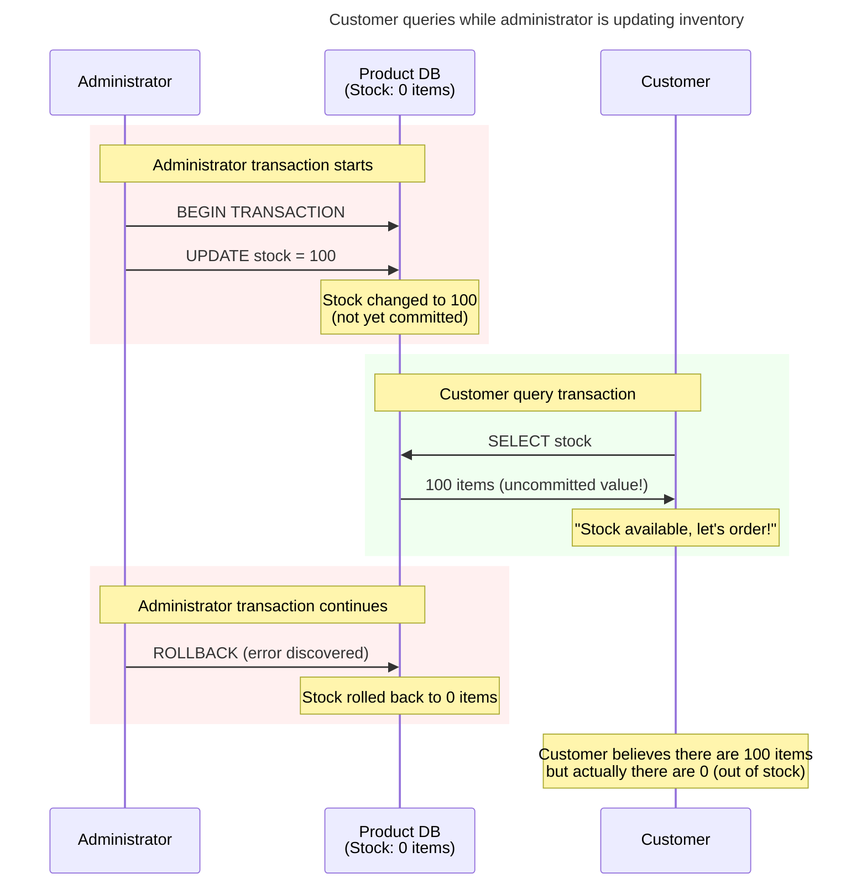
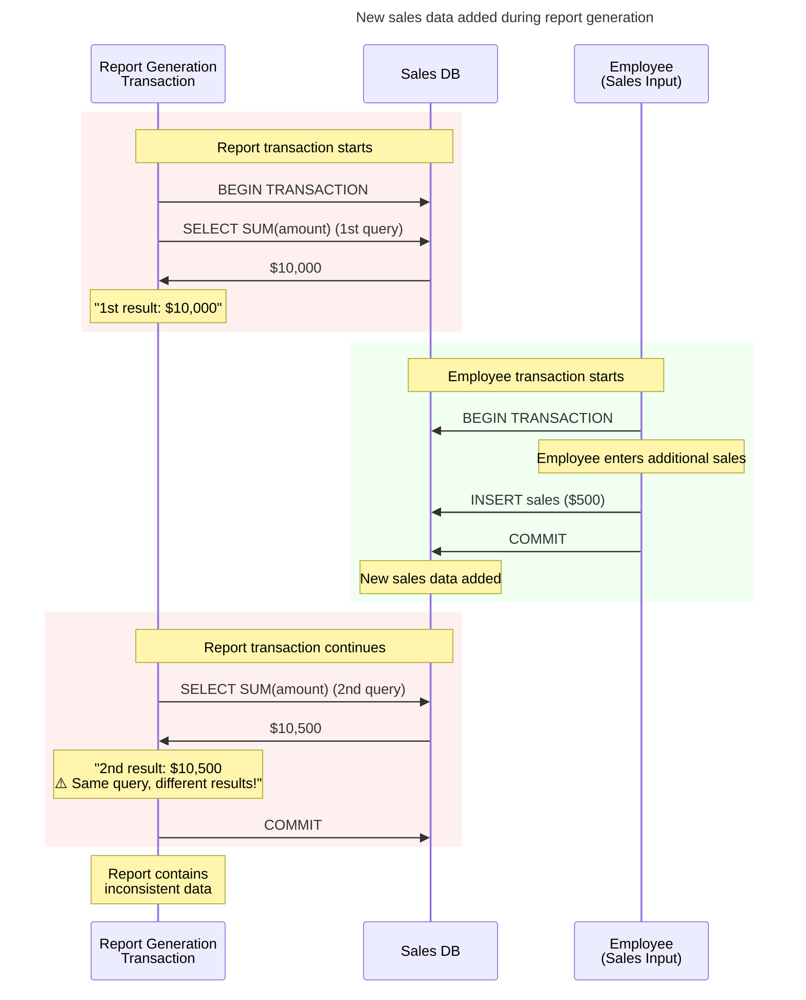
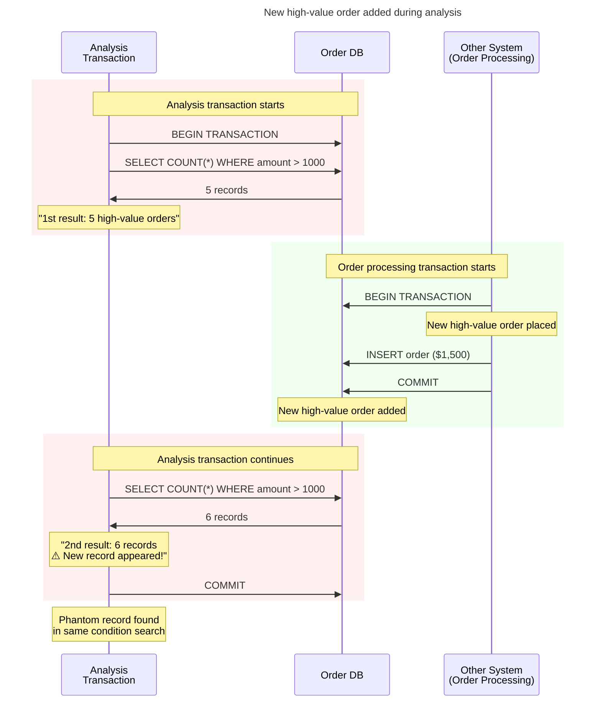
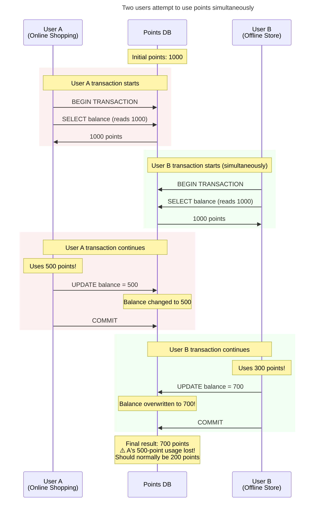
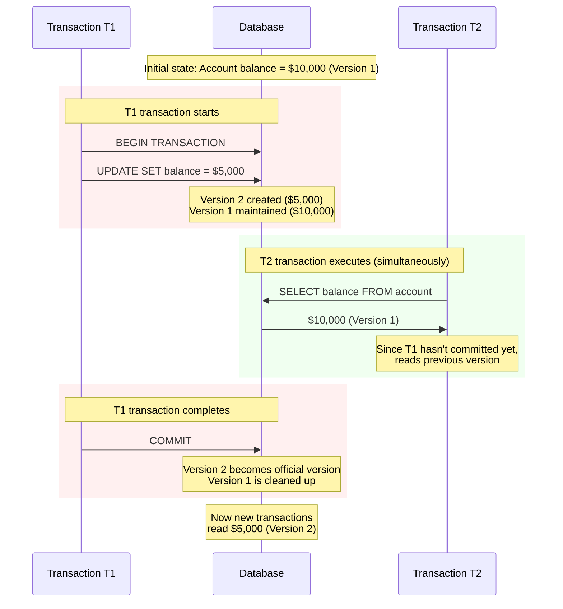

# Database Concurrency Issues and ANSI SQL Standardization

What would happen if 100 people simultaneously withdrew money from a bank account? Or if multiple customers ordered the last item in stock at the same time in an online store? Ensuring data integrity in these situations is exactly what **concurrency control** is about.

This article examines the nature of database concurrency problems and the ANSI SQL standardization process. Specific implementation methods will be covered in a separate article.

## Why Do Concurrency Problems Occur?

### The Root Cause

Databases must guarantee **ACID** properties.

- **Atomicity**: All operations either completely succeed or completely fail
- **Consistency**: The database always maintains a consistent state
- **Isolation**: Concurrently executing transactions do not interfere with each other
- **Durability**: Committed data is permanently stored

Among these, **Isolation** is the core of concurrency control. However, perfect isolation significantly degrades performance, so we need to find an appropriate balance.

## Concurrency Problems

Let's explore the concurrency problems defined in the ANSI SQL-92 standard[^5] with real-world scenarios. The standard defines three concurrency problems (Dirty Read, Non-repeatable Read, Phantom Read)[^5], while Lost Update is not included[^6].

### Dirty Read

**Scenario**: Inventory management system of an online store

**Problem**: Reading uncommitted data leads to incorrect decisions.

### Non-repeatable Read

**Scenario**: Monthly report generation system

**Problem**: The same query returns different results within the same transaction.

### Phantom Read

**Scenario**: Statistical analysis system

**Problem**: Previously non-existent data appears when querying with the same conditions.

### Lost Update

> [!note] About ANSI SQL-92 Standard
> Lost Update is not included in the ANSI SQL-92 standard[^6], which defines only three concurrency problems[^6]. This problem was systematically identified by Berenson et al. in their 1995 paper 'A Critique of ANSI SQL Isolation Levels,' but **it has not been officially added to any subsequent SQL standards including SQL:2008, SQL:2011, SQL:2016, or SQL:2023**. While individual database vendors recognize and implement solutions for this problem, it remains unstandardized.

**Scenario**: Points accumulation system

**Problem**: One update is lost due to concurrent modifications.

## History of ANSI SQL Standardization

### The Era of Chaos (1980s)

Initially, each database vendor used different approaches.

- **IBM System R**: Strict two-phase locking (2PL)
- **Oracle**: Row-level locking + read consistency
- **SQL Server**: Page-level locking
- **Each with different terminology and behaviors**

Developers had to learn new concurrency models every time they switched databases.

### The Emergence of ANSI SQL-92 Standard

In 1992, a standard was finally established. The concept of **Isolation Levels** was introduced to systematically classify concurrency problems.

| Isolation Level | Dirty Read | Non-repeatable Read | Phantom Read | Characteristics |
|-----------------|------------|---------------------|--------------|----------------|
| **READ UNCOMMITTED** | Allowed | Allowed | Allowed | Fastest, most dangerous |
| **READ COMMITTED** | Prevented | Allowed | Allowed | Default for most DBMS |
| **REPEATABLE READ** | Prevented | Prevented | Allowed | MySQL InnoDB default |
| **SERIALIZABLE** | Prevented | Prevented | Prevented | Safest, slowest |

> [!note] Differences Between Standard and Actual Implementation
> Each database implements things slightly differently. While the standard was established, databases only try their best to follow it, and sometimes it's not adhered to due to implementation differences.

### Significance of Standardization and Reality's Barriers

The ANSI SQL-92 standard was certainly meaningful progress.

- **Common Language**: All developers use the same terminology
- **Predictability**: Can predict what problems occur at each isolation level
- **Freedom of Choice**: Select isolation levels appropriate for application characteristics
- **Portability**: Easier migration to other databases

However, while the ANSI standard perfectly solved concurrency problems, it caused serious performance bottlenecks with the **lock-based technology** of that time.

### Performance Bottlenecks of Lock-Based Implementation

In the early days of ANSI SQL-92 standard, **lock-based approaches** were used to implement isolation levels, causing serious performance bottlenecks at high isolation levels.

**Problems with Lock-Based REPEATABLE READ**
- Places **shared locks** on all read rows and maintains them until transaction end
- Long-running report queries block all updates
- A single analysis operation can paralyze the entire system

**Problems with Lock-Based SERIALIZABLE**  
- **Range locks** lock all data matching conditions
- `WHERE salary > 5000` condition locks all matching employee data
- Practically equivalent to entire table locking

> [!note] Differences in Modern MVCC-Based Databases
> MVCC-based databases like MySQL InnoDB and PostgreSQL don't have these problems. They don't use read locks even in REPEATABLE READ, which is why MySQL can use it as the default isolation level.

### Realistic Compromises

Due to these performance issues, high isolation levels were difficult to use in practice. Most applications could only use the performance-acceptable `READ COMMITTED`, and `REPEATABLE READ` and `SERIALIZABLE` became features that "exist in the standard but can't be used in practice."

## MVCC: An Innovative Solution

### Theoretical Foundation and Early Implementation

Long before the ANSI standard, database researchers were seeking ways to fundamentally solve concurrency problems. Their efforts eventually bore fruit in the innovative approach called Multi-Version Concurrency Control.

The theoretical foundation of MVCC was first presented in 1978 by David P. Reed of MIT in his doctoral dissertation[^7]. Reed proposed the core idea that conflicts between read and write operations could be avoided by maintaining multiple versions of data simultaneously. Later, in 1981, Phil Bernstein and Nathan Goodman developed this concept into systematic theory through their paper "Concurrency Control in Distributed Database Systems."

The first success in implementing theory into practice was Digital Equipment Corporation's VAX Rdb/ELN in 1984. This was the first commercial database to apply MVCC, a monumental event proving that theoretical concepts could work in actual business environments. However, VAX Rdb moved away from the mainstream with DEC's decline and is now called Oracle Rdb, used only as a niche product on the OpenVMS platform.

> [!note] Current Status of Oracle Rdb
> VAX Rdb was acquired by Oracle and is now called Oracle Rdb, but it operates only on the specialized OpenVMS platform and is rarely used in mainstream markets. OpenVMS is a legacy operating system developed by DEC in the 1970s, currently accounting for only 0.1%[^1] of the total OS market share as a niche product.

Two years later in 1986, UC Berkeley started the POSTGRES project, which further developed MVCC from an academic perspective[^2]. This project, led by Professor Michael Stonebraker, showed a different approach from commercial products by enabling queries of data at specific past points through a unique feature called "Time Travel." Interestingly, both databases implemented MVCC long before the ANSI SQL-92 standard was established in 1992, showing how actual implementation preceded standardization.

> [!note] Removal of PostgreSQL's Time Travel Feature
> POSTGRES's Time Travel feature was removed in PostgreSQL 6.2 (1997)[^3]. The main reasons were **performance overhead** and **rapid storage usage increase**. Storing all data change history consumed disk space quickly, and performance degraded significantly when searching past versions. Instead, current PostgreSQL **maintains only MVCC** to focus on concurrency control.

Oracle proved MVCC's success in the commercial market. Oracle v4 in 1984 was actually the first commercial database to implement MVCC[^4]. Starting in the 1990s, Oracle began implementing rollback segment-based MVCC and widely promoted the concept of "Read Consistency" to the enterprise market. Particularly with Oracle 9i in 2001, they introduced Undo tablespace with automatic management features, completely proving that MVCC technology could operate stably and efficiently even in large-scale commercial environments.

### Core Idea of MVCC

While traditional approaches placed **locks on single data**, **Multi-Version Concurrency Control** approached with the innovative solution of **managing multiple versions of data** simultaneously.

### Revolutionary Advantages of MVCC

The changes MVCC brought were revolutionary in the database world.

**The biggest change was that reads and writes no longer interfere with each other.** In traditional lock-based approaches, when a long read operation like report generation started, all other updates had to stop. But in MVCC, read operations are never blocked. Customer order processing continues even while generating month-end reports.

**The second innovation is guaranteeing consistent reads.** Since it guarantees a data snapshot from the moment a transaction starts, report results maintain consistency even if data is changed elsewhere during report generation. This is particularly important for complex analytical operations.

**Consequently, system concurrency improved dramatically.** More users could work simultaneously, and overall system throughput increased significantly. Performance levels previously unimaginable in terms of concurrent connections and throughput became achievable.

## What You Need to Know in Practice

### Practical Isolation Level Selection Guide

When selecting isolation levels, you must consider the balance between application requirements and performance. Let's examine specifically when each isolation level is used.

**READ UNCOMMITTED** is the lowest isolation level, used when speed is more important than accuracy. It's utilized in real-time monitoring dashboards or system status screens, suitable for approximate statistical queries where fast response is needed even with slightly inaccurate data.

**READ COMMITTED** is the isolation level most web applications use by default. It provides sufficient consistency for typical CRUD operations while ensuring good performance. Everyday application functions like user profile updates, post writing, and commenting operate safely at this level.

**REPEATABLE READ** is used for operations requiring consistent data snapshots, such as report generation or data migration. It's chosen when consistent results must be guaranteed for long-running analytical queries or batch processes, even if data changes midway.

**SERIALIZABLE** is the highest isolation level, used in financial transaction systems where perfect consistency is essential. It's the isolation level chosen for systems where concurrency errors could have critical business impact, such as account transfers, inventory management, and flight reservations.

### Characteristics of Modern Databases

Most databases used today are implemented based on MVCC. This is because they effectively solve the concurrency problems we've examined while providing high performance.

The default isolation level is mostly set to **READ COMMITTED**. This is because it's the most balanced choice for typical applications. However, MySQL's InnoDB engine is an exception, using **REPEATABLE READ** as default for historical reasons related to MySQL's replication mechanism.

Modern databases also provide **automatic deadlock detection and resolution** features. The system automatically detects deadlock situations and selects the transaction that can be resolved with the least cost for rollback. Developers no longer need to handle deadlocks directly.

**Snapshot Isolation** support is also one of the core technologies of modern databases. This is an advanced form of MVCC that provides consistent data views from transaction start time while achieving high concurrency.

### Future Development Directions

Concurrency control technology continues to evolve rapidly. Particularly with the spread of cloud and distributed systems, new challenges are emerging.

In **distributed database environments**, there are complex problems of controlling concurrency between data spread across multiple servers. New algorithms are being researched to solve distributed transaction and global consistency problems that are difficult to resolve with existing single-server MVCC.

In **cloud-native environments**, ensuring data consistency between microservices is an important challenge. New approaches like event sourcing, CQRS, and Saga patterns are gaining attention for maintaining overall system consistency while each service has independent databases.

In **real-time analytics systems**, the boundary between online transaction processing (OLTP) and online analytical processing (OLAP) is disappearing. HTAP (Hybrid Transactional/Analytical Processing) systems need to immediately utilize incoming transaction data for analysis, requiring different concurrency control strategies than before.

Specific implementation methods and practical applications of concurrency control will be covered in more detail in the next article. I hope this foundational knowledge serves as a solid foundation for all developers working with databases.

---

[^1]: [Wikipedia - OpenVMS Operating System Overview](https://en.wikipedia.org/wiki/OpenVMS)
[^2]: Stonebraker, M. (1986). "The design of POSTGRES." Proceedings of the 1986 ACM SIGMOD International Conference on Management of Data
[^3]: [PostgreSQL Official Documentation - Brief History of PostgreSQL](https://www.postgresql.org/docs/current/history.html)
[^4]: Oracle Corporation. "Oracle Database Concepts: Multi-Version Concurrency Control" - Oracle documentation on MVCC implementation timeline
[^5]: ANSI X3.135-1992, American National Standard for Information Systems -- Database Language -- SQL (1992)
[^6]: Berenson, H., Bernstein, P., Gray, J., Melton, J., O'Neil, E., & O'Neil, P. (1995). "A critique of ANSI SQL isolation levels." ACM SIGMOD Record, 24(2), 1-10.
[^7]: Reed, D. P. (1978). "Naming and synchronization in a decentralized computer system." MIT doctoral dissertation

