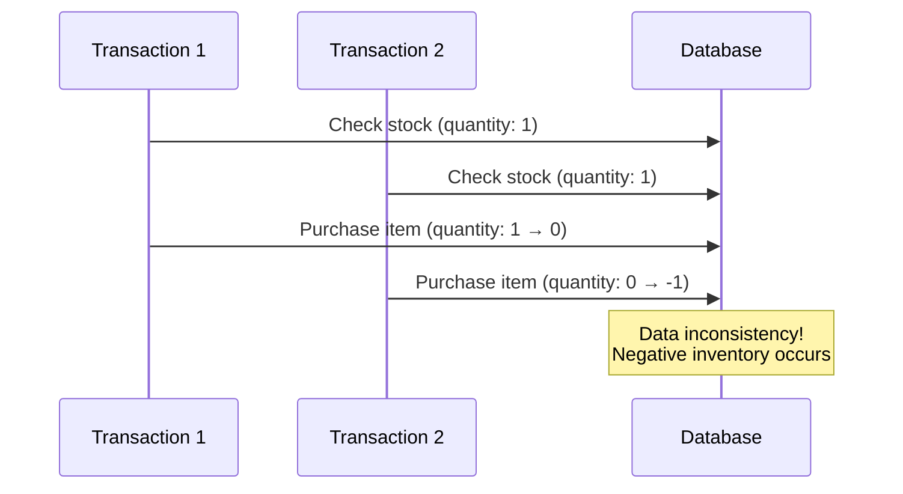
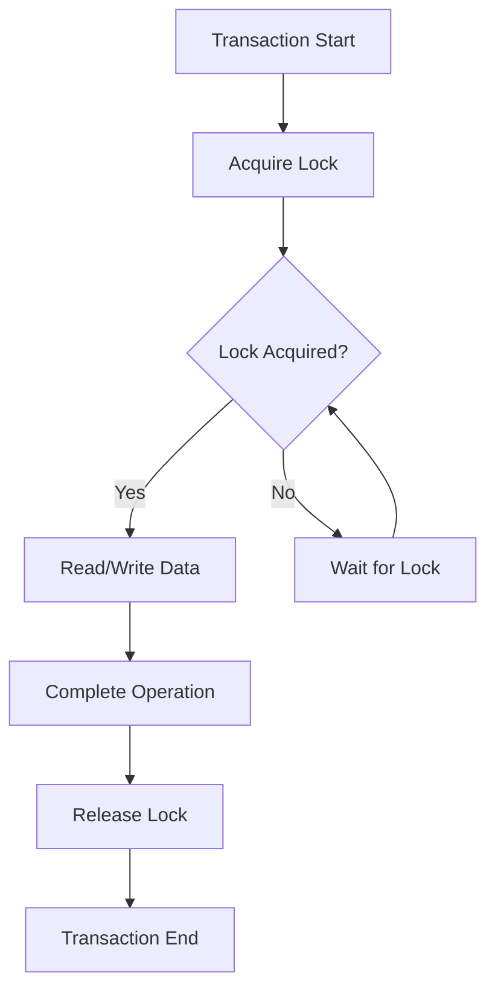
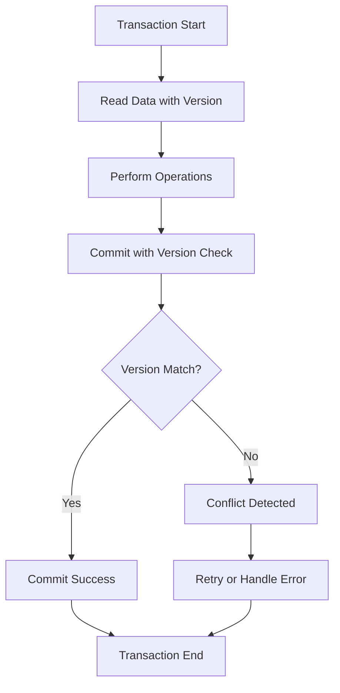
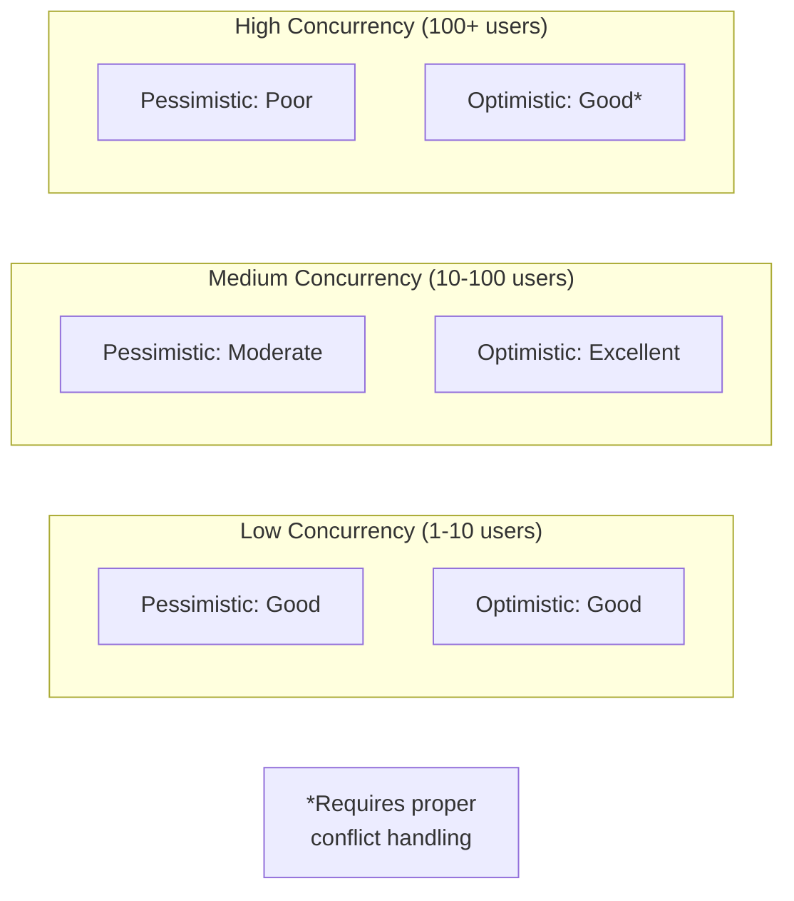

# The Evolution of Database Locking: From Pessimistic to Optimistic Locking

Have you ever experienced your service slowing down as user traffic increased? Or encountered mysterious deadlock errors during peak hours? If you've struggled with database concurrency issues, this article is for you.

Database locking is one of the most crucial concepts for ensuring data consistency in multi-user environments. Today, we'll explore the evolution from traditional pessimistic locking to modern optimistic locking, understanding when and how to use each approach.

## Understanding the Need for Database Locking

### What Problems Does Database Locking Solve?

Imagine an e-commerce site where multiple users are trying to purchase the last item in stock simultaneously. Without proper locking mechanisms, the following scenario could occur:



This is a classic example of a **race condition**. Multiple transactions accessing the same data simultaneously can lead to data inconsistency.

### Types of Data Consistency Issues

Database concurrency can cause several types of problems:

**Dirty Read**
- Reading uncommitted data from another transaction
- Problem: Data might be rolled back

**Non-Repeatable Read**
- Getting different results when reading the same data multiple times within a transaction
- Problem: Other transactions modify data between reads

**Phantom Read**
- New records appearing that match search conditions during a transaction
- Problem: Result set changes unexpectedly

**Lost Update**
- One transaction's changes overwriting another's
- Problem: Data loss occurs

## Pessimistic Locking: The Conservative Approach

### Core Concept

Pessimistic locking operates on the assumption that conflicts will occur. It prevents conflicts by acquiring locks before accessing data.



### Implementation Methods

#### 1. SELECT FOR UPDATE

The most common pessimistic locking method in SQL:

```sql
-- User A's transaction
BEGIN;
SELECT quantity FROM products 
WHERE id = 1 FOR UPDATE;  -- Acquire exclusive lock

-- At this point, other transactions must wait

UPDATE products 
SET quantity = quantity - 1 
WHERE id = 1;

COMMIT;  -- Lock released
```

```sql
-- User B's transaction (waits until User A completes)
BEGIN;
SELECT quantity FROM products 
WHERE id = 1 FOR UPDATE;  -- Waits for lock
-- ...continues after User A's transaction completes
```

#### 2. SELECT FOR SHARE

For read-only access that prevents modifications:

```sql
-- Transaction for reading product information
BEGIN;
SELECT name, price, description 
FROM products 
WHERE id = 1 FOR SHARE;  -- Shared lock (multiple readers allowed)

-- Other read transactions can proceed
-- Write transactions must wait
COMMIT;
```

### Advantages and Disadvantages

**Advantages**
- **Guaranteed Consistency**: Data integrity is ensured
- **Simple Logic**: Easy to understand and implement
- **Predictable Behavior**: Conflicts are prevented upfront

**Disadvantages**
- **Performance Degradation**: Waiting for locks reduces throughput
- **Deadlock Risk**: Circular waiting situations can occur
- **Scalability Issues**: Performance decreases as concurrency increases

> **Important Note**
> Pessimistic locking can significantly impact performance in high-concurrency environments. Use it only when data consistency is absolutely critical.

## Optimistic Locking: The Performance-First Approach

### Core Concept

Optimistic locking assumes conflicts are rare. It allows concurrent access and detects conflicts at commit time.



### Implementation Methods

#### 1. Version-Based Optimistic Locking

The most common approach using a version column:

```sql
-- Table structure
CREATE TABLE products (
    id BIGINT PRIMARY KEY,
    name VARCHAR(100),
    quantity INT,
    version INT DEFAULT 0  -- Version for optimistic locking
);
```

```sql
-- Application code for purchase process
-- 1. Read current data
SELECT id, quantity, version 
FROM products 
WHERE id = 1;
-- Returns: id=1, quantity=10, version=5

-- 2. Update with version check
UPDATE products 
SET quantity = quantity - 1, 
    version = version + 1
WHERE id = 1 AND version = 5;  -- Version condition is crucial

-- If affected rows = 0, conflict occurred
```

#### 2. Timestamp-Based Optimistic Locking

Using last update time instead of version numbers:

```sql
-- Table structure
CREATE TABLE products (
    id BIGINT PRIMARY KEY,
    name VARCHAR(100),
    quantity INT,
    updated_at TIMESTAMP DEFAULT CURRENT_TIMESTAMP
);
```

```sql
-- Read with timestamp
SELECT id, quantity, updated_at 
FROM products 
WHERE id = 1;
-- Returns: id=1, quantity=10, updated_at='2024-01-15 10:30:00'

-- Update with timestamp check
UPDATE products 
SET quantity = quantity - 1,
    updated_at = CURRENT_TIMESTAMP
WHERE id = 1 
  AND updated_at = '2024-01-15 10:30:00';
```

#### 3. Hash-Based Optimistic Locking

Using hash values of entire records:

```sql
-- Calculate hash of current data
SELECT id, quantity, 
       MD5(CONCAT(name, quantity, price)) as data_hash
FROM products 
WHERE id = 1;

-- Update with hash verification
UPDATE products 
SET quantity = quantity - 1
WHERE id = 1 
  AND MD5(CONCAT(name, quantity, price)) = 'calculated_hash';
```

### Advantages and Disadvantages

**Advantages**
- **High Performance**: No lock waiting time
- **Good Scalability**: Performance maintained with increased concurrency
- **No Deadlocks**: Eliminates deadlock possibilities

**Disadvantages**
- **Conflict Handling Required**: Application must handle retry logic
- **Potential Data Loss**: Lost updates possible without proper handling
- **Complex Implementation**: More sophisticated error handling needed

## Performance Comparison

Let's examine how each approach performs under different scenarios:



### Benchmark Results

Based on testing with a simple inventory management system:

| Concurrent Users | Pessimistic Locking TPS | Optimistic Locking TPS | Performance Ratio |
|------------------|--------------------------|------------------------|-------------------|
| 10               | 850                      | 920                    | 1.08x             |
| 50               | 420                      | 780                    | 1.86x             |
| 100              | 180                      | 650                    | 3.61x             |
| 200              | 85                       | 480                    | 5.65x             |

> ✅ = Supported, ❌ = Not supported, ⚠️ = Caution required

The performance difference becomes more pronounced as concurrency increases.

## Use Case Decision Matrix

### When to Use Pessimistic Locking

**Recommended Scenarios**
- **Financial Transactions**: Banking systems, payment processing
- **Critical Inventory**: Limited stock items, reservations
- **Sequential Processing**: Order number generation, audit trails
- **Low Concurrency**: Administrative systems, batch processing

**Example: Bank Transfer System**
```sql
-- Critical: Must prevent concurrent access to account balance
BEGIN;
SELECT balance FROM accounts 
WHERE account_id = 'A001' FOR UPDATE;

-- Perform balance validation and update
UPDATE accounts 
SET balance = balance - 1000 
WHERE account_id = 'A001';

COMMIT;
```

### When to Use Optimistic Locking

**Recommended Scenarios**
- **High-Traffic Systems**: Social media, content management
- **Read-Heavy Workloads**: Product catalogs, news sites
- **Distributed Systems**: Microservices, cloud applications
- **Performance-Critical**: Real-time applications, gaming

**Example: Social Media Post Likes**
```sql
-- High concurrency, occasional conflicts acceptable
UPDATE posts 
SET like_count = like_count + 1,
    version = version + 1
WHERE post_id = 123 
  AND version = current_version;

-- Handle conflicts gracefully in application code
```

## Implementing Optimistic Locking in Applications

### Spring Data JPA Example

```java
@Entity
@Table(name = "products")
public class Product {
    @Id
    @GeneratedValue(strategy = GenerationType.IDENTITY)
    private Long id;
    
    private String name;
    private Integer quantity;
    
    @Version  // Automatic optimistic locking
    private Integer version;
    
    // getters and setters
}

@Service
public class ProductService {
    
    @Autowired
    private ProductRepository productRepository;
    
    @Transactional
    public void purchaseProduct(Long productId, int quantity) {
        int maxRetries = 3;
        int attempt = 0;
        
        while (attempt < maxRetries) {
            try {
                Product product = productRepository.findById(productId)
                    .orElseThrow(() -> new ProductNotFoundException());
                
                if (product.getQuantity() < quantity) {
                    throw new InsufficientStockException();
                }
                
                product.setQuantity(product.getQuantity() - quantity);
                productRepository.save(product);  // Version check occurs here
                
                return; // Success
                
            } catch (OptimisticLockingFailureException e) {
                attempt++;
                if (attempt >= maxRetries) {
                    throw new PurchaseFailedException("Too many concurrent attempts");
                }
                // Brief delay before retry
                try {
                    Thread.sleep(50 * attempt);
                } catch (InterruptedException ie) {
                    Thread.currentThread().interrupt();
                    throw new PurchaseFailedException("Purchase interrupted");
                }
            }
        }
    }
}
```

### Node.js with Sequelize Example

```javascript
// Model definition
const Product = sequelize.define('Product', {
    id: {
        type: DataTypes.INTEGER,
        primaryKey: true,
        autoIncrement: true
    },
    name: DataTypes.STRING,
    quantity: DataTypes.INTEGER,
    version: {
        type: DataTypes.INTEGER,
        defaultValue: 0
    }
}, {
    version: true  // Enable optimistic locking
});

// Service implementation
class ProductService {
    async purchaseProduct(productId, quantity, maxRetries = 3) {
        for (let attempt = 0; attempt < maxRetries; attempt++) {
            const transaction = await sequelize.transaction();
            
            try {
                const product = await Product.findByPk(productId, {
                    transaction,
                    lock: false  // No pessimistic lock
                });
                
                if (!product) {
                    throw new Error('Product not found');
                }
                
                if (product.quantity < quantity) {
                    throw new Error('Insufficient stock');
                }
                
                // Update with automatic version check
                await product.update(
                    { quantity: product.quantity - quantity },
                    { transaction }
                );
                
                await transaction.commit();
                return { success: true };
                
            } catch (error) {
                await transaction.rollback();
                
                if (error.name === 'SequelizeOptimisticLockError' && 
                    attempt < maxRetries - 1) {
                    // Retry with exponential backoff
                    await new Promise(resolve => 
                        setTimeout(resolve, 100 * Math.pow(2, attempt))
                    );
                    continue;
                }
                
                throw error;
            }
        }
        
        throw new Error('Purchase failed after maximum retries');
    }
}
```

## Best Practices and Common Pitfalls

### Optimistic Locking Best Practices

**1. Implement Proper Retry Logic**
```javascript
const retryWithBackoff = async (operation, maxRetries = 3) => {
    for (let attempt = 0; attempt < maxRetries; attempt++) {
        try {
            return await operation();
        } catch (error) {
            if (isOptimisticLockError(error) && attempt < maxRetries - 1) {
                const delay = Math.min(1000, 100 * Math.pow(2, attempt));
                await new Promise(resolve => setTimeout(resolve, delay));
                continue;
            }
            throw error;
        }
    }
};
```

**2. Version Field Management**
- Always include version in SELECT statements
- Never manually modify version values
- Use database-level version incrementation

**3. Conflict Handling Strategy**
```javascript
const handleOptimisticLockConflict = (error, context) => {
    // Log conflict for monitoring
    logger.warn('Optimistic lock conflict', {
        operation: context.operation,
        resourceId: context.resourceId,
        attempt: context.attempt
    });
    
    // Implement business-specific handling
    switch (context.operation) {
        case 'purchase':
            return 'RETRY_WITH_FRESH_DATA';
        case 'like':
            return 'IGNORE_CONFLICT';
        case 'critical_update':
            return 'ESCALATE_TO_USER';
        default:
            return 'RETRY_LIMITED';
    }
};
```

### Common Pitfalls to Avoid

**❌ Forgetting Version Checks**
```sql
-- Wrong: Version not included in WHERE clause
UPDATE products 
SET quantity = quantity - 1, version = version + 1
WHERE id = 1;  -- Missing version condition!
```

**✅ Correct Implementation**
```sql
-- Correct: Version check included
UPDATE products 
SET quantity = quantity - 1, version = version + 1
WHERE id = 1 AND version = ?;  -- Version parameter essential
```

**❌ Ignoring Conflict Scenarios**
```java
// Wrong: No conflict handling
try {
    productRepository.save(product);
} catch (Exception e) {
    // Generic error handling - optimistic lock conflicts ignored
    throw new RuntimeException("Update failed");
}
```

**✅ Proper Conflict Handling**
```java
// Correct: Specific optimistic lock handling
try {
    productRepository.save(product);
} catch (OptimisticLockingFailureException e) {
    // Retry logic or business-specific handling
    return retryOperation(product);
} catch (Exception e) {
    // Handle other exceptions appropriately
    throw new BusinessException("Unexpected error", e);
}
```

## Hybrid Approaches: Getting the Best of Both Worlds

### Selective Locking Strategy

Different operations within the same system can use different locking strategies:

```java
@Service
public class OrderService {
    
    // Critical operations: Use pessimistic locking
    @Transactional
    public void processPayment(Long orderId, PaymentInfo payment) {
        Order order = orderRepository.findByIdWithLock(orderId);  // FOR UPDATE
        // Payment processing logic
    }
    
    // General updates: Use optimistic locking
    @Transactional
    public void updateOrderStatus(Long orderId, OrderStatus status) {
        Order order = orderRepository.findById(orderId);  // No lock
        order.setStatus(status);  // Version check during save
        orderRepository.save(order);
    }
}
```

### Time-Based Strategy

Switch locking strategies based on system load:

```java
@Component
public class AdaptiveLockingStrategy {
    
    @Autowired
    private SystemMetrics systemMetrics;
    
    public LockingStrategy decideLockingStrategy(String operation) {
        double concurrentUsers = systemMetrics.getConcurrentUsers();
        double conflictRate = systemMetrics.getConflictRate();
        
        // High concurrency but low conflicts: Optimistic
        if (concurrentUsers > 100 && conflictRate < 0.05) {
            return LockingStrategy.OPTIMISTIC;
        }
        
        // High conflict rate: Pessimistic
        if (conflictRate > 0.1) {
            return LockingStrategy.PESSIMISTIC;
        }
        
        // Default: Optimistic
        return LockingStrategy.OPTIMISTIC;
    }
}
```

## Monitoring and Troubleshooting

### Key Metrics to Monitor

**Optimistic Locking Metrics**
- Conflict rate (conflicts/total attempts)
- Retry success rate
- Average retry count per operation
- Performance impact of retries

**Pessimistic Locking Metrics**
- Average lock wait time
- Lock timeout frequency
- Deadlock occurrence rate
- Lock contention hotspots

### Monitoring Implementation

```java
@Component
public class LockingMetrics {
    
    private final MeterRegistry meterRegistry;
    private final Counter optimisticConflicts;
    private final Timer lockWaitTime;
    
    public LockingMetrics(MeterRegistry meterRegistry) {
        this.meterRegistry = meterRegistry;
        this.optimisticConflicts = Counter.builder("optimistic.conflicts")
            .description("Number of optimistic locking conflicts")
            .tag("operation", "unknown")
            .register(meterRegistry);
        
        this.lockWaitTime = Timer.builder("pessimistic.lock.wait")
            .description("Time spent waiting for pessimistic locks")
            .register(meterRegistry);
    }
    
    public void recordOptimisticConflict(String operation) {
        optimisticConflicts.increment(Tags.of("operation", operation));
    }
    
    public void recordLockWaitTime(Duration waitTime) {
        lockWaitTime.record(waitTime);
    }
}
```

## Conclusion

Database locking is a critical aspect of maintaining data consistency in concurrent environments. Understanding when and how to use pessimistic versus optimistic locking can significantly impact your application's performance and reliability.

### Key Takeaways

**Pessimistic Locking**
- Use for critical data that cannot tolerate conflicts
- Best for low-concurrency, high-consistency requirements
- Simple to implement but can impact performance

**Optimistic Locking**
- Ideal for high-concurrency, performance-critical applications
- More complex to implement but offers better scalability
- Requires careful conflict handling and retry logic

**Hybrid Approach**
- Consider using both strategies within the same application
- Make decisions based on specific operation requirements
- Monitor performance and adjust strategies as needed

The evolution from pessimistic to optimistic locking reflects the changing needs of modern applications - from simple, single-user systems to complex, high-concurrency distributed systems. By understanding both approaches and their appropriate use cases, you can build more robust and performant applications.

Remember, there's no one-size-fits-all solution. The best locking strategy depends on your specific requirements, traffic patterns, and consistency needs. Start with a simple approach, monitor your system's behavior, and evolve your strategy as your understanding and requirements grow.
