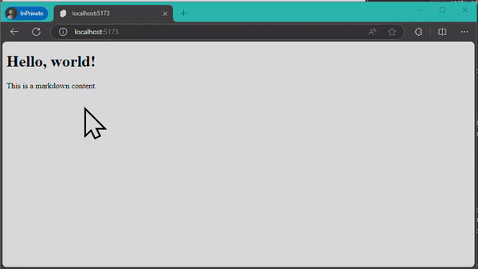

# Svelte Development Diary 1, POJO

I love Markdown, and my favorite syntax within it is [mermaidjs](https://mermaid.js.org/).

However, since Mermaid is designed to operate in a browser environment, I had to temporarily give up on finding a way to make it work in the "No Javascript" environment that I prioritize for my blog.

While pondering how to pre-parse and send it, I discovered the [remark-mermaidjs](https://github.com/remcohaszing/remark-mermaidjs) plugin and decided to apply it.

> \[!note]
> This plugin uses "playwright" in a Node environment to simulate a browser environment and render Mermaid.

## Problem



However, a problem soon arose. As mentioned earlier, since Mermaid is a tool that operates in a browser, there was a discrepancy between the server-rendered results and the browser-rendered results during the hydration phase, causing the results to disappear.

## Solution

The code in `+page.js` runs once on both the server and client, leading to the hydration process. Therefore, I decided to move the Markdown parsing code to `+page.server.js` to skip the hydration process.

**Code causing POJO error:**

```js
import Category from '$lib/post/Category.js';
import Post from '$lib/post/Post.js';

/** @type {import('./$types').PageServerLoad} */
export async function load({ url }) {
	return {
		post: Post.getPosts(url.pathname), // POJO error, returning class instance
		category: Category.getCategory(url.pathname) // POJO error, returning class instance
	};
}
```

**Error:**

```sh
... Cannot stringify arbitrary non-POJOs ...
```

The rendering error occurred because I was not returning a POJO. I then added serialization functions to the methods of each class to ensure they returned POJO objects.

**Code returning POJO:**

```diff
import Category from '$lib/post/Category.js';
import Post from '$lib/post/Post.js';

/** @type {import('./$types').PageServerLoad} */
export async function load({ url }) {
  return {
--   post: Post.getPosts(url.pathname), // POJO error, returning class instance
++   post: Post.getPosts(url.pathname).toSerialize(), // POJO return
--   category: Category.getCategory(url.pathname)  // POJO error, returning class instance
++   category: Category.getCategory(url.pathname).toSerialize() // POJO return
  };
}
```

## Alternative Solutions

- JSON.stringify()
- serialize-javascript
- structuredClone()

While there are other methods to resolve this, in my case, I couldn't serialize using different tools, so I created my own function to proceed.

