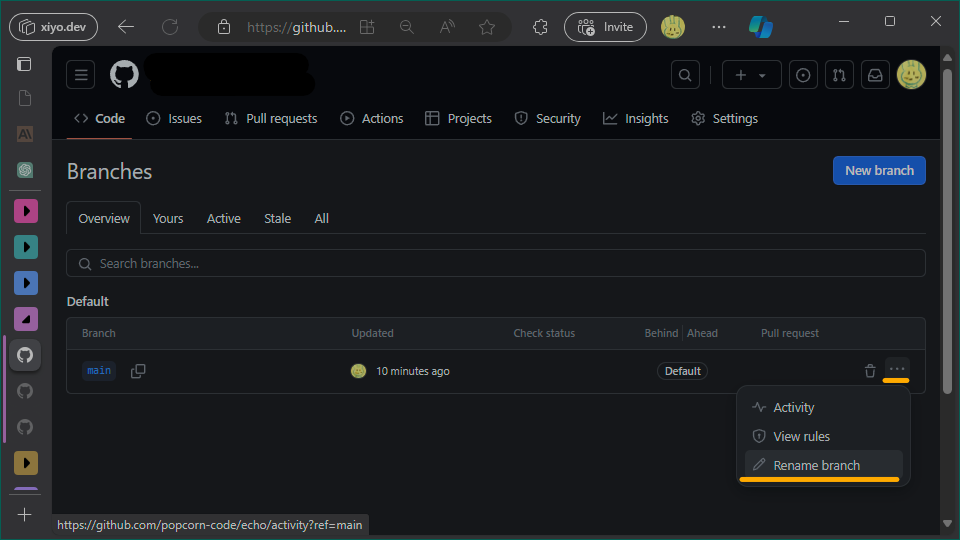

# Renaming a Branch

When initializing a project with Git for local management, a `master` branch is created. Since GitHub often promotes the use of "main" as the branch name, let's explore how to rename the branch.

## Changing the Branch Name with `git` Commands

We will change the branch name from "master" to "main."

### Local Repository

1. Initialize Git.

   ```bash
   git init
   ```

2. Rename the branch.
   ```bash
   git branch -m master main
   ```

### Remote Repository

1. Clone the remote repository.
   ```bash
   git clone repository-url
   ```
2. Navigate to the remote repository.
   ```bash
   cd repository
   ```
3. Rename the branch.
   ```bash
   git branch -m master main
   ```
4. Push the changes to the remote repository.
   ```bash
   git push -u origin main
   ```
5. Delete the old branch from the remote repository.
   ```bash
   git push origin --delete master
   ```

## Renaming the Branch Directly on the Remote Repository

On GitHub, you can rename the branch directly on the web without going through the above steps.



1. Go to the page at <https://github.com/owner-name/branch-name/branches>.
2. Click on the hamburger menu and select `Rename branch`.

## Changing the Default Branch Name on Initialization

To change the default branch name created during Git initialization to "main," use the following command:

```shell
git config --global init.defaultBranch main
```

