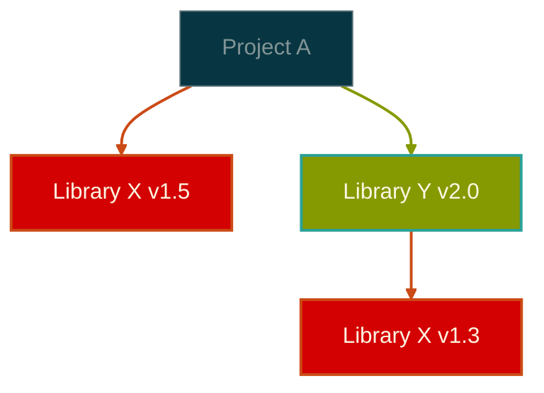

# The Birth and Evolution of Semantic Versioning: The Philosophy of Software Version Management

One of the most fundamental yet complex problems in software development is version management. As projects grow and user bases expand, the question "Is it safe to update this library?" has become a constant concern for developers. Semantic versioning emerged from this chaos as a system of order.

## The Age of Chaos: Before Semantic Versioning

### The Early Chaos of Version Management

In the 1990s and early 2000s, software version management was literally a lawless territory. Developers used their own methods to assign versions, which led to the following confusion:

**Creative but Unpredictable Versions**:
- Early Linux kernel versions: 0.01, 0.02, 0.12, 0.95, 0.96, 0.99, 1.0
- Windows marketing-driven versions: 3.1, 95, 98, ME, 2000, XP
- Some projects' creative versions: "Wombat", "Fuzzy Wuzzy", "Red Bean"

The problems with this approach were clear. You couldn't tell whether updating from version "2.1" to "2.2" was safe or if it required redesigning the entire system.

### The Emergence of Dependency Hell

As package managers became ubiquitous, the problem became even more severe. In complex structures where one project depended on multiple libraries, and each library depended on other libraries, version management became a nightmare.

In such situations, resolving version conflicts in Library X required checking compatibility between each version individually. Version numbers alone couldn't determine compatibility.

## The Philosophy of Semantic Versioning: Meaningful Promises

### Background and Philosophy

In 2010, GitHub co-founder Tom Preston-Werner published the semantic versioning specification. This wasn't just a set of rules, but a **social contract** between developers.

Let's examine the core philosophy of semantic versioning:

**Predictability**: You should be able to understand the nature of changes just by looking at the version number.
**Reliability**: Version numbers are promises between developers and users, and breaking them undermines trust.
**Automation Capability**: Tools should be able to automatically manage dependencies based on version numbers.

### The Semantics of MAJOR.MINOR.PATCH

Semantic versioning clearly communicates the nature of changes through three numbers.

**MAJOR version increases** are warnings saying "be careful." Existing code may not work as-is, and you should check migration guides.

**MINOR version increases** are announcements saying "new features have been added." Existing functionality remains intact while new features are added.

**PATCH version increases** are guarantees saying "this is a safe update." Bugs have been fixed or performance improved, but interfaces haven't changed.

## The World of Pre-releases: Between Development and Deployment

### Alpha: The Beginning of Internal Testing

The term "Alpha" originated at IBM in the 1960s. The first letter of the Greek alphabet, alpha, meant "first stage." Alpha versions are early versions used only within the development team, where basic functionality is implemented but many bugs exist and the system is unstable.

Alpha versions have the following characteristics:
- Prototype-level core functionality
- Frequent crashes and unexpected behavior
- Typically used only by developers
- Incomplete user interfaces

### Beta: The Start of External Validation

"Beta" is the second Greek letter, meaning the stage after Alpha. Beta versions, which began to be used extensively in the 1970s, are stable enough for external users to test.

The historical significance of Beta testing is immense. This was a turning point where software development changed from a closed process to an open collaborative process. With users participating in the development process, feedback from actual usage environments became possible.

### RC (Release Candidate): Final Verification Before Release

Release Candidate means "release candidate" and is a nearly complete version just before official release. No new features are added anymore, only critical bug fixes are made.

The philosophy of RC is "caution." Once software is released, countless users will depend on it, so it's an expression of the will to verify quality until the last moment.

### Snapshot: Moving Targets Under Development

The Snapshot concept, born in the Maven ecosystem, is unique. Expressed in forms like "1.0-SNAPSHOT," it means "heading toward 1.0 but not yet complete."

The philosophical meaning of Snapshot is "transparency." Rather than hiding the development process, it continuously makes it public so team members or other projects can check the latest development status.

## Diversity of Platform-Specific Versioning Cultures

### Java/Maven Ecosystem: Strictness and Clarity

The Java ecosystem follows semantic versioning most strictly. This connects to Java's philosophy of "write once, run anywhere." Breaking compatibility is handled very carefully in the Java ecosystem.

**Semantic Versioning vs Java/Maven Comparison**:

| Item | Semantic Versioning | Java/Maven |
|------|-------------------|------------|
| **Basic Format** | `1.2.3` | `1.2.3` |
| **Alpha** | `1.0.0-alpha.1` | `1.0.0-alpha-1` |
| **Beta** | `1.0.0-beta.2` | `1.0.0-beta-2` |
| **RC** | `1.0.0-rc.1` | `1.0.0-rc` |
| **Snapshot** | None | `1.0.0-SNAPSHOT` |
| **Compatibility Standards** | Principled standards | Very strict |

### JavaScript Ecosystem: Rapid Evolution and Flexibility

The JavaScript ecosystem applies semantic versioning less strictly. Rather than making all API changes MAJOR like Java, it considers actual user impact when making decisions.

**Semantic Versioning vs JavaScript/npm Comparison**:

| Item | Semantic Versioning | JavaScript/npm |
|------|-------------------|----------------|
| **Basic Format** | `1.2.3` | `1.2.3` |
| **Alpha** | `1.0.0-alpha.1` | `1.0.0-alpha.1` |
| **Beta** | `1.0.0-beta.2` | `1.0.0-beta.2` |
| **RC** | `1.0.0-rc.1` | `1.0.0-rc.1` |
| **Range Specification** | None | `^1.2.3`, `~1.2.3` |
| **Compatibility Judgment** | Principled standards | Practical standards |

### Python Ecosystem: Pragmatic Approach

Python established its own versioning standard through PEP 440. While similar to semantic versioning, there are unique differences.

> **PEP 440**: Python Enhancement Proposal 440, the official standard for version identification and dependency specification of Python packages. Python package management tools like pip and PyPI follow this standard.

**Semantic Versioning vs PEP 440 Comparison**:

| Item | Semantic Versioning | PEP 440 (Python) |
|------|-------------------|------------------|
| **Basic Format** | `1.2.3` | `1.2.3` |
| **Alpha** | `1.0.0-alpha.1` | `1.0.0a1` |
| **Beta** | `1.0.0-beta.2` | `1.0.0b2` |
| **RC** | `1.0.0-rc.1` | `1.0.0rc1` |
| **Development Version** | None | `1.0.0.dev0` |
| **Epoch** | None | `1!2.0.0` |
| **Local Version** | None | `1.0.0+ubuntu1` |
| **Compatibility Judgment** | Principled standards | Pragmatic standards |

## Product Management Perspective: Balancing Technology and Marketing

### Technical Version vs Marketing Version

In actual products, technical versions and marketing versions often differ. Let's look at Windows as an example:

- Windows 10 internal version: 10.0.19041
- Marketing version: Windows 10 May 2020 Update
- Development codename: 20H1

This complexity reflects requirements from different perspectives:
- **Development team**: Accurate tracking of technical changes
- **Marketing team**: Names that are familiar and memorable to users
- **Support team**: Accurate version identification for problem solving

### Managing User Expectations

Version numbers shape user expectations. The number "2.0" isn't just an identifier but conveys the message of "a completely renewed product."

Looking at successful version management cases:
- **Gradual improvement**: Chrome's rapid version updates
- **Revolutionary change**: Migration from Python 2 to 3
- **Stability focus**: Ubuntu's LTS (Long Term Support) strategy

## Real-World Dilemmas: The Gap Between Theory and Practice

### Limitations of Perfect Semantic Versioning

In actual development environments, there are cases where it's difficult to follow semantic versioning perfectly.

**Subtle changes**: Bug fixes can unintentionally change existing behavior. It can be difficult to determine whether this is a PATCH change or a MAJOR change.

**Complexity of large organizations**: In large-scale projects where multiple teams collaborate, it's difficult to accurately assess the impact of all changes.

**Legacy compatibility**: Adding new features while maintaining compatibility with old systems often conflicts with semantic versioning principles.

### Need for Organization-Specific Version Policies

Successful version management requires policies tailored to the organization.

**Release cycles**: Strategies that maintain semantic versioning principles while fitting the organization's release cycle are needed.

**Risk assessment**: The risk of changes must be evaluated and appropriate version increase strategies established.

**Communication systems**: Effective methods to communicate version changes to team members and users are needed.

## Evolution Toward the Future

Semantic versioning is not a completed system but a continuously evolving concept. As new development paradigms like cloud-native environments, microservice architectures, and continuous deployment (CD) emerge, new approaches to version management are becoming necessary.

Looking at future challenges:
- Automation of API evolution and compatibility management
- Version consistency in distributed systems
- User-centered release information delivery

Semantic versioning is not just a numbering rule. It's a system of order created by developers and a shared promise to create a trustworthy software ecosystem. While not perfect, it's a precious legacy containing human wisdom for creating order from chaos.
