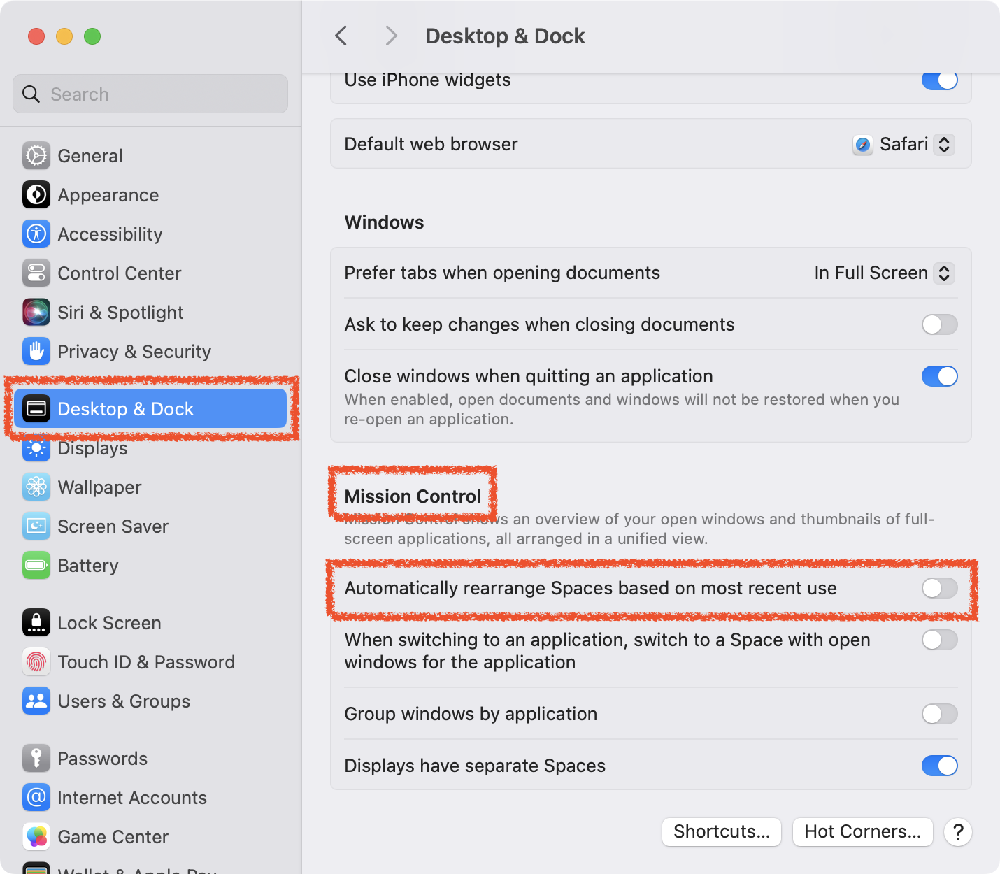

# LOCK DESKTOP SPACE

Learn how to lock the desktop spaces in Mission Control.

## ENVIRONMENT

- macOS 14.0 (Sonoma)

## WHAT IS *MISSION CONTROL*?

Mission Control provides an overview of all currently open windows and full-screen applications, allowing for quick switching and management.

## SOLUTION

0. **Settings Screen**:

   0. Click on the *Desktop & Dock* menu.
   1. Navigate to the *Mission Control* section.
   2. **Uncheck** the option for *Automatically rearrange Spaces based on most recent use*.

## OPTIONS DESCRIPTION

0. **Automatically rearrange Spaces based on most recent use**:

   When this option is enabled, the most recently used spaces (desktop environments) are automatically arranged to the left. Disabling this option will prevent the order of spaces from changing.

1. **When switching to an application, switch to a Space with open windows for the application**:

   Enabling this option will automatically switch to the space where the windows for the specific application are open when you switch to that application.

2. **Group windows by application**:

   When this option is enabled, multiple windows of the same application will be grouped together in the Mission Control view.

3. **Displays have separate Spaces**:

   This allows each display in a multi-display setup to have its own separate spaces. Enabling this option lets you set up independent desktop environments for each monitor.

