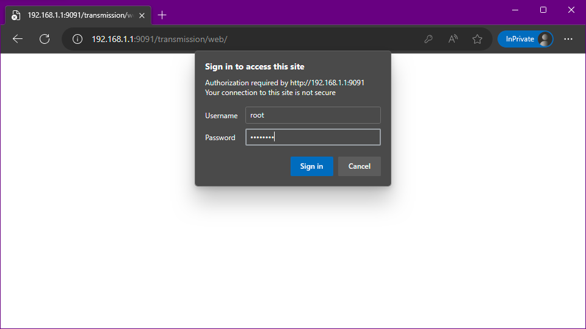
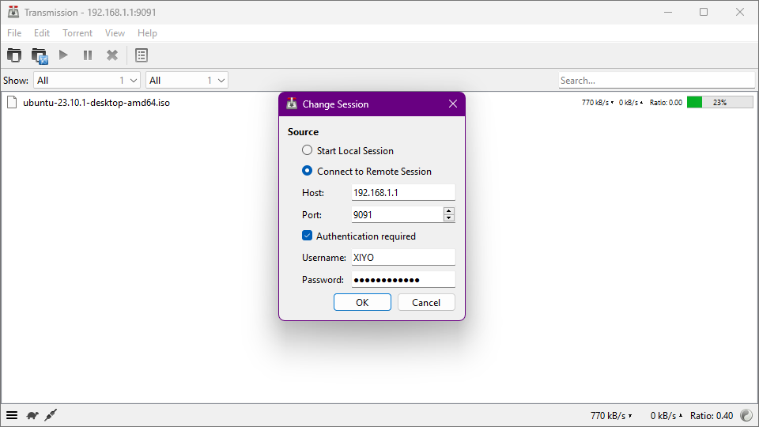

# INSTALL TRANSMISSION ON ASUSWRT

Learn how to install Transmission and manage torrents remotely.

Transmission is a simple torrent daemon with a built-in web *UI*. It is generally used on *NAS* devices, but it can also be used on ASUS routers.

## ENVIRONMENT

Installation environment details.

| Category  |         Details         |
| :------- | :-------------------: |
| Hardware |         AC88U         |
| Firmware | ASUSWRT-MERLIN 386.12 |
| Package  |  Entware armv7sf-k2.6 |

## REQUIREMENTS

The essential requirements are as follows:

- *ASUSWRT-MERLIN* installed
- *SSH* access enabled
- *Entware* installed
- Sufficient capacity of *USB* storage \
  This document uses two storage devices.
- Additional cooling \
  The default heat dissipation features may not be sufficient.

<!--
## OPTIONALS

As an optional step, install to conveniently edit files in *VS Code*.

- Client
    - Install *VS Code* \
        This is required to use *SSH FS*.
        - Install *SSH FS* \
            This is an extension for *VS Code* to edit and manage files on the router.
- Router
    - Install *SFTP* \
        This is required to use *SSH FS* in *VS Code*. -->

## INSTALLATION

0. Access the router via *SSH* in the terminal.
1. Install the package.

   ```bash
   opkg update
   opkg install transmission-web
   ```

   > After updating Entware, install the web interface.

## CONFIGURATION

### KILL TRANSMISSION

Before modifying the settings, stop Transmission. \
If you do not stop it, you will not be able to make changes.

```bash
/opt/etc/init.d/S88transmission stop
```

> Use the script to stop Transmission.

### EDIT SETTINGS

Edit the Transmission configuration file, */opt/etc/transmission/settings.json*, using the default editor, *vi*.

[](https://asciinema.xiyo.dev/a/34)

0. Open the configuration file.

   ```bash
   vi /opt/etc/transmission/settings.json
   ```

   > Open the configuration file using *vi*.

1. Modify the properties.

   - Check the properties to modify.

     ```text
     "download-dir": "/mnt/XIYOsD10/home/xiyo/downloads",
     "incomplete-dir": "/mnt/XIYOsD10/var/tmp/transmission/incomplete",
     "rpc-password": "test1234",
     "rpc-username": "root",
     "watch-dir": "/mnt/XIYOsD10/home/xiyo/watchdir",
     ```

     > *XIYOsD10* is the name of the mounted storage.
     >
     > - *download-dir* \
     >   This is the location where downloaded files will be saved.
     > - *incomplete-dir* \
     >   This is the location where downloading torrent files will be saved. \
     >   The *incomplete-dir-enabled* property must be set to *true* (default).
     > - *rpc-password* \
     >   This is the password used for remote access. \
     >   The default is blank, allowing access without a password. \
     >   The password will be encrypted upon the first access after the daemon starts.
     > - *rpc-username* \
     >   This is the *ID* used for remote access. \
     >   The default is *root*.
     > - *watch-dir* \
     >   This is the location where torrent files will be automatically loaded. \
     >   The *watch-dir-enabled* property must be set to *true* (default).
     >
     > Transmission will automatically create the directories specified in the configuration file if they do not exist, so you do not need to create them manually.

   0. To find a word, press <kbd>/</kbd> and enter the text you want to search for.

   1. To edit text, press <kbd>i</kbd> to switch to insert mode. \
      After finishing your edits, press <kbd>ESC</kbd> to switch back to command mode.

   2. To save, in command mode, type <kbd>:wq</kbd> and press <kbd>Enter</kbd> to save and exit the editor.

### START TRANSMISSION

Start Transmission.

```bash
/opt/etc/init.d/S88transmission start
```

> Use the script to start Transmission.

## OPEN FIREWALL

Open the firewall to effectively connect with peers.

### OPEN PORT

Add the ports to the firewall that will allow inbound connections.

```bash
iptables -I INPUT -p tcp --dport 51413 -j ACCEPT
iptables -I INPUT -p udp --dport 51413 -j ACCEPT
```

> Add the ports used by Transmission to the firewall. \
> *TCP* is used for downloading files, while *UDP* is used for connecting to trackers and peers.

### SAVE RULES

Since the firewall rules will disappear every time the router restarts, set it up so that the rules are applied on each restart.

```bash
FILE="/jffs/scripts/firewall-start"; \
[ ! -f "$FILE" ] && \
echo "#!/bin/sh" > "$FILE" && \
chmod +x "$FILE"; \
echo -e "\n# Allow Transmission" >> "$FILE"; \
echo "iptables -I INPUT -p tcp --dport 51413 -j ACCEPT" >> "$FILE"; \
echo "iptables -I INPUT -p udp --dport 51413 -j ACCEPT" >> "$FILE"
```

> If the *firewall-start* file does not exist, create it and add the firewall rules to the file.

## AUTO START

Set Transmission to start automatically every time the router restarts.

Since Transmission uses additional storage, it should not run until the storage is mounted. \
Set it to run immediately after the drive is mounted.

0. Check for the file. \
   Verify if the script to run after mounting exists, and create it if it does not.

   ```bash
   FILE="/jffs/scripts/post-mount"; \
   [ ! -f "$FILE" ] && \
   touch "$FILE" && \
   chmod +x "$FILE" && \
   echo "#!/bin/sh" > "$FILE"
   ```

   > If the post-mount file does not exist, create it and add execution permissions.

1. Add the auto-execution script. \
   Add the command to run automatically after mounting.

   ```bash
   FILE="/jffs/scripts/post-mount"; \
   SEARCH_STRING=". /jffs/addons/diversion/mount-entware.div # Added by amtm"; \
   ADD_COMMAND="/opt/etc/init.d/S88transmission start"; \
   grep -q "$SEARCH_STRING" "$FILE" || \
   echo -e "\n# Entware addmon start" >> "$FILE" && \
   echo "$ADD_COMMAND" >> "$FILE"
   ```

   > If you have installed or removed *diversion*, the mount script for *diversion* will exist. \
   > In that case, the auto-execution script is already included, so no further action is needed. \
   > If it does not exist, add the script to automatically run Transmission.

## USAGE

### WEB UI



You can access the web *UI* by navigating to *<http://RouterIP:9091>* in your browser. \
The *ID* and password are the values set in the configuration file.

### TRANSMISSION CLIENT



The Transmission client has the capability to access remote servers. \
After launching, simply enter the same information as you would for web access.

## TROUBLESHOOTING

### MOUNTED DIRECTORY CHANGES

If you use the default settings for storage mounting, your mounted storage names will likely be sda1, sdb1, etc. \
In this case, the storage names may change every time the router restarts. Therefore, you need to ensure that the mounts are always fixed.

