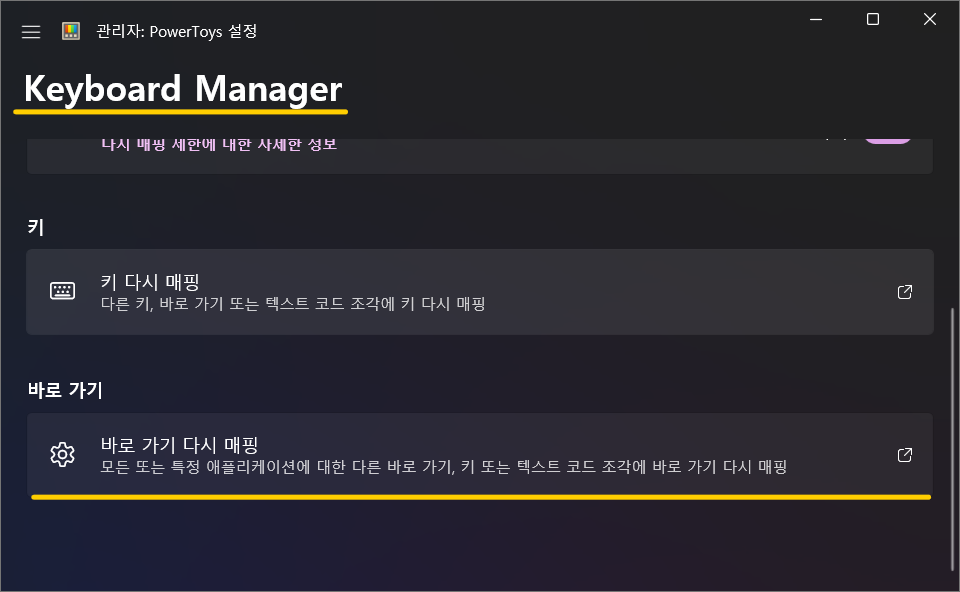
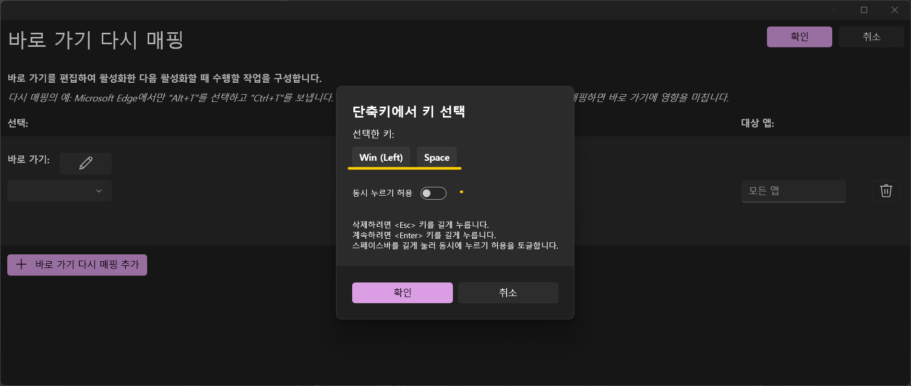
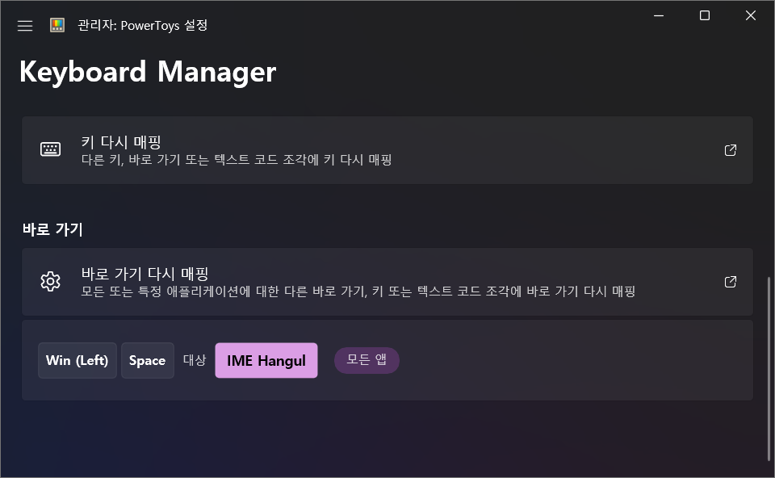

# Changing the Korean/English Toggle Key in Windows

Using a keyboard that operates both on Mac and Windows simultaneously in Windows 11 has led to some inconvenience with the Korean/English toggle. After considering which key to use for the toggle, I decided to follow the Mac's method.

## Changing the Key

### Using Built-in Operating System Features

I decided to use the built-in features of Windows to toggle between Korean and English using the <kbd>shift</kbd> + <kbd>space</kbd> keys, similar to Mac.

#### Changing Keyboard Layout

1. Press <kbd>win</kbd> + <kbd>i</kbd> to open the settings window.
2. Click on the "Time & Language" button in the menu.
3. Click on the "Language & Region" button in the main area.
4. In the language section of the main area, click the "..." button next to "Korean" and then click the "Language Options" button.
5. In the keyboard section of the main area, click the "Change Layout" button.
6. In the "Change Hardware Keyboard Layout" window, select "Korean Keyboard (101 keys) Type 3" and then click the "Restart Now" button.

#### Modifying the Registry

If you search for "keyboard Korean/English registry change" on Google, you will find that "changing keyboard layout" is done through the registry. (Why do they provide a UI if this is the case?...) \
I will replace the explanation with a link that best describes how to change the actual key mapping. This method is labor-intensive and not recommended.

[Best Explained Blog](https://lightinglife.tistory.com/entry/%EC%9C%88%EB%8F%84%EC%9A%B0%EC%97%90%EC%84%9C-%EB%A7%A5%EC%B2%98%EB%9F%BC-Capslock%EC%BA%A1%EC%8A%A4%EB%9D%BD%ED%82%A4%EB%A5%BC-%ED%95%9C%EC%98%81%ED%82%A4%EB%A1%9C-%EB%B3%80%EA%B2%BD%ED%95%98%EB%8A%94-%EB%B0%A9%EB%B2%95by-%EB%A0%88%EC%A7%80%EC%8A%A4%ED%8A%B8%EB%A6%AC-%ED%8E%B8%EC%A7%91#google_vignette)

### Using Utility Programs

#### PowerToys

In this case, I decided to use <kbd>win</kbd> + <kbd>space</kbd> to toggle between Korean and English.

1. Install [PowerToys](https://apps.microsoft.com/store/detail/XP89DCGQ3K6VLD?ocid=pdpshare) from the Microsoft Store.
2. Launch the PowerToys app and click on the "Keyboard Manager" button in the menu area.
3. Click the "Remap Shortcut" button in the main area.
   
4. In the "Remap Shortcut" window, map the keys.
   1. In the "Shortcut" section, click the ✏️ button next to "Shortcut" and enter the combination keys.
      
   2. In the "Target" section, click the ✏️ button next to "Shortcut" and enter the "Korean/English" key.
5. Click the "Save" button in the "Remap Shortcut" window.
6. Click the "Apply" button in the "Keyboard Manager" window.
   

Now, you can toggle between Korean and English using two different methods.

#### jwShiftSpaceKey by Badayak

[Official Website](https://badayak.com/entry/WinHanEng-jwShiftSpaceKey)

I won't explain this part separately... 😘

