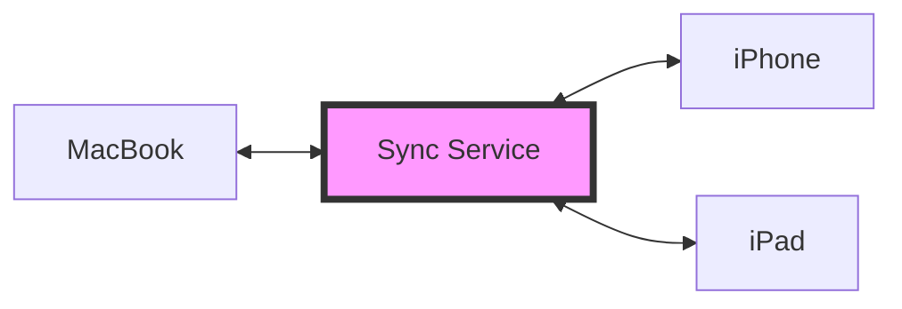

# Obsidian Sync Guide

iCloud, Obsidian Sync, Cloud Drives, and Git - Everything you need to know about Obsidian synchronization from 4 years of hands-on experience. From losing 500 notes to sync conflicts to building a reliable sync system, I'll share all my insights.

"Wait, where did my notes go?"

Three years ago, I lost 500 important project notes due to sync conflicts. Since then, I've personally tested every Obsidian sync method to build the perfect system. Today, I'm sharing all that experience with you.

## Sync vs Backup: Understanding the Fundamental Difference

Many people confuse synchronization and backup. These are completely different concepts.

### What is Synchronization?

Synchronization maintains the **same state** across multiple devices. It's the technology that lets you see notes written on your MacBook immediately on your iPhone.

### What is Backup?

Backup **separately stores** data from a specific point in time. It allows you to recover files that were accidentally deleted or corrupted. For example, compressing all your notes every Monday and saving them to an external drive, or setting up automatic time-based backups through Time Machine.

### Why Does This Difference Matter?

The biggest risk with sync-only services is that **deletions are also synchronized**. If you accidentally delete important files or folders on one device, that deletion is immediately reflected across all devices. The faster and more perfect the synchronization, the less time you have to undo mistakes. This is why having a backup system separate from synchronization is essential.

> Fortunately, most modern cloud services now offer backup features like trash bins or version history alongside synchronization.

## Complete Analysis of 4 Major Sync Methods

### iCloud Drive: Apple Ecosystem Integrated Sync

#### Advantages
- **Setup is really simple.** Just create your Vault in the iCloud Drive folder
- Fast synchronization between Apple devices
- No additional cost (5GB basic storage)

#### Issues Found from Real Experience

##### Large Vault Sync Delays
If you have more than 5,000 notes, initial synchronization can take several hours. In my experience, syncing 10,000 notes took 3 hours. However, once synchronization is complete, only changed files are synced afterward, making it very fast.

> The initial sync only needs to be done well once.

##### Difficulty Checking Sync Status
iCloud doesn't clearly show synchronization progress, making it difficult to confirm completion. After important work, it's best to verify on another device.

### Obsidian Sync: Native Sync Feature

#### Advantages
- Very easy synchronization
- **End-to-End encryption** for perfect security
- Version history (up to 1 year)
- Selective sync available
- Built-in sync conflict resolution in the app

#### Real Usage Experience

##### Cost-effectiveness

$8 per month (about $10) might seem expensive, but it's worth it. The biggest advantage is native integration. Other cloud services also create "copy" files during conflicts, but users must manually find and merge files. In contrast, Obsidian Sync detects and helps resolve conflicts directly within Obsidian. No need to open a separate file explorer or compare filenames. This seamless integration protects your data safely without disrupting your workflow.

### Cloud Drives: External Sync Services

#### Advantages
- **Cost efficiency**: No additional cost if you're already subscribed
- **Generous storage space**: Google One and OneDrive offer terabyte-level capacity
- **Versatility**: You can manage other files alongside Obsidian
- **Fast sync speed**: Stable infrastructure from major IT companies

#### Considerations

##### Mobile App Support Issues
The biggest limitation of cloud drives is mobile support. The Obsidian mobile app cannot directly access cloud drive folders. iOS only supports iCloud, and Android only supports local storage. If you want to edit notes on mobile, you'll need to install and configure third-party apps like FolderSync or Autosync.

##### Inconvenient Conflict Handling
Sync conflicts are a common problem across all services. Cloud drives also create files like "Daily Note (Conflicted copy from Computer A).md" during conflicts. The difference from Obsidian Sync is the merge method. With cloud drives, you need to open a file explorer and manually compare two files, while Obsidian Sync lets you handle it directly within the app. It's a small difference, but the convenience gap becomes significant with daily use.

### Git: Sync Using Version Control System

Git is a tool developers use to manage code, but it can also be excellently utilized for note management. All change history is recorded, and you can return to past versions anytime, making it safe.

#### Git Advantages

- **Free**: You can use services like GitHub and GitLab for free
- **Version tracking**: All modification history is recorded, so you can recover accidentally deleted content
- **Automation possible**: You can set up automatic backup with the Obsidian Git plugin

#### Considerations

Git has a steep learning curve. It takes time to learn commands and concepts, and mobile synchronization also requires additional apps (iOS: Working Copy, Android: MGit). For first-time users, I recommend starting with the Obsidian Git plugin.

## Optimal Strategies by User Type

### General Users

##### Obsidian Sync

For general users, Obsidian Sync is the most convenient. While the $10 monthly cost might be burdensome, it saves time and effort by providing stable synchronization across all devices without complex setup.

#### Cloud Drives

If you're not a Mac user, you can utilize these services:
- Google Drive
- OneDrive

If you're already subscribed to these services, you can sync without additional cost. However, you'll need third-party apps for mobile synchronization.

### Apple-Exclusive Users

##### iCloud + Time Machine

Syncing with iCloud and backing up with Time Machine is the simplest approach. Setup is very easy and synchronization between Apple devices is fast.

Time Machine is macOS's default backup feature, which requires an external drive or NAS. Once configured, it automatically backs up by time period, making it easy to recover accidentally deleted files.

### Developers

##### Git + Git Plugin

Using Git and the Obsidian Git plugin, you can implement powerful version control and automatic backup. Once you install the plugin, it can automatically commit and push changes every 5 minutes, and the plugin helps with conflict resolution.

### Multi-Platform Users

##### Obsidian Sync

Especially if you work across Windows + Mac + Linux, Obsidian Sync is the most stable option.

## Conclusion: My Final System Choice

After 4 years of trial and error, I've settled on the following system:

1. **Main sync**: iCloud Drive (convenience of the Apple ecosystem)
2. **Primary backup**: Git (version control with daily automatic commits)
3. **Secondary backup**: Time Machine (time-based snapshots)

Thanks to this triple safety net, I haven't lost data even once.

I hope you build a synchronization system that matches your work environment and technical level. Don't try too hard to create a perfect system. Start simple and gradually improve as needed - that's the wise approach.
