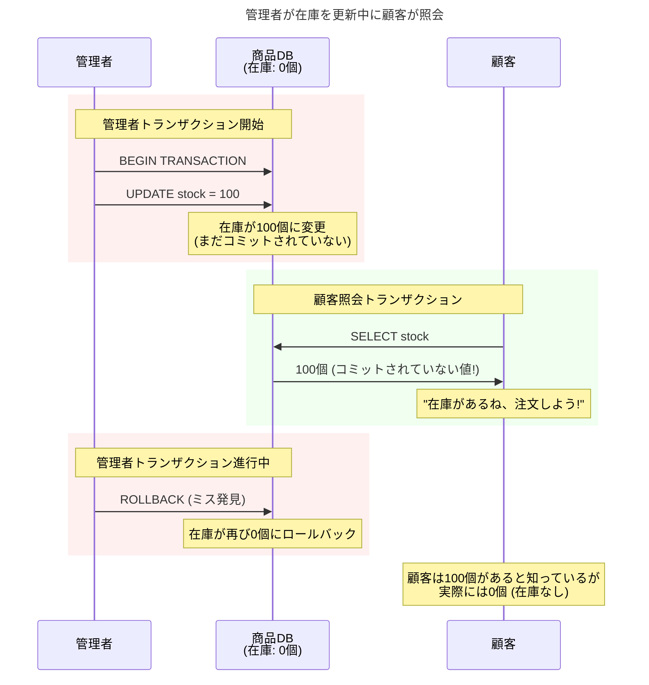
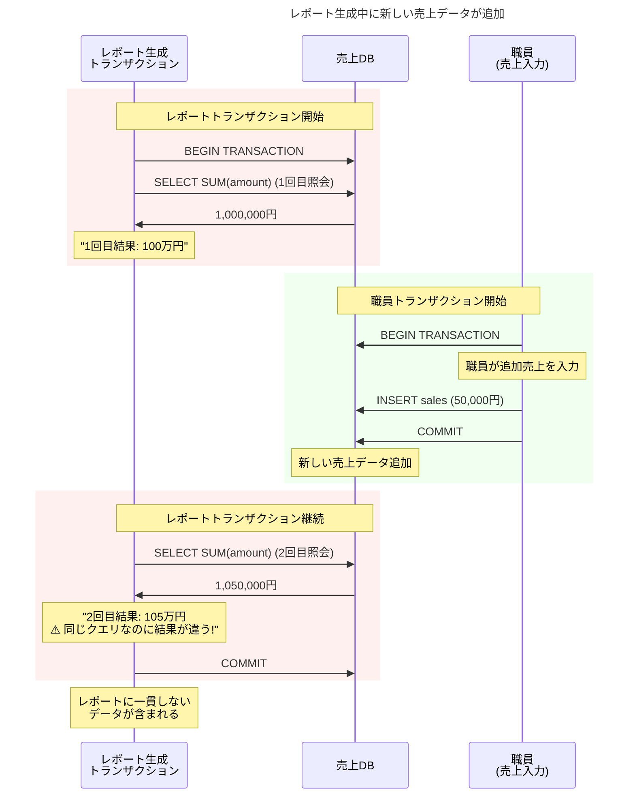
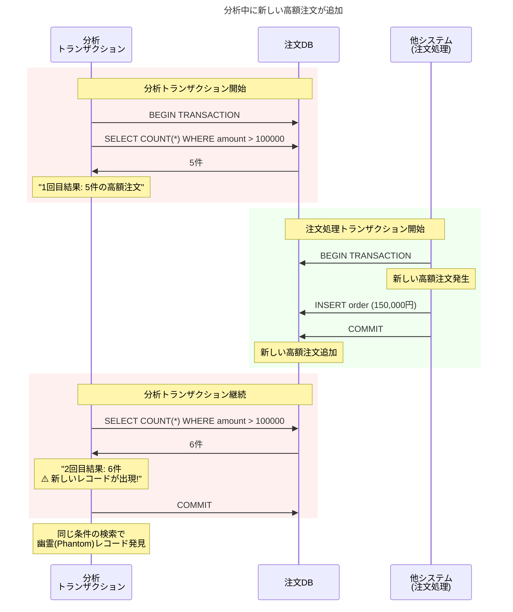
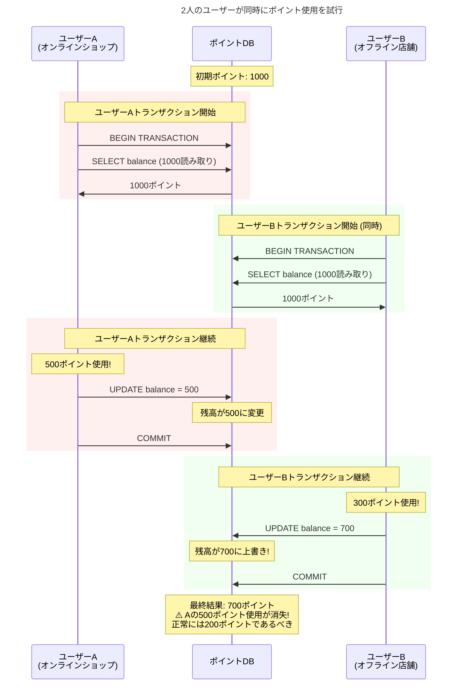
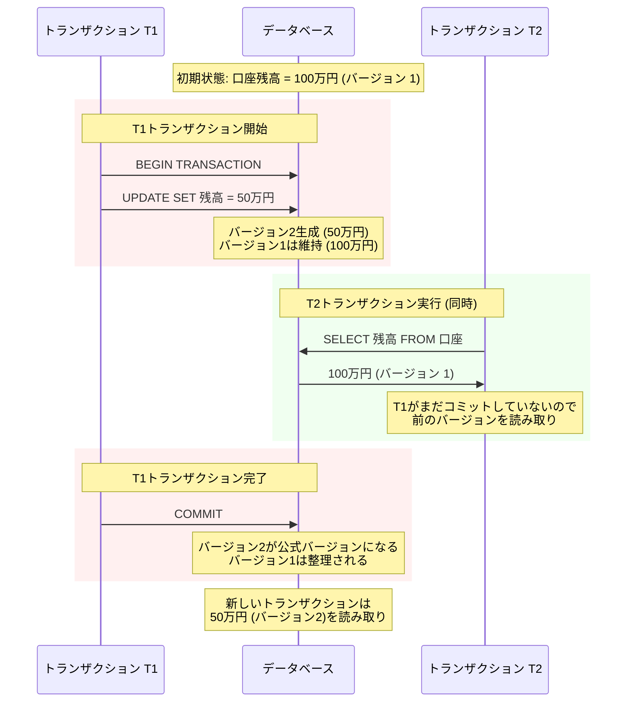

# データベース並行性問題とANSI SQL標準化

同時に100人が銀行口座からお金を引き出したらどうなるでしょうか？またはオンラインショップで最後の在庫1個を複数人が同時に注文したら？このような状況でデータの整合性を保証するのが、まさに**並行性制御**です。

本記事では、データベース並行性問題の本質とANSI SQL標準化過程を見ていきます。具体的な実装方式は別途記事で扱う予定です。

## 並行性問題はなぜ発生するのか？

### 根本的な原因

データベースは**ACID**特性を保証する必要があります。

- **Atomicity（原子性）**: すべての作業が完全に成功するか完全に失敗する
- **Consistency（一貫性）**: データベースは常に一貫した状態を維持する
- **Isolation（分離性）**: 同時実行されるトランザクション同士が互いに影響を与えない
- **Durability（持続性）**: コミットされたデータは永続的に保存される

この中で**分離性**が並行性制御の核心です。しかし完璧な分離はパフォーマンスを大きく低下させるため、適切なバランスポイントを見つける必要があります。

## 並行性問題

ANSI SQL-92標準で定義された三つの並行性問題[^3](Dirty Read、Non-repeatable Read、Phantom Read)を実際の状況と合わせて確認しましょう。

### Dirty Read（ダーティリード）

**状況**: オンラインショップの在庫管理システム

**問題点**: まだ確定していないデータを読んで間違った判断をしてしまいます。

### Non-repeatable Read（反復不可能読み取り）

**状況**: 月末レポート生成システム

**問題点**: 同じトランザクション内で同じデータを読んだのに結果が変わってしまいます。

### Phantom Read（ファントムリード）

**状況**: 統計分析システム

**問題点**: 同じ条件で照会したのに最初になかったデータが出現します。

### Lost Update（更新消失）

> [!note] ANSI SQL-92標準について
> Lost Updateは実際にはANSI SQL-92標準に含まれていません[^2]。この問題は後の研究で追加された概念ですが、実務では非常に重要な並行性問題として認識されています。1995年にBerenson et al.が「A Critique of ANSI SQL Isolation Levels」論文でこの問題を体系的に識別しましたが、**現在までSQL:2008、SQL:2011、SQL:2016、SQL:2023などの最新SQL標準に公式的に追加されていません**。各データベースベンダーが独自にこの問題を認識し解決策を実装していますが、標準化は行われていない状態です。

**状況**: ポイント蓄積システム

**問題点**: 同時修正により一方の更新が消失してしまいます。

## ANSI SQL標準化の歴史

### 混乱の時代（1980年代）

初期には各データベースベンダーごとに異なる方式を使用していました。

- **IBM System R**: 厳格な2段階ロック（2PL）
- **Oracle**: 行レベルロック + 読み取り一貫性
- **SQL Server**: ページレベルロック
- **それぞれ異なる用語と動作方式**

開発者たちはデータベースを変更するたびに新しい並行性モデルを学習する必要がありました。

### ANSI SQL-92標準の登場

1992年、ついに標準が作られました[^3]。**分離レベル（Isolation Level）**という概念を導入して**3つの並行性問題**（Dirty Read、Non-repeatable Read、Phantom Read）を体系的に分類しました。

| 分離レベル | Dirty Read | Non-repeatable Read | Phantom Read | 特徴 |
|-----------|------------|---------------------|--------------|------|
| **READ UNCOMMITTED** | 許可 | 許可 | 許可 | 最速、最危険 |
| **READ COMMITTED** | 防止 | 許可 | 許可 | 大多数のDBMS基本値 |
| **REPEATABLE READ** | 防止 | 防止 | 許可 | MySQL InnoDB基本値 |
| **SERIALIZABLE** | 防止 | 防止 | 防止 | 最安全、最低速 |

> [!note] 標準と実際の実装の違い
> データベースごとに実装が少しずつ異なります。標準が定められましたが、最大限従おうと努力するだけで、実際の実装が異なるため守られない場合もあります。

### 標準化の意義と現実の壁

ANSI SQL-92標準は確実に意味のある発展でした。

- **共通言語**: すべての開発者が同じ用語を使用するようになった
- **予測可能性**: 分離レベル別にどのような問題が発生するか予測可能
- **選択の自由**: アプリケーション特性に合った分離レベルの選択
- **移植性**: 他のデータベースへの移行が容易になった

しかしANSI標準は並行性問題を完璧に解決してくれましたが、当時の**ロック基盤技術**では深刻なパフォーマンスボトルネックを引き起こしました。

### ロック基盤実装のパフォーマンスボトルネック

ANSI SQL-92標準初期には**ロック基盤方式**で分離レベルを実装していたため、高い分離レベルで深刻なパフォーマンスボトルネックが発生しました。

**ロック基盤REPEATABLE READの問題点**
- 読み取ったすべての行に**共有ロック**をかけてトランザクション終了まで維持
- 長時間実行されるレポートクエリがすべての更新をブロック
- 一つの分析作業がシステム全体を麻痺させる

**ロック基盤SERIALIZABLEの問題点**  
- **範囲ロック**で条件に合うすべてのデータをロック
- `WHERE salary > 5000`条件なら該当するすべての職員データがロック
- 実質的にテーブル全体ロックと同じ効果

> [!note] 現代MVCC基盤データベースの違い
> MySQL InnoDB、PostgreSQLのようなMVCC基盤データベースではこのような問題がありません。REPEATABLE READでも読み取りロックを使用しないため、MySQLが基本分離レベルとして使用できるのです。

### 現実的な妥協点

このようなパフォーマンス問題により、高い分離レベルは実務で使用することが困難でした。大多数のアプリケーションはパフォーマンス上妥協可能な`READ COMMITTED`のみ使用せざるを得なく、`REPEATABLE READ`と`SERIALIZABLE`は「標準にはあるが実務では使えない」機能になってしまいました。

## MVCC: 革新的な解決策

### 理論的基礎と初期実装

ANSI標準よりもはるかに以前から、データベース研究者たちは並行性問題を根本的に解決する方法を模索していました。彼らの努力は結局Multi-Version Concurrency Controlという革新的なアプローチとして実を結ぶことになります。

MVCCの理論的土台は1978年MITのDavid P. Reedが発表した博士論文「Naming and synchronization in a decentralized computer system」で初めて提示されました[^4]。Reedは複数バージョンのデータを同時に維持することで読み取りと書き込み作業間の衝突を避けることができるという核心アイデアを提案しました。その後1981年Phil BernsteinとNathan Goodmanが「Concurrency Control in Distributed Database Systems」論文を通じてこの概念を体系的な理論として発展させました。

理論から実際の実装への最初の成功は1984年Digital Equipment CorporationのVAX Rdb/ELNでした。これはMVCCを適用した最初の商用データベースで、理論的概念が実際のビジネス環境でも動作できることを証明した記念碑的な出来事でした。しかしVAX RdbはDECの没落と共に主流から遠ざかり、現在はOracle Rdbと名前を変えてOpenVMSプラットフォームでのみ使用されるニッチ製品となりました。

> [!note] Oracle Rdbの現在の状況
> VAX RdbはOracleが買収して現在Oracle Rdbと呼ばれていますが、OpenVMSという特殊なプラットフォームでのみ動作するため主流市場ではほとんど使用されていません。OpenVMSは1970年代にDECが開発したレガシーオペレーティングシステムで、現在全体のOS市場シェアの0.1%[^1]に過ぎないニッチ市場製品です。

2年後の1986年、UC Berkeleyでは学術的観点からMVCCをさらに発展させたPOSTGRESプロジェクトが始まりました[^5]。Michael Stonebraker教授が率いたこのプロジェクトは商用製品とは異なるアプローチを示し、「タイムトラベル（Time Travel）」という独特な機能を通じて過去特定時点のデータを照会できるようにしました。興味深いことに、この2つのデータベース共に1992年ANSI SQL-92標準が制定されるはるか前にMVCCを実装したという点で、実際の実装が標準化より先行したことを示す事例となりました。

> [!note] PostgreSQLのタイムトラベル機能削除
> POSTGRESのタイムトラベル機能はPostgreSQL 6.2バージョン（1997年）で削除されました[^6]。主な理由は**パフォーマンスオーバーヘッド**と**ストレージ使用量急増**のためでした。すべてのデータ変更履歴を保管する必要があり、ディスク容量が急速に消費され、過去バージョン検索時にパフォーマンスが大幅に低下しました。代わりに現在のPostgreSQLは**MVCCのみ維持**して並行性制御に集中しています。

商用市場でMVCCの成功を確実に立証したのはOracleでした。1984年にリリースされたOracle Version 4が世界初の商用MVCC実装として記録されています[^7]。1990年代からOracleはロールバックセグメント基盤のMVCC実装を本格化し、「読み取り一貫性（Read Consistency）」という概念をエンタープライズ市場に広く知らせました。特に2001年Oracle 9iではUndoテーブルスペースを導入して自動管理機能まで追加することで、MVCC技術が大規模商用環境でも十分に安定的かつ効率的に動作できることを完全に証明しました。

### MVCCの核心アイデア

既存方式は**一つのデータにロック**をかけていたのに対し、**Multi-Version Concurrency Control**は**複数バージョンのデータ**を同時に管理する革新的解決策としてアプローチしました。

### MVCCの革新的利点

MVCCがもたらした変化はデータベース世界に革命のようでした。

**最大の変化は読み取りと書き込みが互いに妨害しなくなったことです。** 既存のロック方式では、レポートを生成する長い読み取り作業が始まると他のすべての更新が停止する必要がありました。しかしMVCCでは読み取り作業が絶対にブロックされません。月末決算レポートを出力している間も顧客の注文処理は継続して進行されます。

**2番目の革新は一貫した読み取りを保証することです。** トランザクションが開始される瞬間のデータスナップショットを保証するため、レポート生成中に他の場所でデータを変更してもレポート結果は一貫性を維持します。これは特に複雑な分析作業で非常に重要な特性です。

**結果として、システムの並行性が劇的に向上しました。** より多くのユーザーが同時に作業できるようになり、システム全体のスループットが大幅に増加しました。以前には想像できなかったレベルの同時接続と処理量を達成できるようになったのです。

## 実務で知っておくべきこと

### 実務分離レベル選択ガイド

分離レベルを選択する際は、アプリケーションの要求事項とパフォーマンス間のバランスを考慮する必要があります。各分離レベルがどのような状況で使用されるか具体的に見てみましょう。

**READ UNCOMMITTED**は最も低い分離レベルで、正確性よりも速度が重要な状況で使用されます。リアルタイムモニタリングダッシュボードやシステム状態を確認する画面で活用され、少し不正確なデータがあっても早い応答が必要な大まかな統計照会に適しています。

**READ COMMITTED**は大多数のWebアプリケーションで基本として使用する分離レベルです。一般的なCRUD作業で十分な一貫性を提供しながらも良いパフォーマンスを保証します。ユーザープロフィール修正、投稿作成、コメント作成のような日常的なアプリケーション機能がこのレベルで安全に動作します。

**REPEATABLE READ**はレポート生成やデータマイグレーションのように一貫したデータスナップショットが必要な作業に使用されます。長時間実行される分析クエリやバッチ処理過程で途中でデータが変更されても一貫した結果を保証する必要がある時に選択します。

**SERIALIZABLE**は最も高い分離レベルで、完璧な一貫性が必須の金融取引システムで使用されます。口座振替、在庫管理、航空便予約のように並行性エラーがビジネスに致命的な影響を与える可能性があるシステムで選択する分離レベルです。

### 現代データベースの特徴

今日使用される大多数のデータベースはMVCC基盤で実装されています。これは先ほど見た並行性問題を効果的に解決しながらも高いパフォーマンスを提供するためです。

分離レベルの基本値は大多数が**READ COMMITTED**に設定されています。これは一般的なアプリケーションで最もバランスの取れた選択だからです。ただしMySQLのInnoDBエンジンのみ例外的に**REPEATABLE READ**を基本値として使用しますが、これはMySQLのレプリケーション（Replication）メカニズムと関連した歴史的理由のためです。

また現代データベースは**自動デッドロック感知及び解決**機能を提供します。システムがデッドロック状況を自動で探知し、最小コストで解決できるトランザクションを選択してロールバックさせます。開発者が直接デッドロックを処理する必要がなくなったのです。

**スナップショット分離（Snapshot Isolation）**支援も現代データベースの核心技術の一つです。これはMVCCの発展した形態で、トランザクション開始時点の一貫したデータビューを提供しながらも高い並行性を達成できるようにしてくれます。

### 今後の発展方向

並行性制御技術は現在も急速に発展しています。特にクラウドと分散システムの拡散により新しい挑戦課題が登場しています。

**分散データベース環境**では複数サーバーにまたがるデータ間の並行性を制御する必要がある複雑な問題があります。既存の単一サーバー基盤MVCCでは解決しにくい分散トランザクションとグローバル一貫性問題を解決するための新しいアルゴリズムが研究されています。

**クラウドネイティブ環境**ではマイクロサービス間のデータ一貫性を保証することが重要な課題です。各サービスが独立したデータベースを持ちながらもシステム全体の一貫性を維持するためのイベントソーシング、CQRS、Sagaパターンのような新しいアプローチが注目されています。

**リアルタイム分析システム**ではオンライントランザクション処理（OLTP）とオンライン分析処理（OLAP）の境界が消えています。HTAP（Hybrid Transactional/Analytical Processing）システムではリアルタイムで入ってくるトランザクションデータを即座に分析に活用する必要があるため、既存とは異なる並行性制御戦略が必要です。

並行性制御の具体的な実装方式と実務適用方法は次の記事でより詳しく扱います。データベースを扱うすべての開発者にこの基礎知識が堅固な土台になることを願います。

---

[^1]: [Wikipedia - OpenVMSオペレーティングシステム概要](https://en.wikipedia.org/wiki/OpenVMS)
[^2]: Berenson, H., Bernstein, P., Gray, J., Melton, J., O'Neil, E., & O'Neil, P. (1995). A critique of ANSI SQL isolation levels. ACM SIGMOD Record, 24(2), 1-10.
[^3]: American National Standards Institute. (1992). Information Systems - Database Language - SQL (ANSI X3.135-1992). New York: ANSI.
[^4]: Reed, D. P. (1978). Naming and synchronization in a decentralized computer system (Doctoral dissertation, Massachusetts Institute of Technology).
[^5]: Stonebraker, M. (1986). "The design of POSTGRES." Proceedings of the 1986 ACM SIGMOD International Conference on Management of Data
[^6]: [PostgreSQL公式文書 - PostgreSQLの簡潔な歴史](https://www.postgresql.org/docs/current/history.html)
[^7]: Oracle Corporation. Oracle Database Concepts: Multiversion Concurrency Control. Oracle Documentation.

