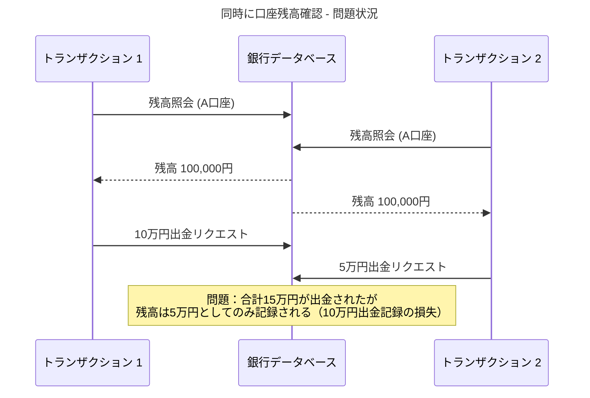
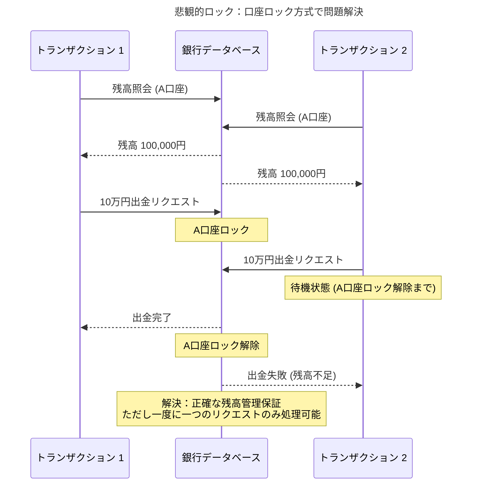
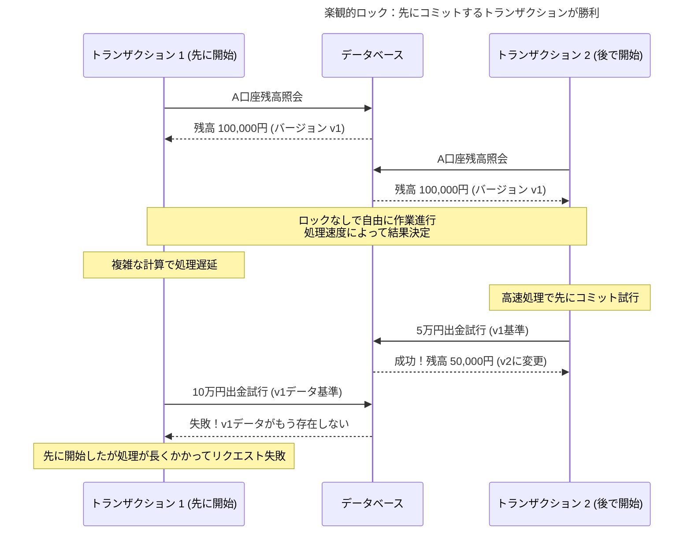

# データベースロッキングの進化：悲観的ロックから楽観的ロックまで

銀行でお金を引き出す方法を考えてみてください。従来の銀行システムでは、一度に一人の顧客だけが特定の口座にアクセスできます。一人の顧客が取引中の場合、他のリクエストは必ず待機する必要があります。一方、現代のATMネットワークでは、複数の顧客がそれぞれ異なるATMで同時に取引を試行できますが、同時取引の問題が発生すると「取引中にエラーが発生しました。再試行してください」というメッセージを受け取ることになります。

この2つの方式が、まさにデータベース世界の**悲観的ロック**と**楽観的ロック**の核心哲学を示しています。

1970年代初頭、最初のリレーショナルデータベースが登場したときから、開発者たちは一つの根本的な問題と格闘してきました。複数のユーザーが同時に同じデータを修正しようとするとき、どのようにデータの一貫性を保証するのか？

## 同時実行性問題の発見：1970年代のジレンマ

1970年代初頭、IBM System Rが開発された当時、研究者たちはすぐに致命的な問題を発見しました。複数のユーザーが同時に同じデータを修正するときに発生する**同時実行性問題**でした。

簡単な例で見てみましょう。1980年代の銀行システムで、2つの異なる端末から同時に同じ口座にアクセスしたらどうなるでしょうか？

このような状況を**更新損失問題（Lost Update Problem）**と呼び、1970年代からデータベース研究者を悩ませてきた古典的な同時実行性問題です。

## 従来のロック：データベースと共に生まれた基本メカニズム

初期のデータベースシステムの解答は直感的で単純でした。「問題が発生する前に完全に防ぐ」。

この方式は最初は単純に**「ロック（Lock）」**と呼ばれました。特別な形容詞がつかない、データベースの基本的な同時実行性制御方法でした。

原理は単純でした。一つのデータには一度に一つのトランザクションだけがアクセスでき、どのトランザクションがいつアクセスするかはデータベースが自動的に管理しました。従来の銀行システムで一つの取引が口座を処理している間、他の取引が同じ口座にアクセスできないのと同じです。

## 悲観的ロック：既存方式に重ねられた新しい名前

「悲観的ロック（Pessimistic Locking）」という名前は実際には後に生まれた用語です。1981年に新しいアプローチである「楽観的ロック」が登場したことで、既存の従来のロック方式を区別するために「悲観的」という形容詞が重ねられたのです。

本質的には同じ方式ですが、新しい観点から見た名前を得ることになったわけです。

### 悲観的ロック：口座をロックする銀行

悲観的ロックでは、データベースがすべての責任を負います。リクエストが特定のデータにアクセスすると、そのデータをロックし、作業が終了するまで他のリクエストはアクセスできなくします。

開発者やユーザーは特に気にする必要がありません。データベースが自動的に順序を決め、正確なデータ処理を保証するからです。しかし、ロックされたデータは最初のリクエストの作業が完全に終了するまでアクセスが不可能で、他のリクエストは待機する必要があります。

### 悲観的ロックの特徴

悲観的ロックは「競合が頻繁に発生する」と仮定します。そのためデータベースがすべての同時実行性制御を担当し、開発者はロックについて気にする必要がありません。確実なデータ一貫性を保証しますが、その代わりに同時処理能力が制限されます。

## 1981年、哲学の転換点

1980年代中盤、システム規模が大きくなり同時ユーザーが急増すると、従来のロック方式の限界が明確になりました。一度に一つのリクエストだけを処理する方式では、増加する同時アクセス要求に対応できませんでした。

1981年、H.T. KungとJ.T. RobinsonがACM Transactions on Database Systemsに発表した論文「On Optimistic Methods for Concurrency Control」は、データベースロッキング歴史の転換点となりました。

この論文で研究者たちは既存のロック方式を**「悲観的（Pessimistic）」**と命名しました。競合が頻繁に発生すると仮定して事前に遮断する方式だからです。そして新しいアプローチである**「楽観的（Optimistic）」**方式を提案しました。競合はまれに発生すると仮定して、一旦作業を進行した後で後に競合を検査する方式でした。

この研究を通じて初めて同時実行性制御技法が**2つの哲学**に明確に分類され、今日まで使用される「悲観的ロック」と「楽観的ロック」という用語が誕生しました。

## 楽観的ロックの革新：「競合はまれである」という大胆な仮定

1981年研究者たちが提案した楽観的ロックの核心アイデアは、既存のアプローチと正反対でした。従来のロックが「競合が頻繁に発生するので事前に防ぐ」だったとすれば、楽観的ロックは「競合はまれに発生するので一旦進行して後で確認する」という哲学でした。

### 楽観的ロック：実際には「ロック」ではない競合検出メカニズム

興味深いことに「楽観的ロック」という名前とは異なり、この方式は実際にはデータをロックしません。代わりに**競合検出と意図的失敗**を通じて同時実行性を制御するメカニズムです。

楽観的ロックの核心目的は**「競合がほとんど発生しないデータについては、わざわざロックをかけない」**ということです。すべてのトランザクションが自由にデータを読み取り、修正作業を準備できますが、実際にデータを変更しようとするトランザクションのコミット直前にのみ競合を検査します。競合が発見されると、後から試行したトランザクションを意図的に失敗させ、開発者が再試行ロジックを実装する必要があります。

### 楽観的ロックの主要特徴

**競合予防ではなく競合検出方式**です。悲観的ロックのように事前に防ぐのではなく、競合が実際に発生したときのみ検出して処理します。

**開発者が競合処理の責任を負います**。競合発生時の再試行ロジックを開発者が直接実装する必要があるため、開発複雑度が増加します。しかし競合がまれな環境では非常に効率的です。

## 2つのロック方式の現代的発展

### 悲観的ロックの進化：より精巧なロックメカニズム

従来のロック方式も止まってはいませんでした。現代の悲観的ロックは次のように発展しました。

**細分化されたロック**を通じてロック範囲を最適化しました。テーブル全体をロックする代わりに行単位やページ単位でロックをかけて同時実行性を高めました。

**効率的な待機列管理**でロック待機キューとタイムアウト設定を通じて待機時間を予測できるようになりました。

また**即座応答オプション**でロックを即座に取得できない場合は待機せずにすぐに失敗する選択権を提供します。**スキップロック**を通じては既にロックがかかったデータはスキップして次のデータを処理する方式も登場しました。

### 楽観的ロックの発展：実装方式の多様化

楽観的ロックは最初に**バージョンカラム（Version Column）**方式で実装されました。各データにバージョン番号を付与して変更事項を追跡する方法でした。しかし時間が経つにつれて様々な実装方式が登場しました。

**タイムスタンプベース**方式はデータの最後修正時間を基準に競合を検出します。**チェックサムベース**方式はデータ全体のハッシュ値で変更有無を確認し、**全体データ比較**方式は読み取ったデータと現在のデータを直接比較します。**CAS (Compare-And-Swap)**方式はハードウェアレベルで支援するアトミック演算を活用してより効率的な競合検出を実装しました。

技術的発展と共に**段階的検証**で複数のデータを一度に修正するときにより正確な競合検出が可能になり、**遅延検証**でトランザクション完了直前にのみ競合を確認してパフォーマンスを向上させました。

## 現代的選択ガイド：どのレストラン方式を選ぶか？

### 悲観的ロック（専用アクセス方式）が適切な場合

データベースの観点から見ると、次のような状況で悲観的ロックが有利です。

- **金融取引システム**：ミスが許されない重要な取引（決済、送金）
- **在庫管理システム**：同時更新が頻繁に発生する人気商品管理
- **多段階業務処理**：複数の段階が順序通りに進行する必要がある複雑なトランザクション
- **高い信頼性要求**：クライアントが待機してでも完璧なデータ一貫性を望む場合

### 楽観的ロック（競合検出方式）が適切な場合

次のような状況では楽観的ロックが効果的です。

- **一般的なアプリケーション**：高速応答が重要な大部分のオンラインサービス
- **ユーザーデータ管理**：競合がまれな個人プロフィールや設定管理
- **非同期処理環境**：クライアントが直接再試行ロジックを実装できる環境
- **大容量処理**：多くの同時リクエストを処理する必要がある分散システム

## 実際のシステムでの選択：データ特性による適用

実際のシステムでは、すべてのデータに一つのロック方式だけを使用しません。データの特性とアクセスパターンに応じて適切な方式を選択するのが一般的です。

### データタイプ別戦略

**個人データ**には楽観的ロックが効果的です。ユーザープロフィール、個人設定、個人文書などは同時修正がほとんど発生しないため、高速処理が可能です。

**共有リソース**の場合は悲観的ロックが必要です。在庫数量、座席予約、口座残高などは同時アクセスが頻繁なため、正確性が優先されるべきです。

### システム規模別アプローチ

**小規模システム**では単純な悲観的ロックでも十分な場合が多いです。同時ユーザーが少なくロック競合が激しくなく、実装と管理が単純です。

**大規模システム**では状況に応じた戦略選択が重要です。データ特性とアクセスパターンを分析してテーブルや機能別に異なるロック戦略を適用するのが一般的です。

## パフォーマンス特性：競合頻度が核心変数

2つの方式のパフォーマンスは**競合発生頻度**によって大きく異なります。一般的な特性は次の通りです。

**競合がまれな状況**では楽観的ロックが有利です。大部分のトランザクションが再試行なしで成功するため、ロックを取得して解除するオーバーヘッドがなく、より高速な処理が可能です。

**競合が頻繁な状況**では悲観的ロックが有利です。楽観的ロックでは再試行が多くなって全体処理時間が急激に増加しますが、悲観的ロックは待機時間はあっても再試行はないため、予測可能なパフォーマンスを提供します。

**転換点は通常競合率20-30%付近**で現れます。これはシステム特性と再試行コストによって変わることがありますが、この地点を超えると悲観的ロックがより効率的な場合が多いです。

## 結論：完璧なソリューションは存在しない

50年にわたる進化の核心教訓は次の通りです：

**「完璧なロック戦略は存在しない。ユーザーと状況に合った最適組み合わせを見つけることが核心である。」**

最も重要なのは**実際のデータと使用パターンを測定**することです。理論的判断よりは実際の競合発生率、応答時間、ユーザー満足度を基準に決定すべきです。またシステムが成長するにつれてパターンが変わることがあるため、**継続的なモニタリングと調整**が必要です。

## 終わりに：測定と検証の重要性

1970年代IBM研究者が発見した同時実行性制御問題は、今日でも依然としてすべてのデータシステムの核心課題です。50年が経った今、私たちは悲観的ロックと楽観的ロックという2つの基本アプローチとその変形を活用できるようになりました。

しかし技術がいくら発展しても変わらない原則があります。**測定なしの最適化は推測に過ぎない**ということです。どのロック戦略が最適かは、実際のデータと使用パターンを分析してこそ分かります。

皆さんが次のプロジェクトでロック戦略を選択するときは、理論より実測を優先してください。現在のシステムの競合発生率を測定し、ユーザーの実際のアクセスパターンを分析し、小さな範囲でテストしてみてください。そしてシステムが成長するにつれてパターンが変わることがあるという点を記憶して、継続的に観察し調整することが真のデータベースマスタリーです。

完璧なロック戦略は存在しません。しかし皆さんのユーザーとシステムに最も適した戦略は必ず見つけることができます。
