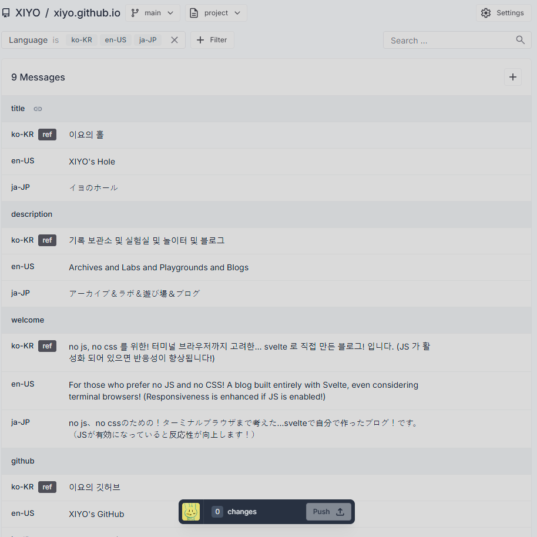
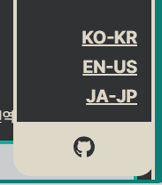

# Paraglide JS 適用記

新しい国際化ライブラリである**Paraglide JS**をプロジェクトに適用した経験を共有します。

## なぜ国際化を導入したのか？

過去に経験した不便な開発経験の一つは、国際化のためにプロジェクトを複製して言語を変更し、各言語ごとに別々のインスタンスを運営しなければならなかった点です。この過程で言語ごとに機能が異なってしまう問題が発生し、それにより国際化作業が非常に面倒でした。

そのような経験が繰り返されないよう、このブログで国際化を試みて対処方法を学びました。

## Paraglide JSとは？

**Paraglide JS**は人工知能を活用した翻訳支援ツールです。単一言語で作成されたコンテンツを**ウェブエディタ**を通じて簡単に翻訳でき、追加の翻訳版も簡単に管理できます。個人ユーザーには無料で提供され、企業向けの有料化政策を検討中なので、負担なく使用できます。

## 特徴

### エディタ

[Paraglide JS | inlang](https://inlang.com/m/gerre34r/library-inlang-paraglideJs)で説明する特徴は軽量、型安全、VS Code拡張機能提供などの他に、便利な特徴は「翻訳エディタ提供」です。


> 開発システムがない外部でもエディタを通じて翻訳を提供できます。

開発初期には韓国語のみで作成して素早い作業物を作り、後でエディタを通じて作業できるため、協業時にも非常に便利な機能です。特に、「機械翻訳機能を提供」するため、素早く翻訳を提供できます。

翻訳されていない文章はデフォルト言語で出力されるため、テキストが空になるといった問題は発生しません。

### メタタグ最適化

HTML文書に言語に関する情報を追加で挿入するため、SEOとブラウザに最適化します。

```html
<html lang="ko-kr" dir="ltr">
  <head>
  <link rel="alternate" hreflang="ko-kr" href="http://localhost:5173/posts">
  <link rel="alternate" hreflang="ja-jp" href="http://localhost:5173/ja-jp/posts">
  <link rel="alternate" hreflang="en-us" href="http://localhost:5173/en-us/posts">
  </head>
```

> `<html lang="ko-kr" dir="ltr">`の`lang`属性はブラウザが翻訳オプションの有効化を検討する属性です。`dir`属性はテキストの方向を制御する属性です。

## 適用方法

全部で2つの方法がありますが、違いは単に自動化の有無です。
SvelteKitとよく統合されたイニシャライザーのみを見て、基本的なイニシャライザーは除外します。

### paraglide-sveltekit イニシャライザーを使用する

イニシャライザーを使用すると、プロジェクトに簡単に適用できます。

```shell
npx @inlang/paraglide-sveltekit init
npm install
```

> 必ず`npx`コマンドで実行する必要があり、他のパッケージマネージャーはサポートされていません。

適用後、些細な問題が一つありました。
自動生成される`ParaglideJS`コンポーネントが例外対象まで包む問題でした。

その問題を解決するため、`ParaglideJS`が例外対象を含まないように修正しました。

```svelte data-title="+layout.svelte"
<script>  
  import { ParaglideJS } from '@inlang/paraglide-sveltekit';  
  import { i18n } from '$lib/i18n';  
  
  const { children } = $props();  
</script>  

<ParaglideJS {i18n}> // [!code --]
  <svelte:head>  
    <title>{$page.data.title}</title>  
    <meta name="description" content={$page.data.description} />  
  </svelte:head>  

<ParaglideJS {i18n}> // [!code ++]
  <div id="container-content">  
   <Header title={$page.data.title} />  
   <main class="margin-block">  
    {@render children()}  
   </main>   <Footer gitLog={$page.data.gitLog} />  
  </div>  <Nav />
</ParaglideJS>
```

> `svelte:head`コンポーネントは他の要素内に存在できないため、`ParaglideJS`コンポーネントの外に出しました。

## 使い方

### 国際化言語の追加

SvelteKitイニシャライザーを使用した場合、`/messages/{lang}.json`に各言語に合ったファイルが生成されます。
初期には一つの言語についてのみ作成し、エディタを利用して追加の翻訳を提供できます。

`/messages/ko-kr.json`に文章追加

```json data-title="ko-kr.json"
{
    "$schema": "https://inlang.com/schema/inlang-message-format",  
    "title": "イヨのホール",  
    "description": "記録保管所および実験室および遊び場およびブログ",  
    "welcome": "no js、no cssのための！ターミナルブラウザまで考慮した...svelteで直接作ったブログ！です。（JSが有効になっていると反応性が向上します！）",  
}
```
> まず一つの言語でのみ作成すれば良いです。

今、プロジェクトを`npm run dev`で実行すると、ビルド時にParaglide JSが言語ファイルをビルドして`/src/lib/paraglide/messages.js`を生成し、型安全なコードを作成できるようにします。

生成された`messages.js`を使用して国際化文を使用すると、言語が変わるたびに言語に合わせて交換されます。

```svelte data-title="+page.svelte"
<script>  
  import Border from '$lib/ui/Border.svelte';  
  import * as m from '$lib/paraglide/messages.js'; // [!code focus]
</script>  
  
<Border viewTransitionName="post" negative>  
  <div class="padding content">  
   <p>{m.welcome()}</p> // [!code focus]
  </div>
</Border>
```

### 言語セレクターの追加

言語を変更できるコンポーネントを別に作成して管理できます。

```svelte data-title="LangSwitch.svelte"
<script>  
  import { availableLanguageTags } from '$lib/paraglide/runtime.js';  
  import { i18n } from '$lib/i18n.js';  
  import { page } from '$app/stores';  
</script>  
  
{#snippet switcher({href, lang})}  
  <li>
    <a {href} hreflang={lang}>  
      {lang}  
    </a>
  </li>
{/snippet}  
  
<ul>  
  {#each availableLanguageTags as lang}  
    {@render switcher({href: i18n.route($page.url.pathname), lang})}  
  {/each}
</ul>
```

> Svelteのスニペット構文を使用してより モジュール化しました。

今、このセレクターを希望する位置に入れるだけで、言語変更が非常に簡単に動作します。



> 言語セレクターをナビゲーションに入れました。

## おわりに

ParaglideJSは簡単な国際化機能を提供しますが、使用時に注意すべき点があります。特に言語が変更されるたびにコンポーネントが全体的に再レンダリングされるため、レンダリングごとに結果が異なる可能性のあるコンポーネントでは慎重である必要があります。例えば、ランダム関数が含まれているコンポーネントの場合、予期しない動作を引き起こす可能性があります。

また、Paraglide JSが提供する文章は状態変数ではないため、再レンダリングが起こらない場合についてのロジックも考慮する必要があります。

マークダウンのためのライブラリでもないため、マークダウンの国際化についても考慮したデザインをしなければならない面倒な点もあります。
