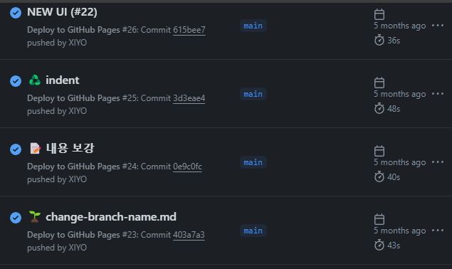
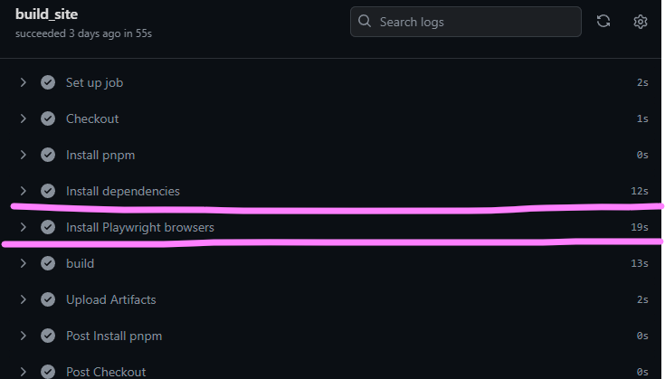
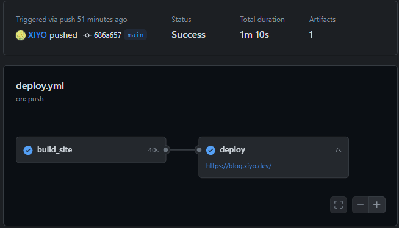

# GitHub Actionsのキャッシュを使用する

GitHub Actionsを使用していると、ビルド速度が徐々に遅くなることを経験しました。これを改善するために、依存関係のインストール時間を節約できるキャッシュの活用方法を導入しました。

## ビルド速度の変化



初期のビルド速度は40秒未満で非常に速かったです。しかし、時間が経つにつれてビルド時間が徐々に長くなり、特にMarkdownファイルにMermaidパーサーを追加した後はビルド時間が急激に増加しました。


これは単にMermaid文法の問題だけではありません。私のブログはSvelteを使用してプリレンダリングを行っているため、初期ビルド時にすべてのMarkdownファイルをパースするための時間が必要でした。

さらに、Markdownファイルにフロントマターを使用せず、GitHubでも正常に表示されることを望んでいたため、作成日や更新日などのメタデータを含めていませんでした。この部分を補うために`git log`コマンドを使用してデータを追加する作業を行った結果、CPU負荷が大きくなり、性能向上も難しくなりました。（ワーカーを分離すれば性能が改善されるかもしれませんが、まだ私のスキルでは簡単ではありません…）



結局、ビルドの最適化のために、まずパッケージのインストール時間を短縮することに焦点を当てることにしました。

## GitHub Workflowの修正

`初期Workflow`の一部

```yml
jobs:
  build_site:
    runs-on: ubuntu-latest
    steps:
      - name: Checkout
        uses: actions/checkout@v4
        with:
          fetch-depth: 0

      - name: Install pnpm
        uses: pnpm/action-setup@v3
        with:
          version: 8

      - name: Install dependencies
        run: pnpm install

      - name: Install Playwright browsers
        run: pnpm exec playwright install --with-deps chromium

      - name: build
        env:
          BASE_PATH: '/${{ github.event.repository.name }}'
        run: |
          pnpm run build
      - name: Upload Artifacts
        uses: actions/upload-pages-artifact@v3
        with:
          # this should match the `pages` option in your adapter-static options
          path: 'build/'
```

初期Workflowはキャッシュを全く活用していませんでした。GitHub ActionsとSvelteを初めて使用した時期で、まず自動ビルドが正常に行われれば満足だったからです。

`最適化されたWorkflow`の一部

```diff
jobs:
  build_site:
    runs-on: ubuntu-latest
    steps:
      - name: Checkout
        uses: actions/checkout@v4
        with:
          fetch-depth: 0

      - name: Install pnpm
-       uses: pnpm/action-setup@v3
+       uses: pnpm/action-setup@v4
        with:
-         version: 8
+         run_install: false

+     - name: Install Node.js
+       uses: actions/setup-node@v4
+       with:
+         node-version: 22
+         cache: 'pnpm'  # ノードモジュールに対するキャッシュを有効化（内蔵機能使用）

      - name: Install dependencies
        run: pnpm install # キャッシュされてインストール速度が向上

+     - name: Get installed Playwright version
+       id: playwright-version
+       run: echo "PLAYWRIGHT_VERSION=$(pnpm list @playwright/test --depth=0 | grep @playwright/test | awk '{print $2}')" >> $GITHUB_ENV

+     - name: Cache playwright binaries
+       uses: actions/cache@v4.0.2
+       id: playwright-cache
+       with:
+         path: ~/.cache/ms-playwright
+         key: ${{ runner.os }}-playwright-${{ env.PLAYWRIGHT_VERSION }}

+     - run: pnpx playwright install --with-deps chromium
+       if: steps.playwright-cache.outputs.cache-hit != 'true'

      - name: build
        env:
          BASE_PATH: '/${{ github.event.repository.name }}'
        run: |
          pnpm run build
      - name: Upload Artifacts
        uses: actions/upload-pages-artifact@v3
        with:
          # this should match the `pages` option in your adapter-static options
          path: 'build/'
```

この最適化されたコードの核心はキャッシュの効果的な使用です。

Node.jsモジュールのキャッシュは`actions/setup-node@v4`で提供される`cache: pnpm`オプションを設定して有効化しました。直接キャッシュを保存する方法もありますが、基本的に提供される抽象化されたオプションを活用する方が効率的だと判断しました。

特にビルド速度低下の主要な原因であった`playwright`を別途キャッシュすることで、インストール時間を最小化しました。キャッシュが既に存在する場合、インストールステップを省略してビルド時間をさらに最適化できました。

> \[!note]
> 上記コードの`playwright`バージョン抽出機能はpnpmパッケージ用のものです。他のパッケージマネージャーを使用する場合は、別のコードを確認してください....🥲

## ビルド速度の変化




ビルド速度は大幅に向上しませんでしたが、適切な最適化を通じてある程度満足できる結果を得ることができました。

### 追加の最適化案

さらに考慮すべき最適化方法はいくつかあります：

- 並列実行
- カスタムランナーを使用してカスタムコンテナを使用
- すべてのプロセスを1つのワークフローに統合する
