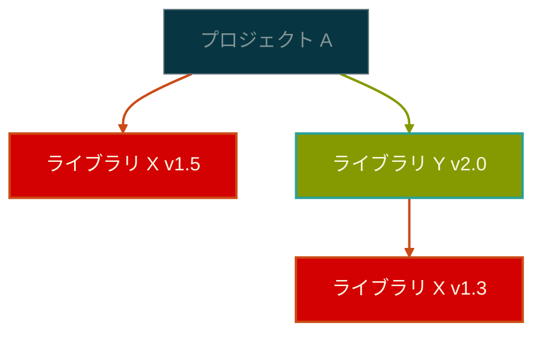

# セマンティックバージョニングの誕生と進化：ソフトウェアバージョン管理の哲学

ソフトウェア開発において最も基本的でありながら複雑な問題の一つが、まさにバージョン管理です。プロジェクトが成長し、ユーザーが増えるにつれて、「このライブラリをアップデートしても大丈夫だろうか？」という疑問は、開発者にとって絶え間ない悩みの種となりました。セマンティックバージョニングは、このような混乱の中から生まれた秩序のシステムです。

## 無秩序の時代：セマンティックバージョニング以前

### 初期バージョン管理の混沌

1990年代と2000年代初頭、ソフトウェアのバージョン管理は文字通り無法地帯でした。開発者たちはそれぞれ独自の方法でバージョンを付け、これが次のような混乱を引き起こしました。

**創造的だが予測不可能なバージョン**：
- Linux カーネルの初期バージョン：0.01、0.02、0.12、0.95、0.96、0.99、1.0
- Windows のマーケティング中心バージョン：3.1、95、98、ME、2000、XP
- 一部プロジェクトの独創的なバージョン：「Wombat」、「Fuzzy Wuzzy」、「Red Bean」

このような方式の問題点は明確でした。バージョン「2.1」から「2.2」へのアップデートが安全なのか、それとも全体システムを再設計する必要があるのか分からなかったのです。

### 依存性地獄（Dependency Hell）の登場

パッケージマネージャーが普及するにつれ、問題はさらに深刻になりました。一つのプロジェクトが複数のライブラリに依存し、各ライブラリがまた別のライブラリに依存する複雑な構造において、バージョン管理は悪夢となりました。

このような状況でライブラリ X のバージョン競合を解決するには、各バージョン間の互換性を一つ一つ確認する必要がありました。バージョン番号だけでは互換性を判断できなかったからです。

## セマンティックバージョニングの哲学：意味のある約束

### 誕生背景と哲学

2010年、GitHub の共同創設者である Tom Preston-Werner がセマンティックバージョニング仕様を発表しました。これは単純なルールではなく、開発者間の**社会的契約**でした。

セマンティックバージョニングの核心哲学を見てみましょう。

**予測可能性**：バージョン番号だけ見ても変更事項の性格を把握できなければなりません。
**信頼性**：バージョン番号は開発者とユーザー間の約束であり、これを破ることは信頼を損なうことです。
**自動化可能性**：ツールがバージョン番号を基に自動的に依存性を管理できなければなりません。

### MAJOR.MINOR.PATCH の意味論

セマンティックバージョニングは三つの数字を通じて変更事項の性格を明確に伝達します。

**MAJOR バージョンの増加**は「注意してください」という警告です。既存のコードがそのまま動作しない可能性があり、マイグレーションガイドを確認する必要があります。

**MINOR バージョンの増加**は「新しい機能が追加されました」という知らせです。既存機能はそのまま維持しながら新しい機能が追加されたという意味です。

**PATCH バージョンの増加**は「安全な更新です」という保証です。バグが修正されたり性能が改善されましたが、インターフェースは変更されていません。

## プレリリースの世界：開発とデプロイの間

### Alpha：内部テストの始まり

「Alpha」という用語は1960年代の IBM から始まりました。ギリシャ文字の最初の文字であるアルファは「第一段階」を意味しました。Alpha バージョンは開発チーム内部でのみ使用される初期バージョンで、基本機能は実装されているがバグが多く不安定な状態です。

Alpha バージョンは次のような特徴を持ちます：
- 核心機能のプロトタイプレベル
- 頻繁なクラッシュと予期しない動作
- 開発者のみが使用するのが一般的
- ユーザーインターフェースが完成していない

### Beta：外部検証の始まり

「Beta」は二番目のギリシャ文字で、Alpha の次の段階を意味します。1970年代から本格的に使用され始めた Beta バージョンは、外部ユーザーがテストできる程度に安定化されたバージョンです。

Beta テストの歴史的意味は非常に大きいです。これはソフトウェア開発が閉鎖的なプロセスから開放的な協力プロセスへと変化する転換点でした。ユーザーが開発プロセスに参加することで、実際の使用環境でのフィードバックを受けることができるようになりました。

### RC（Release Candidate）：リリース直前の最後の検証

Release Candidate は「リリース候補」という意味で、正式リリース直前のほぼ完成されたバージョンです。これ以上新しい機能を追加せず、重大なバグ修正のみが行われます。

RC の哲学は「慎重さ」です。ソフトウェアが一度リリースされると数多くのユーザーが依存することになるため、最後の瞬間まで品質を検証するという意志の表現です。

### Snapshot：開発中の動的なターゲット

Maven エコシステムで誕生した Snapshot 概念は独特です。「1.0-SNAPSHOT」のような形で表現され、これは「1.0 に向かっているがまだ完成していない状態」を意味します。

Snapshot の哲学的意味は「透明性」です。開発プロセスを隠さず継続的に公開することで、チームメンバーや他のプロジェクトで最新の開発状況を確認できるようにします。

## プラットフォーム別バージョニング文化の多様性

### Java/Maven エコシステム：厳格さと明確性

Java エコシステムはセマンティックバージョニングを最も厳格に従う傾向があります。これは Java の「一度書けばどこでも実行」という哲学と繋がっています。互換性を破ることは Java エコシステムにおいて非常に慎重に扱われることです。

**セマンティックバージョニング vs Java/Maven 比較**：

| 項目 | セマンティックバージョニング | Java/Maven |
|------|---------------|------------|
| **基本形式** | `1.2.3` | `1.2.3` |
| **Alpha** | `1.0.0-alpha.1` | `1.0.0-alpha-1` |
| **Beta** | `1.0.0-beta.2` | `1.0.0-beta-2` |
| **RC** | `1.0.0-rc.1` | `1.0.0-rc` |
| **Snapshot** | なし | `1.0.0-SNAPSHOT` |
| **互換性基準** | 原則的基準 | 非常に厳格 |

### JavaScript エコシステム：迅速な進化と柔軟性

JavaScript エコシステムはセマンティックバージョニングをより柔軟に適用します。Java のようにすべての API 変更を MAJOR として上げるのではなく、実際のユーザーへの影響度を考慮して判断します。

**セマンティックバージョニング vs JavaScript/npm 比較**：

| 項目 | セマンティックバージョニング | JavaScript/npm |
|------|---------------|----------------|
| **基本形式** | `1.2.3` | `1.2.3` |
| **Alpha** | `1.0.0-alpha.1` | `1.0.0-alpha.1` |
| **Beta** | `1.0.0-beta.2` | `1.0.0-beta.2` |
| **RC** | `1.0.0-rc.1` | `1.0.0-rc.1` |
| **範囲指定** | なし | `^1.2.3`、`~1.2.3` |
| **互換性判断** | 原則的基準 | 実用的基準 |

### Python エコシステム：実用主義的アプローチ

Python は PEP 440 を通じて独自のバージョニング標準を確立しました。セマンティックバージョニングと似ていますが、独特の違いがあります。

> **PEP 440**：Python Enhancement Proposal 440 で、Python パッケージのバージョン識別と依存性仕様のための公式標準です。pip、PyPI などの Python パッケージ管理ツールがこの標準に従います。

**セマンティックバージョニング vs PEP 440 比較**：

| 項目           | セマンティックバージョニング         | PEP 440 (Python) |
| ------------ | --------------- | ---------------- |
| **基本形式**    | `1.2.3`         | `1.2.3`          |
| **Alpha**    | `1.0.0-alpha.1` | `1.0.0a1`        |
| **Beta**     | `1.0.0-beta.2`  | `1.0.0b2`        |
| **RC**       | `1.0.0-rc.1`    | `1.0.0rc1`       |
| **開発バージョン**    | なし              | `1.0.0.dev0`     |
| **Epoch**    | なし              | `1!2.0.0`        |
| **Local バージョン** | なし              | `1.0.0+ubuntu1`  |
| **互換性判断** | 原則的基準 | 実用主義的基準 |

## プロダクト管理の観点：技術とマーケティングのバランス

### 技術的バージョン vs マーケティングバージョン

実際のプロダクトでは技術的バージョンとマーケティングバージョンが異なる場合が多いです。Windows の場合を見てみましょう。

- Windows 10 内部バージョン：10.0.19041
- マーケティングバージョン：Windows 10 May 2020 Update
- 開発コードネーム：20H1

このような複雑性は異なる観点の要求事項を反映しています：
- **開発チーム**：技術的変更事項の正確な追跡
- **マーケティングチーム**：ユーザーに親しみやすく覚えやすい名前
- **サポートチーム**：問題解決のための正確なバージョン識別

### ユーザー期待値管理

バージョン番号はユーザーの期待値を形成します。「2.0」という数字は単純な識別子ではなく「完全に新しくなったプロダクト」というメッセージを伝達します。

成功したバージョン管理の事例を見ると次の通りです：
- **段階的改善**：Chrome の迅速なバージョンアップデート
- **革新的変化**：Python 2 から 3 への移行
- **安定性重視**：Ubuntu の LTS（Long Term Support）戦略

## 現実的ジレンマ：理論と実務の乖離

### 完璧なセマンティックバージョニングの限界

実際の開発現場では、セマンティックバージョニングを完璧に従うことが困難な場合があります。

**微細な変更事項**：バグ修正が意図せず既存の動作を変更することがあります。これが PATCH 変更なのか MAJOR 変更なのか判断が困難な場合があります。

**大規模組織の複雑性**：複数のチームが協力する大規模プロジェクトでは、すべての変更事項の影響を正確に把握することが困難です。

**レガシー互換性**：古いシステムとの互換性を維持しながら新しい機能を追加することは、しばしばセマンティックバージョニングの原則と衝突します。

### 組織別バージョンポリシーの必要性

成功したバージョン管理のためには、組織に適したポリシーが必要です。

**リリースサイクル**：セマンティックバージョニングの原則を維持しながら、組織のリリースサイクルに合った戦略が必要です。

**リスク評価**：変更事項のリスクを評価し、適切なバージョン増加戦略を立てる必要があります。

**コミュニケーション体系**：バージョン変更事項をチームメンバーやユーザーに効果的に伝達する方法が必要です。

## 未来への進化

セマンティックバージョニングは完成したシステムではなく、継続的に進化する概念です。クラウドネイティブ環境、マイクロサービスアーキテクチャ、継続的デプロイメント（CD）など新しい開発パラダイムが登場することで、バージョン管理にも新しいアプローチが必要になっています。

今後の課題を見ると次の通りです：
- API 進化と互換性管理の自動化
- 分散システムでのバージョン一貫性
- ユーザー中心のリリース情報伝達

セマンティックバージョニングは単純な番号付けルールではありません。これは開発者たちが作り出した秩序のシステムであり、信頼できるソフトウェアエコシステムを作るための共同の約束です。完璧ではありませんが、混沌の中から秩序を作り出す人間の知恵が込められた貴重な遺産と言えるでしょう。
