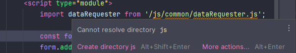
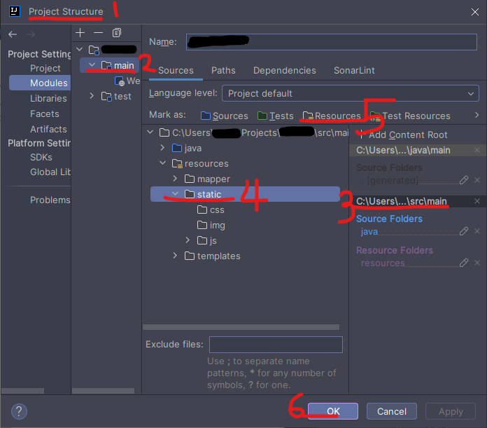

# IntelliJにおけるHTMLの静的リソース認識問題の解決

IntelliJでSpring BootプロジェクトのHTMLが静的リソースであるJavaScriptファイルを認識しない問題を解決します。

コードを記述する際に、IntelliJがJavaScriptファイルを認識しないために不便を感じることがあります。この問題は実際にアプリケーションを実行する際には影響を与えませんが、コーディング中にエラーを引き起こす可能性があるため、解決が必要です。

## 原因

Spring BootプロジェクトでHTMLにJavaScriptファイルをインポートする際に、JavaScriptのパスを正しく見つけられない問題が発生します。これはIntelliJのリソースディレクトリ設定が原因です。

## 解決方法

IntelliJの**Project Structure**ウィンドウで`src/main/resources/static`ディレクトリをリソースとして追加します。

> **ヒント**
>
> <kbd>Ctrl</kbd> + <kbd>Alt</kbd> + <kbd>Shift</kbd> + <kbd>S</kbd>を押すことで**Project Structure**ウィンドウを開くことができます。

