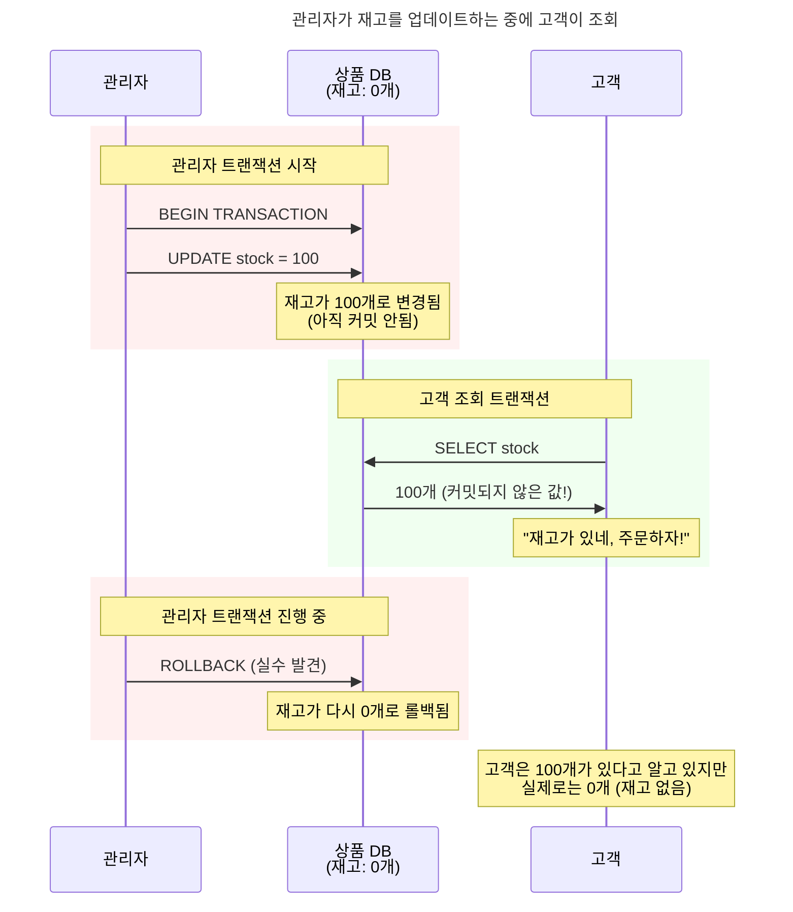
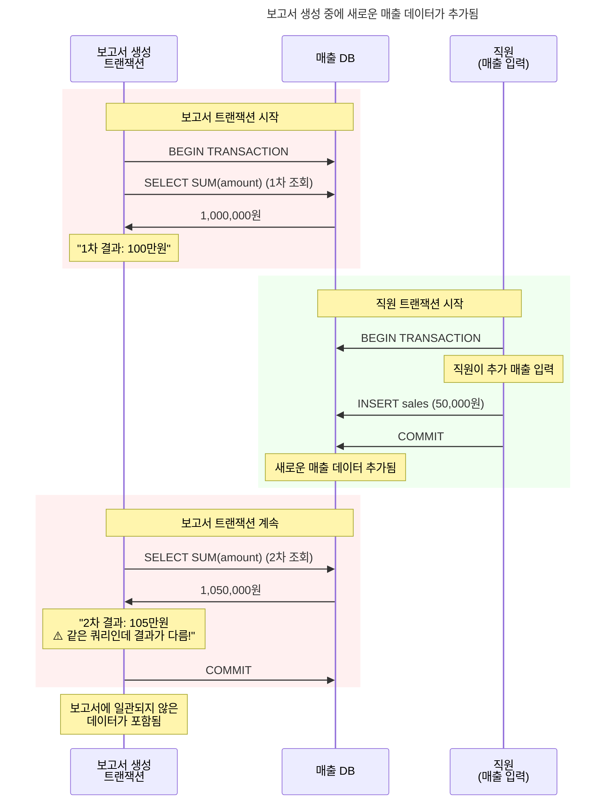
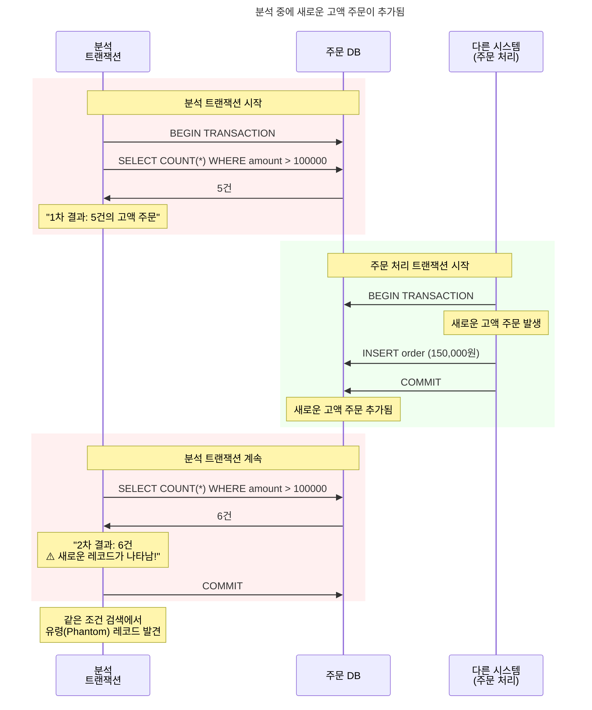
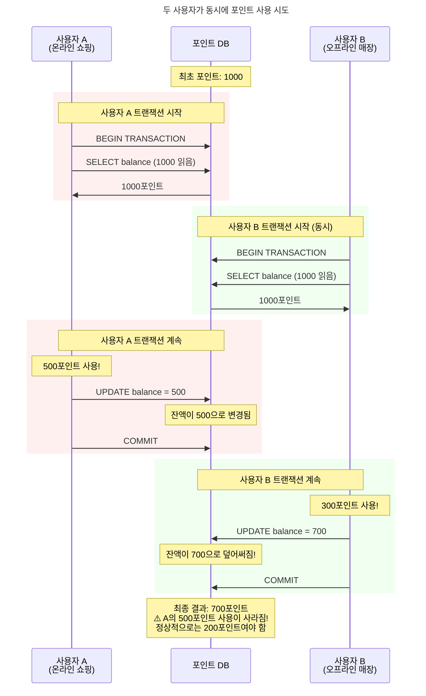
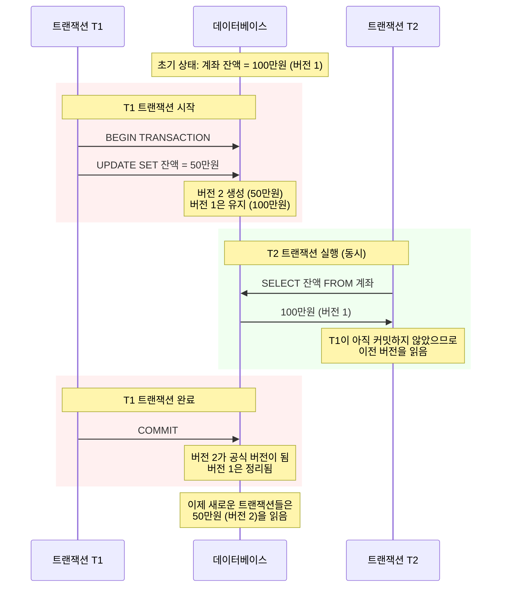

# 데이터베이스 동시성 문제와 ANSI SQL 표준화

동시에 100명이 은행 계좌에서 돈을 인출한다면 어떻게 될까요? 또는 온라인 쇼핑몰에서 마지막 재고 1개를 여러 명이 동시에 주문한다면? 이런 상황에서 데이터의 정합성을 보장하는 것이 바로 **동시성 제어**입니다.

본 글에서는 데이터베이스 동시성 문제의 본질과 ANSI SQL 표준화 과정을 살펴보겠습니다. 구체적인 구현 방식은 별도 글에서 다룰 예정입니다.

## 동시성 문제는 왜 발생할까?

### 근본적인 원인

데이터베이스는 **ACID** 특성을 보장해야 합니다.

- **Atomicity (원자성)**: 모든 작업이 완전히 성공하거나 완전히 실패
- **Consistency (일관성)**: 데이터베이스는 항상 일관된 상태 유지
- **Isolation (격리성)**: 동시 실행되는 트랜잭션들이 서로 영향을 주지 않음
- **Durability (지속성)**: 커밋된 데이터는 영구적으로 저장

이 중 **격리성**이 동시성 제어의 핵심입니다. 하지만 완벽한 격리는 성능을 크게 떨어뜨리므로, 적절한 균형점을 찾아야 합니다.

## 동시성 문제들

ANSI SQL-92 표준에서 정의한 세 가지 동시성 문제[^5](Dirty Read, Non-repeatable Read, Phantom Read)와 함께 실무에서 중요한 추가 문제를 살펴보겠습니다.

### Dirty Read (더티 리드)

**상황**: 온라인 쇼핑몰의 재고 관리 시스템

**문제점**: 아직 확정되지 않은 데이터를 읽어서 잘못된 판단을 하게 됩니다.

### Non-repeatable Read (반복 불가능한 읽기)

**상황**: 월말 보고서 생성 시스템

**문제점**: 같은 트랜잭션 내에서 같은 데이터를 읽었는데 결과가 달라집니다.

### Phantom Read (팬텀 리드)

**상황**: 통계 분석 시스템

**문제점**: 같은 조건으로 조회했는데 처음에 없던 데이터가 나타납니다.

### Lost Update (갱신 분실)

> [!note] ANSI SQL 표준과 Lost Update
> Lost Update는 ANSI SQL-92 표준에서 공식적으로 정의하지 않은 문제입니다[^7]. 1995년 Berenson et al.이 "A Critique of ANSI SQL Isolation Levels" 논문에서 이 문제를 체계적으로 식별했지만, **현재까지도 SQL:2008, SQL:2011, SQL:2016, SQL:2023 등 최신 SQL 표준에 공식적으로 추가되지 않았습니다**. 각 데이터베이스 벤더들이 자체적으로 이 문제를 인식하고 해결책을 구현하고 있지만, 표준화는 이루어지지 않은 상태입니다.

**상황**: 포인트 적립 시스템

**문제점**: 동시 수정으로 인해 한쪽 업데이트가 분실됩니다.

## ANSI SQL 표준화의 역사

### 혼란의 시대 (1980년대)

초기에는 각 데이터베이스 벤더마다 다른 방식을 사용했습니다.

- **IBM System R**: 엄격한 2단계 잠금 (2PL)
- **Oracle**: 행 수준 잠금 + 읽기 일관성
- **SQL Server**: 페이지 수준 잠금
- **각각 다른 용어와 동작 방식**

개발자들은 데이터베이스를 바꿀 때마다 새로운 동시성 모델을 학습해야 했습니다.

### ANSI SQL-92 표준의 등장

1992년, 드디어 표준이 만들어졌습니다[^5]. **격리 수준(Isolation Level)**이라는 개념을 도입해서 세 가지 동시성 문제(Dirty Read, Non-repeatable Read, Phantom Read)를 체계적으로 분류했습니다.

| 격리 수준 | Dirty Read | Non-repeatable Read | Phantom Read | 특징 |
|-----------|------------|---------------------|--------------|------|
| **READ UNCOMMITTED** | 허용 | 허용 | 허용 | 가장 빠름, 가장 위험 |
| **READ COMMITTED** | 방지 | 허용 | 허용 | 대부분 DBMS 기본값 |
| **REPEATABLE READ** | 방지 | 방지 | 허용 | MySQL InnoDB 기본값 |
| **SERIALIZABLE** | 방지 | 방지 | 방지 | 가장 안전, 가장 느림 |

> [!note] 표준과 실제 구현의 차이
> 데이터베이스마다 구현이 조금씩 다릅니다. 표준이 정해졌지만 최대한 따르려고 노력할 뿐, 실제 구현이 다르기 때문에 지켜지지 않을 때도 있습니다.

### 표준화의 의의와 현실의 벽

ANSI SQL-92 표준은 분명 의미 있는 발전이었습니다.

- **공통 언어**: 모든 개발자가 같은 용어를 사용하게 됨
- **예측 가능성**: 격리 수준별로 어떤 문제가 발생할지 예측 가능
- **선택의 자유**: 애플리케이션 특성에 맞는 격리 수준 선택
- **이식성**: 다른 데이터베이스로 이전이 용이해짐

하지만 ANSI 표준은 동시성 문제를 완벽하게 해결해주었지만, 그 당시의 **잠금 기반 기술**로는 심각한 성능 병목을 야기했습니다.

### 잠금 기반 구현의 성능 병목

ANSI SQL-92 표준 초기에는 **잠금 기반 방식**으로 격리 수준을 구현했기 때문에 높은 격리 수준에서 심각한 성능 병목이 발생했습니다.

**잠금 기반 REPEATABLE READ의 문제점**
- 읽은 모든 행에 **공유 잠금**을 걸고 트랜잭션 끝까지 유지
- 장시간 실행되는 보고서 쿼리가 모든 업데이트를 차단
- 하나의 분석 작업이 전체 시스템을 마비시킴

**잠금 기반 SERIALIZABLE의 문제점**  
- **범위 잠금**으로 조건에 맞는 모든 데이터를 잠금
- `WHERE salary > 5000` 조건이면 해당하는 모든 직원 데이터가 잠김
- 실질적으로 테이블 전체 잠금과 다름없는 효과

> [!note] 현대 MVCC 기반 데이터베이스의 차이점
> MySQL InnoDB, PostgreSQL 같은 MVCC 기반 데이터베이스에서는 이런 문제가 없습니다. REPEATABLE READ에서도 읽기 잠금을 사용하지 않기 때문에 MySQL이 기본 격리 수준으로 사용할 수 있는 것입니다.

### 현실적인 타협점

이러한 성능 문제로 인해 높은 격리 수준은 실무에서 사용하기 어려웠습니다. 대부분의 애플리케이션은 성능상 타협 가능한 `READ COMMITTED`만 사용할 수밖에 없었고, `REPEATABLE READ`와 `SERIALIZABLE`은 "표준에는 있지만 실무에서는 쓸 수 없는" 기능이 되어버렸습니다.

## MVCC: 혁신적인 해결책

### 이론적 기초와 초기 구현

ANSI 표준보다 훨씬 이전부터 데이터베이스 연구자들은 동시성 문제를 근본적으로 해결할 방법을 모색하고 있었습니다. 이들의 노력은 결국 Multi-Version Concurrency Control이라는 혁신적인 접근법으로 결실을 맺게 됩니다.

MVCC의 이론적 토대는 1978년 MIT의 David P. Reed가 발표한 박사 논문에서 처음 제시되었습니다[^6]. Reed는 여러 버전의 데이터를 동시에 유지함으로써 읽기와 쓰기 작업 간의 충돌을 피할 수 있다는 핵심 아이디어를 제안했습니다. 이후 1980년대 초 여러 연구자들이 이 개념을 분산 데이터베이스 환경으로 확장하여 체계적인 이론으로 발전시켰습니다.

이론에서 실제 구현으로의 첫 번째 성공은 1984년 Digital Equipment Corporation의 VAX Rdb/ELN이었습니다. 이는 MVCC를 적용한 최초의 상용 데이터베이스로, 이론적 개념이 실제 비즈니스 환경에서도 작동할 수 있음을 증명한 기념비적인 사건이었습니다. 하지만 VAX Rdb는 DEC의 몰락과 함께 주류에서 멀어졌고, 현재는 Oracle Rdb로 이름을 바꾸어 OpenVMS 플랫폼에서만 사용되는 틈새 제품이 되었습니다.

> [!note] Oracle Rdb의 현재 상황
> VAX Rdb는 Oracle이 인수하여 현재 Oracle Rdb로 불리지만, OpenVMS라는 특수한 플랫폼에서만 동작하여 주류 시장에서는 거의 사용되지 않습니다. OpenVMS는 1970년대 DEC이 개발한 레거시 운영체제로, 현재 전체 OS 시장 점유율의 0.1%[^1]에 불과한 틈새 시장 제품입니다.

2년 후인 1986년, UC Berkeley에서는 학술적 관점에서 MVCC를 더욱 발전시킨 POSTGRES 프로젝트가 시작되었습니다[^2]. Michael Stonebraker 교수가 이끈 이 프로젝트는 상용 제품과는 다른 접근을 보여주었는데, "시간 여행(Time Travel)"이라는 독특한 기능을 통해 과거 특정 시점의 데이터를 조회할 수 있게 했습니다. 흥미롭게도 이 두 데이터베이스 모두 1992년 ANSI SQL-92 표준이 제정되기 훨씬 전에 MVCC를 구현했다는 점에서, 실제 구현이 표준화보다 앞서갔음을 보여주는 사례가 되었습니다.

> [!note] PostgreSQL의 시간 여행 기능 제거
> POSTGRES의 시간 여행 기능은 PostgreSQL 6.2 버전(1997년)에서 제거되었습니다[^3]. 주된 이유는 **성능 오버헤드**와 **스토리지 사용량 급증** 때문이었습니다. 모든 데이터 변경 이력을 보관해야 해서 디스크 공간이 빠르게 소모되고, 과거 버전 검색 시 성능이 크게 저하되었습니다. 대신 현재 PostgreSQL은 **MVCC만 유지**하여 동시성 제어에 집중하고 있습니다.

상용 시장에서 MVCC의 성공을 확실히 입증한 것은 Oracle이었습니다[^4]. 1984년 Oracle v4부터 "읽기 일관성(Read Consistency)"을 구현하기 시작했고, 이는 업계 최초의 상용 데이터베이스 MVCC 기능이었습니다. 1990년대에는 롤백 세그먼트 기반의 성숙한 MVCC 시스템을 완성했고, 2001년 Oracle 9i에서는 Undo 테이블스페이스를 도입하여 자동 관리 기능까지 추가함으로써, MVCC 기술이 대규모 상용 환경에서도 충분히 안정적이고 효율적으로 작동할 수 있음을 완전히 증명했습니다.

### MVCC의 핵심 아이디어

기존 방식은 **하나의 데이터에 잠금**을 걸었다면, **Multi-Version Concurrency Control**은 **여러 버전의 데이터**를 동시에 관리하는 혁신적 해결책으로 접근했습니다.

### MVCC의 혁신적 장점

MVCC가 가져온 변화는 데이터베이스 세계에 혁명과 같았습니다.

**가장 큰 변화는 읽기와 쓰기가 서로 방해하지 않게 된 것입니다.** 기존 잠금 방식에서는 보고서를 생성하는 긴 읽기 작업이 시작되면 다른 모든 업데이트가 멈춰 서야 했습니다. 하지만 MVCC에서는 읽기 작업이 절대 차단되지 않습니다. 월말 결산 보고서를 뽑는 동안에도 고객들의 주문 처리는 계속 진행됩니다.

**두 번째 혁신은 일관된 읽기를 보장한다는 점입니다.** 트랜잭션이 시작되는 순간의 데이터 스냅샷을 보장하기 때문에, 보고서 생성 중에 다른 곳에서 데이터를 변경해도 보고서 결과는 일관성을 유지합니다. 이는 특히 복잡한 분석 작업에서 매우 중요한 특성입니다.

**결과적으로 시스템의 동시성이 극적으로 향상되었습니다.** 더 많은 사용자가 동시에 작업할 수 있게 되었고, 시스템 전체 처리량이 대폭 증가했습니다. 이전에는 상상할 수 없었던 수준의 동시 접속과 처리량을 달성할 수 있게 된 것입니다.

## 실무에서 알아야 할 것들

### 실무 격리 수준 선택 가이드

격리 수준을 선택할 때는 애플리케이션의 요구사항과 성능 간의 균형을 고려해야 합니다. 각 격리 수준이 어떤 상황에서 사용되는지 구체적으로 살펴보겠습니다.

**READ UNCOMMITTED**는 가장 낮은 격리 수준으로, 정확성보다는 속도가 중요한 상황에서 사용됩니다. 실시간 모니터링 대시보드나 시스템 상태를 확인하는 화면에서 활용되며, 약간의 부정확한 데이터가 있더라도 빠른 응답이 필요한 대략적인 통계 조회에 적합합니다.

**READ COMMITTED**는 대부분의 웹 애플리케이션에서 기본으로 사용하는 격리 수준입니다. 일반적인 CRUD 작업에서 충분한 일관성을 제공하면서도 좋은 성능을 보장합니다. 사용자 프로필 수정, 게시글 작성, 댓글 달기 같은 일상적인 애플리케이션 기능들이 이 수준에서 안전하게 동작합니다.

**REPEATABLE READ**는 보고서 생성이나 데이터 마이그레이션처럼 일관된 데이터 스냅샷이 필요한 작업에 사용됩니다. 장시간 실행되는 분석 쿼리나 배치 처리 과정에서 중간에 데이터가 변경되어도 일관된 결과를 보장해야 할 때 선택합니다.

**SERIALIZABLE**은 가장 높은 격리 수준으로, 완벽한 일관성이 필수인 금융 거래 시스템에서 사용됩니다. 계좌 이체, 재고 관리, 항공편 예약처럼 동시성 오류가 비즈니스에 치명적인 영향을 미칠 수 있는 시스템에서 선택하는 격리 수준입니다.

### 현대 데이터베이스의 특징

오늘날 사용되는 대부분의 데이터베이스는 MVCC 기반으로 구현되어 있습니다. 이는 앞서 살펴본 동시성 문제들을 효과적으로 해결하면서도 높은 성능을 제공하기 때문입니다.

격리 수준의 기본값은 대부분 **READ COMMITTED**로 설정되어 있습니다. 이는 일반적인 애플리케이션에서 가장 균형 잡힌 선택이기 때문입니다. 다만 MySQL의 InnoDB 엔진만은 예외적으로 **REPEATABLE READ**를 기본값으로 사용하는데, 이는 MySQL의 복제(Replication) 메커니즘과 관련된 역사적 이유 때문입니다.

또한 현대 데이터베이스들은 **자동 데드락 감지 및 해결** 기능을 제공합니다. 시스템이 데드락 상황을 자동으로 탐지하고, 가장 적은 비용으로 해결할 수 있는 트랜잭션을 선택해서 롤백시킵니다. 개발자가 직접 데드락을 처리할 필요가 없어진 것입니다.

**스냅샷 격리(Snapshot Isolation)** 지원도 현대 데이터베이스의 핵심 기술 중 하나입니다. 이는 MVCC의 발전된 형태로, 트랜잭션 시작 시점의 일관된 데이터 뷰를 제공하면서도 높은 동시성을 달성할 수 있게 해줍니다.

### 앞으로의 발전 방향

동시성 제어 기술은 현재도 빠르게 발전하고 있습니다. 특히 클라우드와 분산 시스템의 확산에 따라 새로운 도전과제들이 등장하고 있습니다.

**분산 데이터베이스 환경**에서는 여러 서버에 걸쳐 있는 데이터 간의 동시성을 제어해야 하는 복잡한 문제가 있습니다. 기존의 단일 서버 기반 MVCC로는 해결하기 어려운 분산 트랜잭션과 글로벌 일관성 문제를 해결하기 위한 새로운 알고리즘들이 연구되고 있습니다.

**클라우드 네이티브 환경**에서는 마이크로서비스 간의 데이터 일관성을 보장하는 것이 중요한 과제입니다. 각 서비스가 독립적인 데이터베이스를 가지면서도 전체 시스템의 일관성을 유지하기 위한 이벤트 소싱, CQRS, Saga 패턴 같은 새로운 접근법들이 주목받고 있습니다.

**실시간 분석 시스템**에서는 온라인 트랜잭션 처리(OLTP)와 온라인 분석 처리(OLAP)의 경계가 사라지고 있습니다. HTAP(Hybrid Transactional/Analytical Processing) 시스템에서는 실시간으로 들어오는 트랜잭션 데이터를 즉시 분석에 활용할 수 있어야 하므로, 기존과는 다른 동시성 제어 전략이 필요합니다.

동시성 제어의 구체적인 구현 방식과 실무 적용 방법은 다음 글에서 더 자세히 다루겠습니다. 데이터베이스를 다루는 모든 개발자에게 이 기초 지식이 견고한 토대가 되기를 바랍니다.

---

[^1]: [Wikipedia - OpenVMS 운영체제 개요](https://en.wikipedia.org/wiki/OpenVMS)
[^2]: Stonebraker, M. (1986). "The design of POSTGRES." Proceedings of the 1986 ACM SIGMOD International Conference on Management of Data
[^3]: [PostgreSQL 공식 문서 - PostgreSQL의 간략한 역사](https://www.postgresql.org/docs/current/history.html)
[^4]: Oracle Corporation. "Oracle Database Concepts Guide" - Oracle Version History and MVCC Implementation Timeline
[^5]: ANSI X3.135-1992, American National Standard for Information Systems -- Database Language -- SQL (1992)
[^6]: Reed, D. P. (1978). "Naming and Synchronization in a Decentralized Computer System." MIT Laboratory for Computer Science Technical Report MIT/LCS/TR-205
[^7]: Berenson, H., Bernstein, P., Gray, J., Melton, J., O'Neil, E., & O'Neil, P. (1995). "A Critique of ANSI SQL Isolation Levels." Proceedings of the 1995 ACM SIGMOD International Conference on Management of Data

