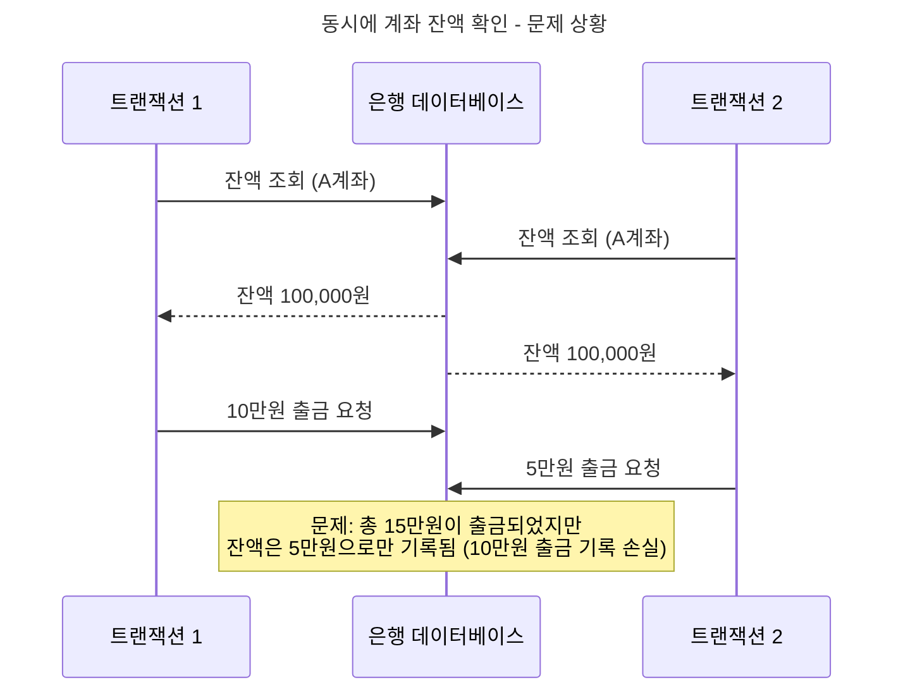
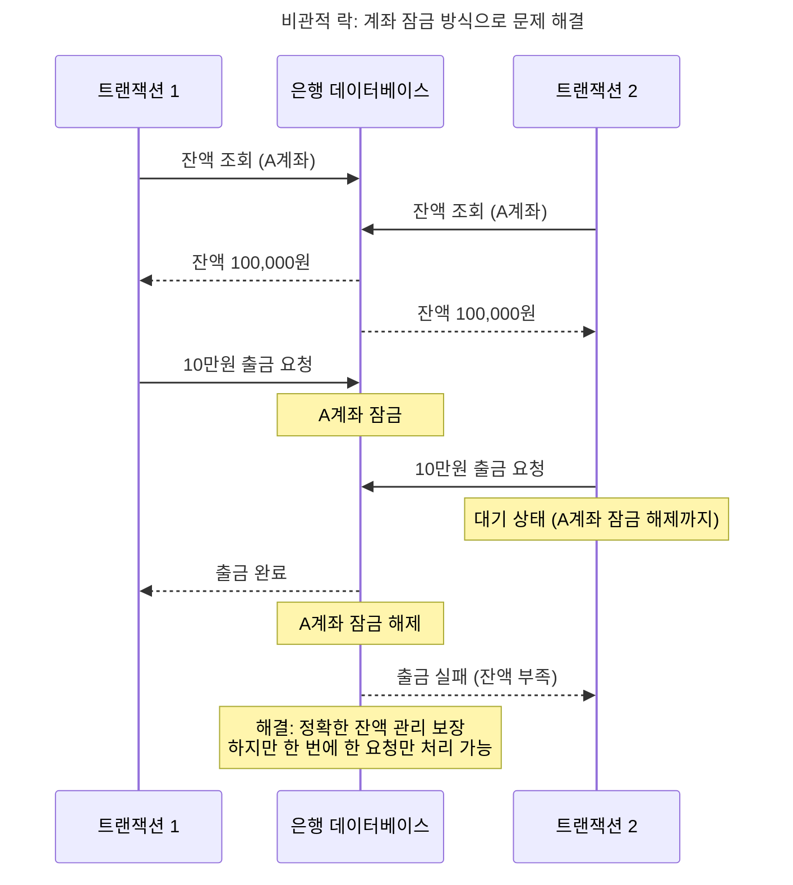
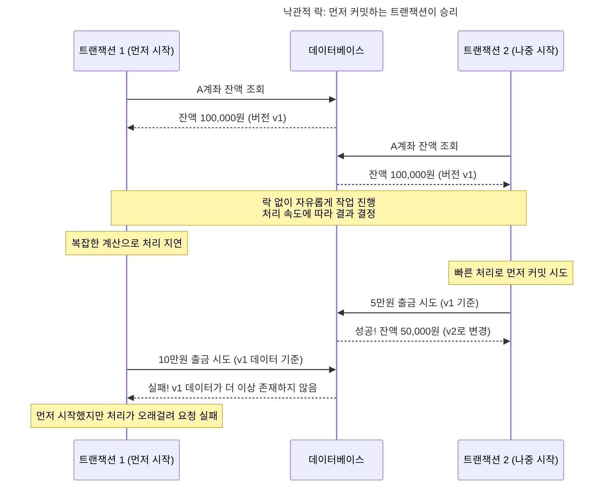

# 데이터베이스 락킹의 진화: 비관적 락에서 낙관적 락까지

은행에서 돈을 인출하는 방식을 생각해보세요. 전통적인 은행 시스템에서는 한 번에 한 고객씩만 특정 계좌에 접근할 수 있습니다. 한 고객이 거래 중이면 다른 요청은 반드시 기다려야 합니다. 반면 현대적인 ATM 네트워크에서는 여러 고객이 각자 다른 ATM에서 동시에 거래를 시도할 수 있지만, 동시 거래 문제가 발생하면 "거래 중 오류가 발생했습니다. 다시 시도해주세요"라는 메시지를 받게 됩니다.

이 두 가지 방식이 바로 데이터베이스 세계의 **비관적 락**과 **낙관적 락**의 핵심 철학을 보여줍니다.

1970년대 초, 최초의 관계형 데이터베이스가 등장했을 때부터 개발자들은 하나의 근본적인 문제와 씨름해왔습니다. 여러 사용자가 동시에 같은 데이터를 수정하려 할 때, 어떻게 데이터 일관성을 보장할 것인가?

## 동시성 문제의 발견: 1970년대의 딜레마

1970년대 초 IBM System R이 개발될 당시, 연구자들은 곧바로 치명적인 문제를 발견했습니다. 여러 사용자가 동시에 같은 데이터를 수정할 때 발생하는 **동시성 문제**였죠.

간단한 예시로 살펴보겠습니다. 1980년대 은행 시스템에서 두 개의 다른 터미널에서 동시에 같은 계좌에 접근한다면 어떻게 될까요?

이런 상황을 **갱신 손실 문제(Lost Update Problem)**라고 부르며, 1970년대부터 데이터베이스 연구자들을 괴롭혀온 고전적인 동시성 문제입니다.

## 전통적인 락: 데이터베이스와 함께 태어난 기본 메커니즘

초기 데이터베이스 시스템들의 해답은 직관적이고 단순했습니다. "문제가 생기기 전에 아예 막아버리자."

이 방식은 처음에는 단순히 **"락(Lock)"**이라고 불렸습니다. 특별한 형용사가 붙지 않은, 데이터베이스의 기본적인 동시성 제어 방법이었죠. 

원리는 단순했습니다. 하나의 데이터에는 한 번에 한 개의 트랜잭션만 접근할 수 있고, 어떤 트랜잭션이 언제 접근하는지는 데이터베이스가 알아서 관리했습니다. 전통적인 은행 시스템에서 한 거래가 계좌를 처리하는 동안 다른 거래가 같은 계좌에 접근할 수 없는 것처럼 말이죠.

## 비관적 락: 기존 방식에 덧씌워진 새로운 이름

"비관적 락(Pessimistic Locking)"이라는 이름은 사실 나중에 생겨난 용어입니다. 1981년 새로운 접근법인 "낙관적 락"이 등장하면서, 기존의 전통적인 락 방식을 구분하기 위해 "비관적"이라는 형용사가 덧씌워진 것입니다. 

본질적으로는 똑같은 방식이지만, 새로운 관점에서 바라본 이름을 얻게 된 셈이죠.

### 비관적 락: 계좌를 잠그는 은행

비관적 락에서는 데이터베이스가 모든 책임을 집니다. 요청이 특정 데이터에 접근하면 그 데이터를 잠그고, 작업이 끝날 때까지 다른 요청은 접근할 수 없게 합니다. 

개발자나 사용자는 특별히 신경 쓸 것이 없습니다. 데이터베이스가 알아서 순서를 정해주고 정확한 데이터 처리를 보장하니까요. 하지만 잠긴 데이터는 첫 번째 요청의 작업이 완전히 마무리될 때까지 접근이 불가능하고, 다른 요청들은 대기해야 합니다.

### 비관적 락의 특징

비관적 락은 "충돌이 자주 일어날 것이다"라고 가정합니다. 그래서 데이터베이스가 모든 동시성 제어를 담당하고, 개발자는 락에 대해 신경 쓸 필요가 없죠. 확실한 데이터 일관성을 보장하지만, 그 대신 동시 처리 능력이 제한됩니다.

## 1981년, 철학의 전환점

1980년대 중반, 시스템 규모가 커지고 동시 사용자가 급증하면서 전통적 락킹 방식의 한계가 명확해졌습니다. 한 번에 하나의 요청만 처리하는 방식으로는 증가하는 동시 접근 요구를 감당할 수 없었죠.

1981년, H.T. Kung과 J.T. Robinson이 ACM Transactions on Database Systems에 발표한 논문 "On Optimistic Methods for Concurrency Control"은 데이터베이스 락킹 역사의 전환점이 되었습니다.

이 논문에서 연구자들은 기존의 락킹 방식을 **"비관적(Pessimistic)"**이라고 명명했습니다. 충돌이 자주 일어날 것이라고 가정하고 미리 차단하는 방식이기 때문이죠. 그리고 새로운 접근법인 **"낙관적(Optimistic)"** 방식을 제안했습니다. 충돌이 드물 것이라고 가정하고, 일단 작업을 진행한 후 나중에 충돌을 검사하는 방식이었습니다.

이 연구를 통해 처음으로 동시성 제어 기법이 **두 가지 철학**으로 명확히 분류되었고, 오늘날까지 사용되는 "비관적 락"과 "낙관적 락"이라는 용어가 탄생했습니다.

## 낙관적 락의 혁신: "충돌은 드물다"는 대담한 가정

1981년 연구자들이 제안한 낙관적 락의 핵심 아이디어는 기존 접근법과 정반대였습니다. 전통적인 락이 "충돌이 자주 일어날 것이니 미리 막자"였다면, 낙관적 락은 "충돌은 드물게 일어날 것이니 일단 진행하고 나중에 확인하자"는 철학이었습니다.

### 낙관적 락: 실제로는 "락"이 아닌 충돌 감지 메커니즘

흥미롭게도 "낙관적 락"이라는 이름과 달리, 이 방식은 실제로 데이터를 잠그지 않습니다. 대신 **충돌 감지와 의도적 실패**를 통해 동시성을 제어하는 메커니즘입니다.

낙관적 락의 핵심 목적은 **"충돌이 거의 발생하지 않는 데이터에 대해서는 굳이 락을 걸지 말자"**는 것입니다. 모든 트랜잭션이 자유롭게 데이터를 읽고 수정 작업을 준비할 수 있지만, 실제로 데이터를 변경하려는 트랜잭션 커밋 직전에만 충돌을 검사합니다. 충돌이 발견되면 나중에 시도한 트랜잭션을 의도적으로 실패시키고, 개발자가 재시도 로직을 구현해야 합니다.

### 낙관적 락의 주요 특징

**충돌 예방이 아닌 충돌 감지 방식**입니다. 비관적 락처럼 미리 막는 것이 아니라, 충돌이 실제로 발생했을 때만 감지하고 처리합니다.

**개발자가 충돌 처리 책임을 집니다**. 충돌 발생 시 재시도 로직을 개발자가 직접 구현해야 하므로 개발 복잡도가 증가합니다. 하지만 충돌이 드문 환경에서는 매우 효율적입니다.

## 두 가지 락킹 방식의 현대적 발전

### 비관적 락의 진화: 더 정교한 락킹 메커니즘

전통적인 락킹 방식도 가만히 있지 않았습니다. 현대의 비관적 락은 다음과 같이 발전했습니다.

**세분화된 락킹**을 통해 락킹 범위를 최적화했습니다. 전체 테이블을 잠그는 대신 행 단위나 페이지 단위로 락을 걸어 동시성을 높였죠.

**효율적인 대기열 관리**로 락 대기 큐와 타임아웃 설정을 통해 대기 시간을 예측할 수 있게 되었습니다.

또한 **즉시 응답 옵션**으로 락을 즉시 획득할 수 없으면 대기하지 않고 바로 실패하는 선택권을 제공합니다. **스킵 락**을 통해서는 이미 락이 걸린 데이터는 건너뛰고 다음 데이터를 처리하는 방식도 등장했습니다.

### 낙관적 락의 발전: 구현 방식의 다양화

낙관적 락은 처음에 **버전 컬럼(Version Column)** 방식으로 구현되었습니다. 각 데이터에 버전 번호를 부여하여 변경사항을 추적하는 방법이었죠. 하지만 시간이 지나면서 다양한 구현 방식이 등장했습니다.

**타임스탬프 기반** 방식은 데이터의 마지막 수정 시간을 기준으로 충돌을 감지합니다. **체크섬 기반** 방식은 데이터 전체의 해시값으로 변경 여부를 확인하고, **전체 데이터 비교** 방식은 읽었던 데이터와 현재 데이터를 직접 비교합니다. **CAS (Compare-And-Swap)** 방식은 하드웨어 차원에서 지원하는 원자적 연산을 활용하여 더 효율적인 충돌 감지를 구현했습니다.

기술적 발전과 함께 **단계적 검증**으로 여러 데이터를 한 번에 수정할 때 더 정확한 충돌 감지가 가능해졌고, **지연된 검증**으로 트랜잭션 완료 직전에만 충돌을 확인하여 성능을 향상시켰습니다.

## 현대적 선택 가이드: 어떤 식당 방식을 택할 것인가?

### 비관적 락(전용 접근 방식)이 적합한 경우

데이터베이스 관점에서 보면 다음과 같은 상황에서 비관적 락이 유리합니다.

- **금융 거래 시스템**: 실수가 용납되지 않는 중요한 거래 (결제, 송금)
- **재고 관리 시스템**: 동시 업데이트가 자주 일어나는 인기 상품 관리
- **다단계 업무 처리**: 여러 단계가 순서대로 진행되어야 하는 복잡한 트랜잭션
- **높은 신뢰성 요구**: 클라이언트가 대기하더라도 완벽한 데이터 일관성을 원하는 경우

### 낙관적 락(충돌 감지 방식)이 적합한 경우

다음과 같은 상황에서는 낙관적 락이 효과적입니다.

- **일반적인 애플리케이션**: 빠른 응답이 중요한 대부분의 온라인 서비스
- **사용자 데이터 관리**: 충돌이 드문 개인 프로필이나 설정 관리
- **비동기 처리 환경**: 클라이언트가 직접 재시도 로직을 구현할 수 있는 환경
- **대용량 처리**: 많은 동시 요청을 처리해야 하는 분산 시스템

## 실제 시스템에서의 선택: 데이터 특성에 따른 적용

실제 시스템에서는 모든 데이터에 하나의 락킹 방식만 사용하지 않습니다. 데이터의 특성과 접근 패턴에 따라 적절한 방식을 선택하는 것이 일반적입니다.

### 데이터 유형별 전략

**개인 데이터**에는 낙관적 락이 효과적입니다. 사용자 프로필, 개인 설정, 개인 문서 등은 동시 수정이 거의 일어나지 않으므로 빠른 처리가 가능합니다.

**공유 리소스**의 경우 비관적 락이 필요합니다. 재고 수량, 좌석 예약, 계좌 잔액 등은 동시 접근이 빈번하므로 정확성이 우선되어야 합니다.

### 시스템 규모별 접근

**소규모 시스템**에서는 단순한 비관적 락으로도 충분한 경우가 많습니다. 동시 사용자가 적어 락 경합이 심하지 않고, 구현과 관리가 단순합니다.

**대규모 시스템**에서는 상황에 따른 전략 선택이 중요합니다. 데이터 특성과 접근 패턴을 분석하여 테이블이나 기능별로 서로 다른 락킹 전략을 적용하는 것이 일반적입니다.

## 성능 특성: 충돌 빈도가 핵심 변수

두 방식의 성능은 **충돌 발생 빈도**에 따라 크게 달라집니다. 일반적인 특성은 다음과 같습니다.

**충돌이 드문 상황**에서는 낙관적 락이 유리합니다. 대부분의 트랜잭션이 재시도 없이 성공하므로 락을 획득하고 해제하는 오버헤드가 없어 더 빠른 처리가 가능합니다.

**충돌이 빈번한 상황**에서는 비관적 락이 유리합니다. 낙관적 락에서는 재시도가 많아져 전체 처리 시간이 급격히 증가하지만, 비관적 락은 대기 시간은 있어도 재시도는 없으므로 예측 가능한 성능을 제공합니다.

**전환점은 보통 충돌률 20-30% 근처**에서 나타납니다. 이는 시스템 특성과 재시도 비용에 따라 달라질 수 있지만, 이 지점을 넘어서면 비관적 락이 더 효율적인 경우가 많습니다.

## 결론: 완벽한 솔루션은 없다

50년에 걸친 진화의 핵심 교훈은 다음과 같습니다:

**"완벽한 락킹 전략은 없다. 사용자와 상황에 맞는 최적 조합을 찾는 것이 핵심이다."**

가장 중요한 것은 **실제 데이터와 사용 패턴을 측정**하는 것입니다. 이론적인 판단보다는 실제 충돌 발생률, 응답 시간, 사용자 만족도를 기준으로 결정해야 합니다. 또한 시스템이 성장하면서 패턴이 바뀔 수 있으므로 **지속적인 모니터링과 조정**이 필요합니다.

## 마치며: 측정과 검증의 중요성

1970년대 IBM 연구자들이 발견한 동시성 제어 문제는 오늘날에도 여전히 모든 데이터 시스템의 핵심 과제입니다. 50년이 지난 지금, 우리는 비관적 락과 낙관적 락이라는 두 가지 기본 접근법과 그 변형들을 활용할 수 있게 되었습니다.

하지만 기술이 아무리 발전해도 변하지 않는 원칙이 있습니다. **측정 없는 최적화는 추측일 뿐**이라는 것입니다. 어떤 락킹 전략이 최적인지는 실제 데이터와 사용 패턴을 분석해야만 알 수 있습니다.

여러분이 다음 프로젝트에서 락킹 전략을 선택할 때는 이론보다 실측을 우선하시기 바랍니다. 현재 시스템의 충돌 발생률을 측정하고, 사용자의 실제 접근 패턴을 분석하고, 작은 범위에서 테스트해보세요. 그리고 시스템이 성장하면서 패턴이 바뀔 수 있다는 점을 기억하여 지속적으로 관찰하고 조정하는 것이 진정한 데이터베이스 마스터리입니다.

완벽한 락킹 전략은 존재하지 않습니다. 하지만 여러분의 사용자와 시스템에 가장 적합한 전략은 반드시 찾을 수 있습니다.
