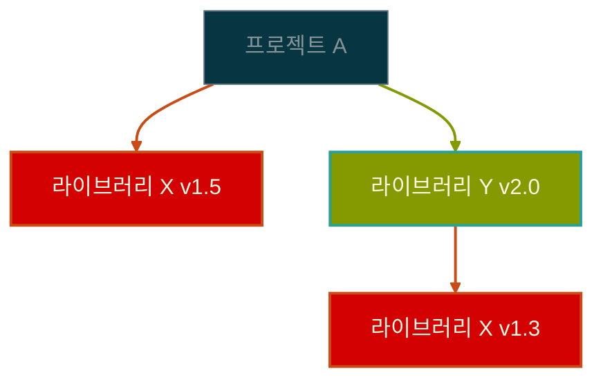

# 시멘틱 버저닝의 탄생과 진화: 소프트웨어 버전 관리의 철학

소프트웨어 개발에서 가장 기본적이면서도 복잡한 문제 중 하나가 바로 버전 관리입니다. 프로젝트가 성장하고 사용자가 늘어날수록, "이 라이브러리를 업데이트해도 괜찮을까?"라는 질문은 개발자들에게 끊임없는 고민거리가 되었습니다. 시멘틱 버저닝은 이런 혼란 속에서 탄생한 질서의 체계입니다.

## 무질서의 시대: 시멘틱 버저닝 이전

### 초기 버전 관리의 혼돈

1990년대와 2000년대 초반, 소프트웨어 버전 관리는 말 그대로 무법지대였습니다. 개발자들은 각자 나름의 방식으로 버전을 매겼고, 이는 다음과 같은 혼란을 야기했습니다.

**창의적이지만 예측 불가능한 버전들**:
- Linux 커널의 초기 버전: 0.01, 0.02, 0.12, 0.95, 0.96, 0.99, 1.0
- Windows의 마케팅 중심 버전: 3.1, 95, 98, ME, 2000, XP
- 일부 프로젝트의 독창적 버전: "Wombat", "Fuzzy Wuzzy", "Red Bean"

이런 방식의 문제점은 명확했습니다. 버전 "2.1"에서 "2.2"로 업데이트하는 것이 안전한지, 아니면 전체 시스템을 다시 설계해야 하는지 알 수 없었던 것입니다.

### 의존성 지옥(Dependency Hell)의 등장

패키지 매니저가 보편화되면서 문제는 더욱 심각해졌습니다. 하나의 프로젝트가 여러 라이브러리에 의존하고, 각 라이브러리가 또 다른 라이브러리들에 의존하는 복잡한 구조에서 버전 관리는 악몽이 되었습니다.

이런 상황에서 라이브러리 X의 버전 충돌을 해결하려면, 각 버전 간의 호환성을 일일이 확인해야 했습니다. 버전 번호만으로는 호환성을 판단할 수 없었기 때문입니다.

## 시멘틱 버저닝의 철학: 의미 있는 약속

### 탄생 배경과 철학

2010년, GitHub의 공동창립자 톰 프레스턴-워너(Tom Preston-Werner)가 시멘틱 버저닝 명세를 발표했습니다. 이는 단순한 규칙이 아닌, 개발자들 간의 **사회적 계약**이었습니다.

시멘틱 버저닝의 핵심 철학을 살펴보겠습니다.

**예측 가능성**: 버전 번호만 보고도 변경사항의 성격을 파악할 수 있어야 합니다.
**신뢰성**: 버전 번호는 개발자와 사용자 간의 약속이며, 이를 어기는 것은 신뢰를 깨뜨리는 일입니다.
**자동화 가능성**: 도구들이 버전 번호를 기반으로 자동으로 의존성을 관리할 수 있어야 합니다.

### MAJOR.MINOR.PATCH의 의미론

시멘틱 버저닝은 세 개의 숫자를 통해 변경사항의 성격을 명확히 전달합니다.

**MAJOR 버전 증가**는 "주의하세요"라는 경고입니다. 기존 코드가 그대로 작동하지 않을 수 있으며, 마이그레이션 가이드를 확인해야 합니다.

**MINOR 버전 증가**는 "새로운 기능이 추가되었습니다"라는 소식입니다. 기존 기능은 그대로 유지되면서 새로운 기능이 추가되었다는 의미입니다.

**PATCH 버전 증가**는 "안전한 업데이트입니다"라는 보장입니다. 버그가 수정되었거나 성능이 개선되었지만, 인터페이스는 변경되지 않았습니다.

## Pre-release의 세계: 개발과 배포 사이

### Alpha: 내부 테스트의 시작

"Alpha"라는 용어는 1960년대 IBM에서 시작되었습니다. 그리스 문자의 첫 번째 글자인 알파는 "첫 번째 단계"를 의미했습니다. Alpha 버전은 개발팀 내부에서만 사용되는 초기 버전으로, 기본 기능은 구현되었지만 버그가 많고 불안정한 상태입니다.

Alpha 버전은 다음과 같은 특징을 가집니다.
- 핵심 기능의 프로토타입 수준
- 빈번한 크래시와 예상치 못한 동작
- 개발자들만 사용하는 것이 일반적
- 사용자 인터페이스가 완성되지 않음

### Beta: 외부 검증의 시작

"Beta"는 두 번째 그리스 문자로, Alpha 다음 단계를 의미합니다. 1970년대부터 본격적으로 사용되기 시작한 Beta 버전은 외부 사용자들이 테스트할 수 있을 정도로 안정화된 버전입니다.

Beta 테스팅의 역사적 의미는 매우 큽니다. 이는 소프트웨어 개발이 폐쇄적인 과정에서 개방적인 협력 과정으로 변화하는 전환점이었습니다. 사용자들이 개발 과정에 참여하게 되면서, 실제 사용 환경에서의 피드백을 받을 수 있게 되었습니다.

### RC(Release Candidate): 출시 직전의 마지막 검증

Release Candidate는 "출시 후보"라는 뜻으로, 정식 출시 직전의 거의 완성된 버전입니다. 더 이상 새로운 기능을 추가하지 않고, 오직 심각한 버그 수정만 이루어집니다.

RC의 철학은 "신중함"입니다. 소프트웨어가 한 번 출시되면 수많은 사용자들이 의존하게 되므로, 마지막 순간까지 품질을 검증하겠다는 의지의 표현입니다.

### Snapshot: 개발 중인 움직이는 타겟

Maven 생태계에서 탄생한 Snapshot 개념은 독특합니다. "1.0-SNAPSHOT"과 같은 형태로 표현되며, 이는 "1.0을 향해 가고 있지만 아직 완성되지 않은 상태"를 의미합니다.

Snapshot의 철학적 의미는 "투명성"입니다. 개발 과정을 숨기지 않고 지속적으로 공개하여, 팀원들이나 다른 프로젝트에서 최신 개발 상황을 확인할 수 있게 합니다.

## 플랫폼별 버저닝 문화의 다양성

### Java/Maven 생태계: 엄격함과 명확성

Java 생태계는 시멘틱 버저닝을 가장 엄격하게 따르는 편입니다. 이는 Java의 "한 번 작성하면 어디서나 실행"이라는 철학과 연결됩니다. 호환성을 깨뜨리는 것은 Java 생태계에서 매우 신중하게 다뤄지는 일입니다.

**시멘틱 버저닝 vs Java/Maven 비교**:

| 항목 | 시멘틱 버저닝 | Java/Maven |
|------|---------------|------------|
| **기본 형식** | `1.2.3` | `1.2.3` |
| **Alpha** | `1.0.0-alpha.1` | `1.0.0-alpha-1` |
| **Beta** | `1.0.0-beta.2` | `1.0.0-beta-2` |
| **RC** | `1.0.0-rc.1` | `1.0.0-rc` |
| **Snapshot** | 없음 | `1.0.0-SNAPSHOT` |
| **호환성 기준** | 원칙적 기준 | 매우 엄격 |

### JavaScript 생태계: 빠른 진화와 유연성

JavaScript 생태계는 시멘틱 버저닝을 덜 엄격하게 적용합니다. Java처럼 모든 API 변경을 MAJOR로 올리지 않고, 실제 사용자 영향도를 고려해서 판단합니다.

**시멘틱 버저닝 vs JavaScript/npm 비교**:

| 항목 | 시멘틱 버저닝 | JavaScript/npm |
|------|---------------|----------------|
| **기본 형식** | `1.2.3` | `1.2.3` |
| **Alpha** | `1.0.0-alpha.1` | `1.0.0-alpha.1` |
| **Beta** | `1.0.0-beta.2` | `1.0.0-beta.2` |
| **RC** | `1.0.0-rc.1` | `1.0.0-rc.1` |
| **범위 지정** | 없음 | `^1.2.3`, `~1.2.3` |
| **호환성 판단** | 원칙적 기준 | 실용적 기준 |

### Python 생태계: 실용주의적 접근

Python은 PEP 440을 통해 자체적인 버저닝 표준을 정립했습니다. 시멘틱 버저닝과 유사하지만, 독특한 차이점들이 있습니다.

> **PEP 440**: Python Enhancement Proposal 440으로, Python 패키지의 버전 식별과 의존성 명세를 위한 공식 표준입니다. pip, PyPI 등 Python 패키지 관리 도구들이 이 표준을 따릅니다.

**시멘틱 버저닝 vs PEP 440 비교**:

| 항목           | 시멘틱 버저닝         | PEP 440 (Python) |
| ------------ | --------------- | ---------------- |
| **기본 형식**    | `1.2.3`         | `1.2.3`          |
| **Alpha**    | `1.0.0-alpha.1` | `1.0.0a1`        |
| **Beta**     | `1.0.0-beta.2`  | `1.0.0b2`        |
| **RC**       | `1.0.0-rc.1`    | `1.0.0rc1`       |
| **개발 버전**    | 없음              | `1.0.0.dev0`     |
| **Epoch**    | 없음              | `1!2.0.0`        |
| **Local 버전** | 없음              | `1.0.0+ubuntu1`  |
| **호환성 판단** | 원칙적 기준 | 실용주의적 기준 |

## 제품 관리 관점: 기술과 마케팅의 균형

### 기술적 버전 vs 마케팅 버전

실제 제품에서는 기술적 버전과 마케팅 버전이 다른 경우가 많습니다. Windows의 경우를 살펴보겠습니다.

- Windows 10 내부 버전: 10.0.19041
- 마케팅 버전: Windows 10 May 2020 Update
- 개발 코드명: 20H1

이런 복잡성은 서로 다른 관점의 요구사항을 반영합니다.
- **개발팀**: 기술적 변경사항의 정확한 추적
- **마케팅팀**: 사용자에게 친숙하고 기억하기 쉬운 이름
- **지원팀**: 문제 해결을 위한 정확한 버전 식별

### 사용자 기대치 관리

버전 번호는 사용자의 기대치를 형성합니다. "2.0"이라는 숫자는 단순한 식별자가 아니라 "완전히 새로워진 제품"이라는 메시지를 전달합니다.

성공적인 버전 관리의 사례들을 살펴보면 다음과 같습니다.
- **점진적 개선**: Chrome의 빠른 버전 업데이트
- **혁신적 변화**: Python 2에서 3으로의 이주
- **안정성 중시**: Ubuntu의 LTS(Long Term Support) 전략

## 현실적 딜레마들: 이론과 실무의 간극

### 완벽한 시멘틱 버저닝의 한계

실제 개발 현장에서는 시멘틱 버저닝을 완벽하게 따르기 어려운 경우들이 있습니다.

**미묘한 변경사항**: 버그 수정이 의도치 않게 기존 동작을 변경할 수 있습니다. 이것이 PATCH 변경인지 MAJOR 변경인지 판단하기 어려운 경우가 있습니다.

**대규모 조직의 복잡성**: 여러 팀이 협력하는 대규모 프로젝트에서는 모든 변경사항의 영향을 정확히 파악하기 어렵습니다.

**레거시 호환성**: 오래된 시스템과의 호환성을 유지하면서 새로운 기능을 추가하는 것은 종종 시멘틱 버저닝의 원칙과 충돌합니다.

### 조직별 버전 정책의 필요성

성공적인 버전 관리를 위해서는 조직에 맞는 정책이 필요합니다.

**릴리스 주기**: 시멘틱 버저닝 원칙을 유지하면서도 조직의 릴리스 주기에 맞는 전략이 필요합니다.

**위험도 평가**: 변경사항의 위험도를 평가하고 적절한 버전 증가 전략을 수립해야 합니다.

**소통 체계**: 버전 변경사항을 팀원들과 사용자들에게 효과적으로 전달하는 방법이 필요합니다.

## 미래를 향한 진화

시멘틱 버저닝은 완성된 체계가 아니라 지속적으로 진화하는 개념입니다. 클라우드 네이티브 환경, 마이크로서비스 아키텍처, 지속적 배포(CD) 등 새로운 개발 패러다임이 등장하면서 버전 관리에도 새로운 접근법이 필요해지고 있습니다.

앞으로의 과제들을 살펴보면 다음과 같습니다.
- API 진화와 호환성 관리의 자동화
- 분산 시스템에서의 버전 일관성
- 사용자 중심의 릴리스 정보 전달

시멘틱 버저닝은 단순한 번호 매기기 규칙이 아닙니다. 이는 개발자들이 만들어낸 질서의 체계이자, 신뢰할 수 있는 소프트웨어 생태계를 만들기 위한 공동의 약속입니다. 완벽하지는 않지만, 혼돈 속에서 질서를 만들어내는 인간의 지혜가 담긴 소중한 유산이라고 할 수 있습니다.
