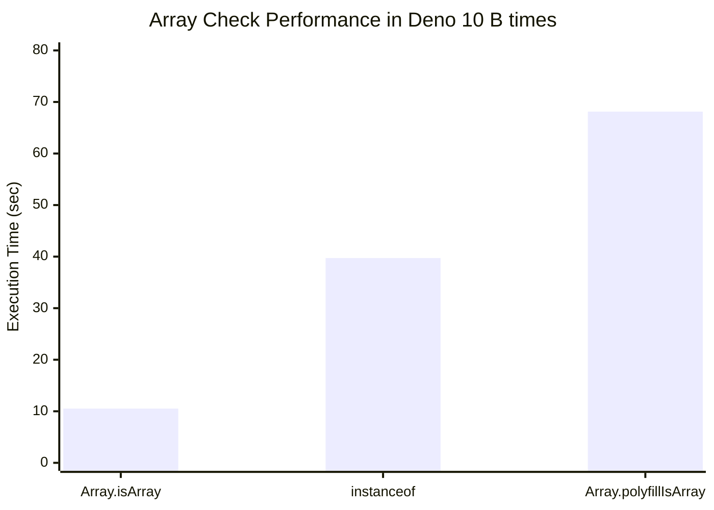
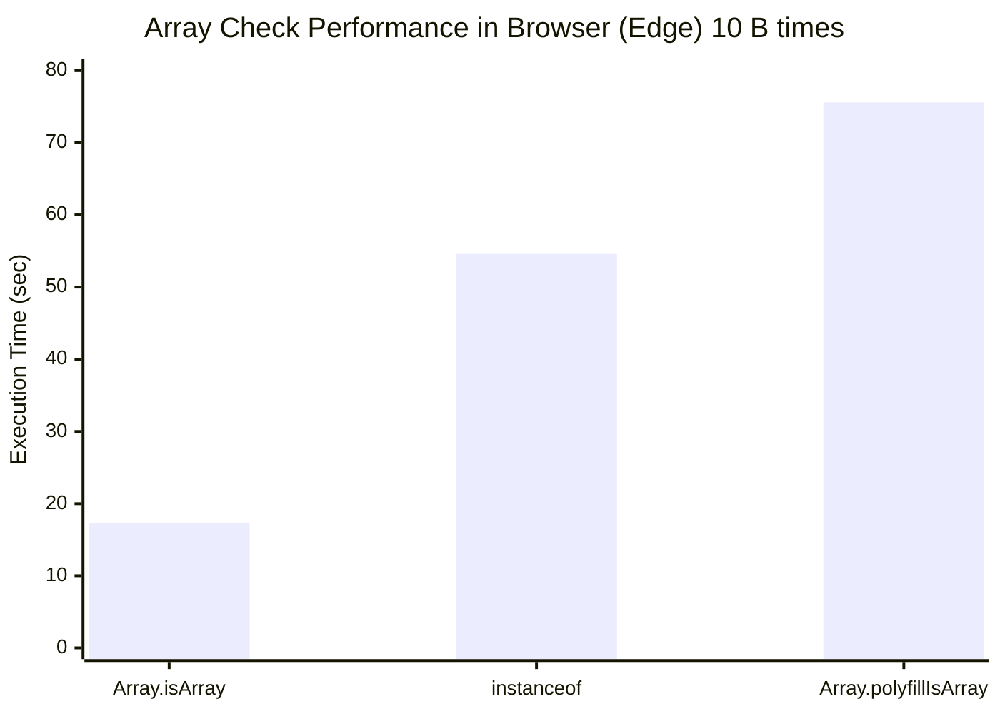

# 배열을 정확히 검증하는 방법

객체의 깊은 복사가 필요한 일이 생겼습니다. \
아무런 라이브러리도 쓰지않고 있는 상황이라 직접 구현하고 있습니다. 🤣\
그 중에서 배열을 정확히 확인하는 방법 중에 `instance of`와 `Array.isArray` 무엇이 현명한 방법인지 알아보겠습니다.

> 알아두기
>
> ES5 부터 `Array.isArray`가 추가되었습니다.

## 결론, 무엇을 사용하면 좋을까요?

`instanceof Array`가 다르게 나올 경우는 iframe으로 디자인된 코드 밖이며,
코드의 통일성을 중요시한다면 `instanceof Array`를 사용하면 됩니다.

단, `iframe`을 사용하는 경우 `Array.isArray`를 사용하면 됩니다.

성능에 유의미한 차이를 두기 위한 과도한 실험을 했지만 실제 사용환경에서는 유의미한 차이를 느낄 수 없습니다.

## 성능 테스트

빈 배열을 백 억번 검증하는 성능 테스트를 edge와 deno에서 진행했습니다.

```javascript
/** @type {Array<Array<number>>} */
const arr = [];
const time = 10_000_000_000;

// 1st
console.time('Array.isArray');
for (let i = 0; i < time; i++) {
	Array.isArray(arr);
}
console.timeEnd('Array.isArray');

// 2nd
console.time('instanceof');
for (let i = 0; i < time; i++) {
	arr instanceof Array;
}
console.timeEnd('instanceof');

Array.polyfillIsArray = function (obj) {
	return Object.prototype.toString.call(obj) === '[object Array]';
};

// 3rd
console.time('Array.polyfillIsArray');
for (let i = 0; i < time; i++) {
	Array.polyfillIsArray(arr);
}
console.timeEnd('Array.polyfillIsArray');
```

## 결과

수치가 낮을 수록 성능이 좋습니다.





유의미한 결과를 만들기 위해서 100억번을 돌린 결과, `Array.isArray`가 가장 빠르게 나왔습니다.

## 왜 `Array.isArray`가 빠를까?

이유는 `Array.isArray`가 내부적으로 최적화 되어 있기 때문입니다.

## 왜 `instanceof`가 느릴까?

`instanceof`는 객체의 프로토타입 체인을 확인합니다. \
즉 부모 부터 조상까지 검증합니다.

## 왜 `Array.polyfillIsArray`가 느릴까?

`Array.polyfillIsArray`가 느린 이유는, 이 방법이 `Object.prototype.toString` 메서드를 호출하고 결과 문자열을 검사하는 과정을 거치기 때문입니다. \
이 과정은 내장 함수 `Array.isArray`보다 더 많은 연산을 필요로 하므로 상대적으로 느릴 수 있습니다.
