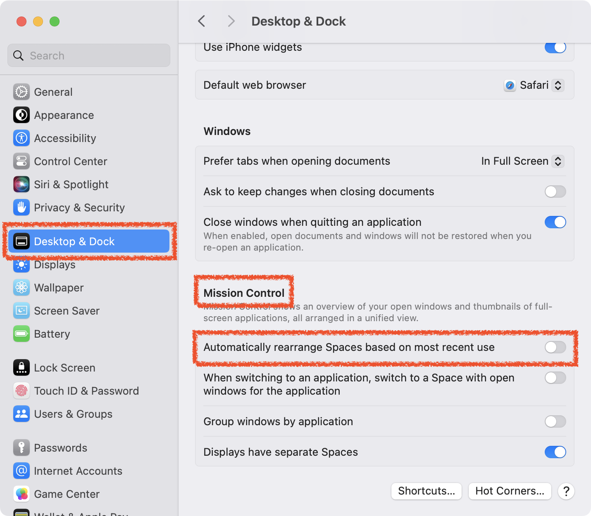

# LOCK DESKTOP SPACE

미션 컨트롤의 데스크톱 스페이스를 잠그는 방법을 알아봅니다.

## ENVIRONMENT

- macOS 14.0(Sonoma)

## WHAT IS _MISSION CONTROL_ ?

미션 컨트롤은 현재 열려있는 모든 창과 전체 화면 애플리케이션의 미리보기를 제공하여 빠르게 전환하고 관리할 수 있게 해줍니다.

## SOLUTION

0. **설정 화면** :

   0. _Desktop & Dock_ 메뉴 클릭
   1. _Misstion Control_ 영역으로 이동
   2. _Automatically rearrange Spaces based on most recent use_ 옵션을 **체크 해제**

## OPTIONS DESCRIPTION

0. **Automatically rearrange Spaces based on most recent use** :

   이 옵션을 활성화하면 가장 최근에 사용한 스페이스(데스크탑 환경)를 좌측으로 자동 정렬합니다. 이 옵션을 비활성화하면 스페이스의 순서가 바뀌지 않습니다.

1. **When switching to an application, switch to a Space with open windows for the application** :

   이 옵션을 활성화하면 특정 애플리케이션으로 전환할 때 해당 애플리케이션의 창이 열려있는 스페이스로 자동 전환됩니다.

2. **Group windows by application** :

   이 옵션을 활성화하면 미션 컨트롤 뷰에서 같은 애플리케이션의 여러 창을 그룹화하여 표시합니다.

3. **Displays have separate Spaces** :

   멀티 디스플레이 환경에서 각 디스플레이마다 별도의 스페이스를 가질 수 있게 합니다. 이 옵션을 활성화하면 각 모니터에 독립된 데스크탑 환경을 설정할 수 있습니다.
