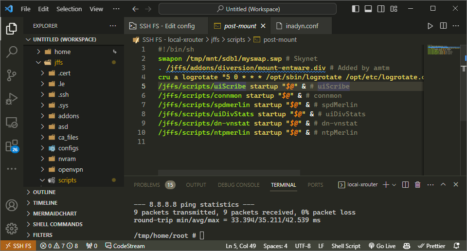
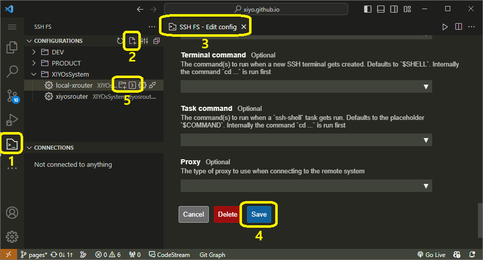

# USE SSH FS



*VS Code*의 *SSH FS*를 사용하여 편리하게 파일을 관리하는 방법을 알아봅니다.

*라우터*에 자주 접속해서 작업을 하다보면, 관리할 파일이 점점 많아집니다. \
그래서 조금 더 편리한 작업을 위해 *VS Code*를 이용하여 파일을 관리 할 수 있도록 기능을 추가했습니다.

최초에는 *Vim*을 설치하고 플러그인을 사용해서 작업을 할까 고민했는데, _Vim_ 설치시 생기는 오류도 확인할 시간도 없고, 플러그인 관리도 잘 할 수 있을지 걱정이들었습니다.

그래서 라우터에 _VS Code_ 서버 버전을 설치하여 작업하려고 했는데, 역시 지원하지 않는 환경이라서 포기하였습니다.

고민 끝에 나온 생각은, 네트워크 파일을 마운트해서 로컬에서 *VS Code*로 작업할 수 없을까 하면서 찾아본 솔루션이 *SSH FS*가 있었습니다. \
*REMOTE FS*라는 확장 기능도 있지만, 설명이 너무 부실하고 마지막 업데이트도 2019년 5월 5일이라 제외했습니다.

## WHAT IS _SSH FS_

*SSH FS*는 *VS Code*의 확장 기능 이며, *SSH FS*는 내부적으로 *SSHFS*를 사용합니다.

*SSHFS*는 *Secure Shell File System*의 약자이며, *SSH*를 통해 *파일 시스템*을 마운트하는 도구입니다. \
*VS Code*를 서버 버전으로 설치할 수 없는 환경에서 유용합니다.

## ENVIRONMENT

- **HARDWARE**: \
  _AC88U_
- **FIRMWARE**: \
  _asuswrt-merlin 386.12_
- **PACKAGE**: \
  _Entware armv7sf-k2.6_

## REQUIREMENTS

- **_SSH_ 접근 허용**
- **_Entware_ 설치**

## METHOD

1. **_openssl-sftp_ 설치**:

   1. *SSH*로 라우터에 접속
   2. 명령어 실행

      ```bash
      opkg install openssl-sftp
      ```

      *entware*를 이용해 *openssl-sftp*를 설치합니다.

2. **_SSH FS_ 설치**:
   1. *마켓플레이스*의 [*SSH FS*] 소개 페이지에서 _Install_ 버튼 클릭

## USAGE



_SSH_ 접속과 동일한 접속 정보를 요구합니다.

0. *프라이머리 사이드 바*에서 _SSH FS_ 버튼 클릭
1. _사이드 바_ 확장 영역에서 설정 생성 버튼 클릭
2. 설정 정보를 입력 화면에서 _SSH_ 접속 정보를 입력
3. 하단에 있는 _SAVE_ 버튼 클릭
4. _사이드 바_ 확장 영역에서 생성된 접속 정보를 보고 클릭 \
   왼쪽은 _디렉토리_ 마운트 기능, 오른쪽은 _터미널_ 연결 입니다.

> *VS Code*의 설정을 *GitHub*와 동기화 하면 더욱 편리하게 사용할 수 있습니다.

[*SSH FS*]: https://marketplace.visualstudio.com/items?itemName=Kelvin.VSCODE-sshfs
