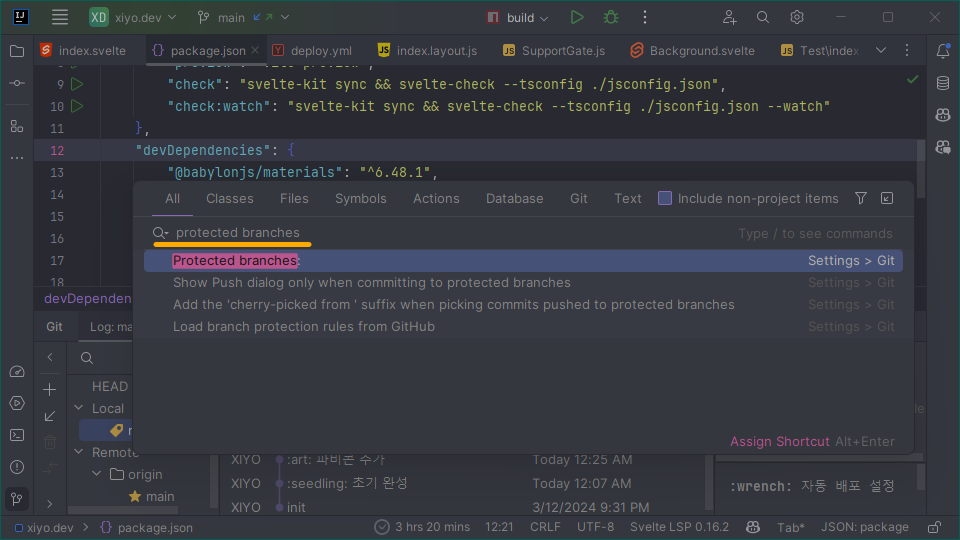
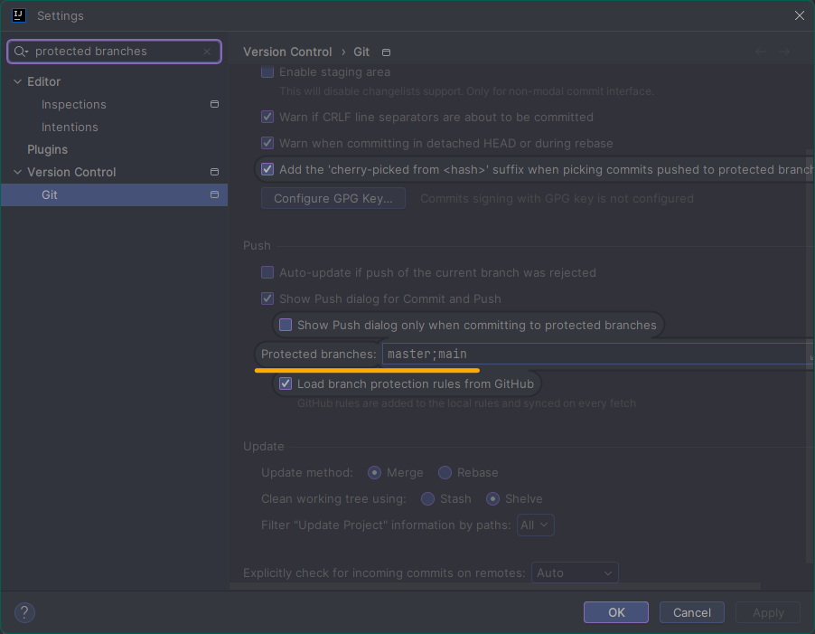

# ENABLE FORCE PUSH ON INTELLIJ

인텔리제이에서 포스 푸시는 마스터, 메인 브랜치에서는 할 수 없게 기본적으로 보호되어있습니다. \
이를 해결하는 방법을 알아보겠습니다.

## SCENARIO

깃허브 액션으로 자동화 배포를 하기 위해 여러 문법 오류를 격었습니다. \
그래서 커밋 로그에 지저분한 테스트 코드 코드가 남아서 이를 깔끔하게 정리하기 위해 포스 푸시 활성화가 필요했습니다.

## SOLUTION

- 방법 0. <kbd>Ctrl</kbd> + <kbd>Shift</kbd> + <kbd>A</kbd> 조합 단축키를 입력해 `Search Everywhere` 창을 엽니다. 0. `Search Everywhere` 창에서 "Protected branches:"를 입력하고 일치하는 항목을 클릭합니다. 0. `settings` 창에서 `Protected branches:` 필드를 찾아 내용을 삭제합니다.

## TROUBLESHOOTING

깃허브와 깃랩은 브랜치 보호 기능이 있기 때문에 각 리포지토리의 설정을 확인해야 합니다.
