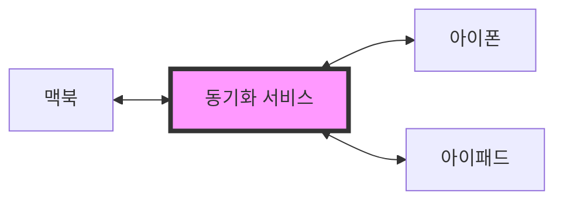

# 옵시디언 동기화 가이드

iCloud, Obsidian Sync, 클라우드 드라이브, Git까지. 4년간의 실전 경험으로 알려드리는 옵시디언 동기화의 모든 것. 동기화 충돌로 500개의 노트를 잃은 경험부터 안정적인 동기화 시스템 구축까지, 모든 노하우를 공유합니다.

"아니, 왜 내 노트가 사라졌지?" 

3년 전 저는 중요한 프로젝트 노트 500개가 동기화 충돌로 날아간 경험이 있습니다. 그때부터 옵시디언 동기화의 모든 방법을 직접 테스트하며 완벽한 시스템을 만들어왔습니다. 오늘은 그 모든 경험을 공유합니다.

## 동기화 vs 백업: 근본적인 차이 이해하기

많은 분들이 동기화와 백업을 혼동합니다. 이 둘은 완전히 다른 개념입니다.

### 동기화란?

동기화는 여러 기기에서 **같은 상태**를 유지하는 것입니다. 맥북에서 작성한 노트를 아이폰에서 바로 볼 수 있게 하는 기술이죠.

### 백업이란?

백업은 특정 시점의 데이터를 **별도로 보관**하는 것입니다. 실수로 삭제했거나 손상된 파일을 복구할 수 있게 해줍니다. 예를 들어, 매주 월요일마다 전체 노트를 압축하여 외장 하드에 저장하거나, Time Machine을 통해 시간대별로 자동 백업을 설정하는 것이 백업입니다.

### 왜 이 차이가 중요한가?

동기화만 제공하는 서비스의 가장 큰 위험은 **삭제도 동기화된다**는 점입니다. 한 기기에서 실수로 중요한 파일이나 폴더를 삭제하면, 그 삭제 작업이 모든 기기에 즉시 반영됩니다. 동기화가 빠르고 완벽할수록 실수를 되돌릴 시간조차 없습니다. 이런 이유로 동기화와 별도로 백업 시스템을 갖추는 것이 필수적입니다.

> 다행히 최근 대부분의 클라우드 서비스는 휴지통이나 버전 히스토리 같은 백업 기능도 함께 제공하고 있습니다.

## 4가지 주요 동기화 방법 완전 분석

### iCloud Drive: 애플 생태계 통합 동기화

#### 장점
- **설정이 정말 간단합니다.** Vault를 iCloud Drive 폴더에 만들면 끝
- 애플 기기 간 동기화가 빠릅니다
- 추가 비용이 없습니다 (기본 5GB)

#### 실제 경험에서 발견한 문제점

##### 대용량 Vault 동기화 지연
5,000개 이상의 노트가 있다면 초기 동기화가 수 시간 걸릴 수 있습니다. 제 경험상 10,000개 노트 동기화에 3시간이 걸렸습니다. 하지만 한 번 동기화가 완료되면 이후에는 변경된 파일만 동기화되어 매우 빠릅니다.

> 최초의 동기화는 처음만 잘 해두면 됩니다.

##### 동기화 상태 확인의 어려움
iCloud는 동기화 진행 상황을 명확히 보여주지 않아 완료 여부를 확인하기 어렵습니다. 중요한 작업 후에는 다른 기기에서 확인하는 것이 좋습니다.

### Obsidian Sync: 네이티브 동기화 기능

#### 장점
- 매우 쉬운 동기화
- **End-to-End 암호화**로 완벽한 보안
- 버전 히스토리 (최대 1년)
- 선택적 동기화 가능
- 동기화 충돌 앱에서 자체적으로 해결 기능

#### 실제 사용 경험

##### 비용 대비 효용성

월 $8(약 1만원)이 비싸 보일 수 있지만, 그만한 가치가 있습니다. 가장 큰 장점은 네이티브 통합입니다. 다른 클라우드 서비스들도 충돌 시 "사본" 파일을 만들어주지만, 사용자가 직접 파일을 찾아서 병합해야 합니다. 반면 Obsidian Sync는 옵시디언 내부에서 바로 충돌을 감지하고 해결할 수 있게 도와줍니다. 별도의 파일 탐색기를 열 필요도, 파일명을 비교할 필요도 없습니다. 이런 매끄러운 통합이 작업 흐름을 방해하지 않으면서도 데이터를 안전하게 보호합니다.

### 클라우드 드라이브: 외부 동기화 서비스

#### 장점
- **비용 효율성**: 이미 구독 중인 서비스를 활용하므로 추가 비용이 없습니다
- **넉넉한 저장 공간**: Google One, OneDrive는 테라바이트 단위의 용량을 제공합니다
- **범용성**: 옵시디언뿐만 아니라 다른 파일들도 함께 관리할 수 있습니다
- **빠른 동기화 속도**: 대형 IT 기업의 인프라를 활용하여 안정적입니다

#### 주의사항

##### 모바일 앱 지원 문제
클라우드 드라이브의 가장 큰 한계는 모바일 지원입니다. 모바일 옵시디언 앱은 클라우드 드라이브 폴더에 직접 접근할 수 없습니다. iOS는 iCloud만, 안드로이드는 로컬 저장소만 지원하죠. 모바일에서도 노트를 편집하고 싶다면 FolderSync나 Autosync 같은 서드파티 앱을 추가로 설치하고 설정해야 합니다.

##### 동기화 충돌 처리의 불편함
동기화 충돌은 모든 서비스의 공통 문제입니다. 클라우드 드라이브도 충돌 시 "일일노트 (컴퓨터A의 충돌된 사본).md" 같은 파일을 생성합니다. Obsidian Sync와의 차이점은 병합 방법입니다. 클라우드 드라이브는 파일 탐색기를 열어 두 파일을 직접 비교해야 하지만, Obsidian Sync는 앱 내에서 바로 처리할 수 있습니다. 작은 차이지만 매일 사용하다 보면 편의성의 차이가 크게 느껴집니다.

### Git: 버전 관리 시스템을 이용한 동기화

Git은 개발자들이 코드를 관리하는 도구지만, 노트 관리에도 훌륭하게 활용할 수 있습니다. 모든 변경 이력이 기록되고, 언제든 과거 버전으로 돌아갈 수 있어 안전합니다.

#### Git의 장점

- **무료**: GitHub, GitLab 등의 서비스를 무료로 사용할 수 있습니다
- **버전 추적**: 모든 수정 이력이 기록되어 실수로 삭제한 내용도 복구할 수 있습니다
- **자동화 가능**: Obsidian Git 플러그인으로 자동 백업을 설정할 수 있습니다

#### 주의사항

Git은 학습 곡선이 가파릅니다. 명령어와 개념을 익히는 데 시간이 필요하고, 모바일 동기화도 추가 앱(iOS: Working Copy, Android: MGit)이 필요합니다. 처음 사용하시는 분들은 Obsidian Git 플러그인부터 시작하시는 것을 추천합니다.

## 사용자 유형별 최적 전략

### 일반 사용자

##### Obsidian Sync

일반 사용자라면 Obsidian Sync가 가장 편리합니다. 월 1만원의 비용이 부담스럽지만, 복잡한 설정 없이 모든 기기에서 안정적으로 동기화할 수 있어 시간과 노력을 절약할 수 있습니다.

#### 클라우드 드라이브

맥 사용자가 아니라면 다음 서비스를 활용할 수 있습니다.
- Google Drive
- OneDrive

이미 구독 중인 서비스를 활용하면 추가 비용 없이 동기화할 수 있습니다. 다만 모바일 동기화를 위해서는 서드파티 앱이 필요합니다.

### 애플 전용 사용자

##### iCloud + Time Machine

iCloud로 동기화하고 Time Machine으로 백업하는 것이 가장 간편합니다. 설정이 매우 간단하고 애플 기기 간 동기화가 빠릅니다.

Time Machine은 macOS의 기본 백업 기능으로, 외장 하드나 NAS가 있어야 사용할 수 있습니다. 설정하면 시간대별로 자동 백업되어 실수로 삭제한 파일도 쉽게 복구할 수 있습니다.

### 개발자

##### Git + Git 플러그인

Git과 Obsidian Git 플러그인을 활용하면 강력한 버전 관리와 자동 백업을 구현할 수 있습니다. 플러그인을 설치하면 5분마다 자동으로 변경사항을 커밋하고 푸시할 수 있으며, 충돌 해결도 플러그인이 도와줍니다.

### 다중 플랫폼 사용자

##### Obsidian Sync

특히 Windows + Mac + Linux를 오가며 작업한다면 Obsidian Sync가 가장 안정적입니다.

## 마무리: 제가 선택한 최종 시스템

4년간의 시행착오 끝에 저는 다음과 같은 시스템에 정착했습니다.

1. **메인 동기화**: iCloud Drive (애플 생태계의 편리함)
2. **백업 1차**: Git (매일 자동 커밋으로 버전 관리)
3. **백업 2차**: Time Machine (시간대별 스냅샷)

이 3중 안전망 덕분에 지금까지 단 한 번도 데이터를 잃은 적이 없습니다. 

여러분도 자신의 작업 환경과 기술 수준에 맞는 동기화 시스템을 구축하시기 바랍니다. 완벽한 시스템을 만들려고 너무 애쓰지 마세요. 시작은 단순하게, 필요에 따라 점진적으로 개선해 나가는 것이 현명합니다.
